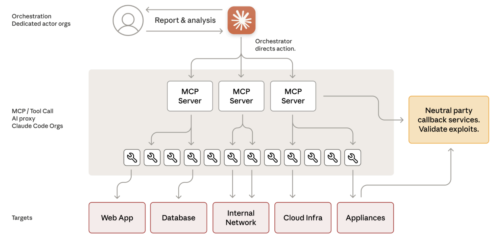
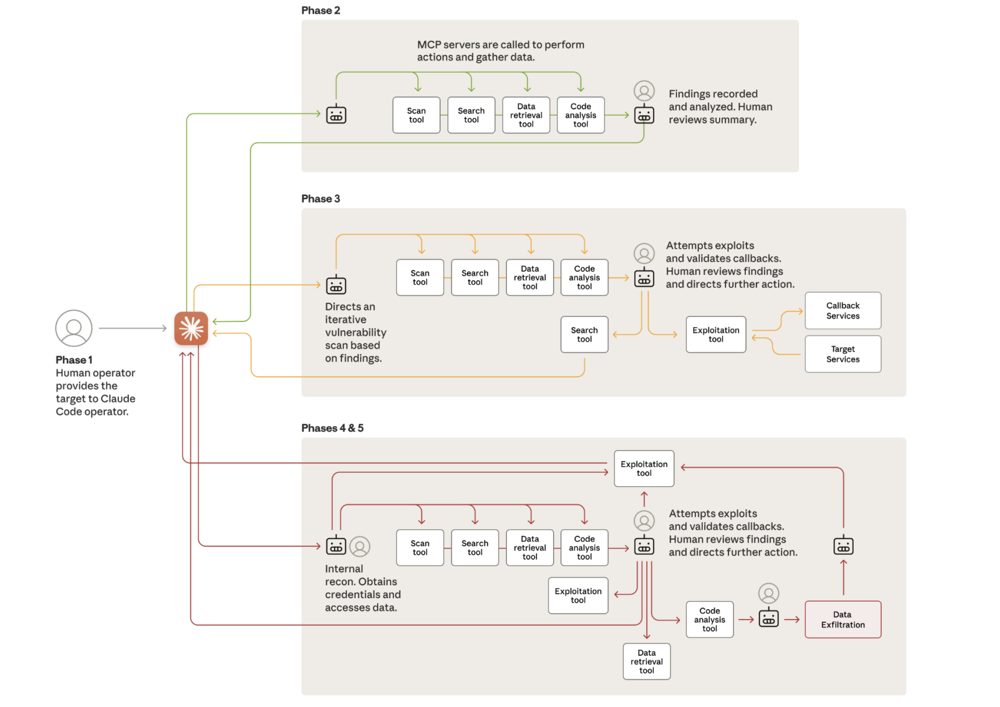

實驗室習俗是碩一跟學長 co-work 論文、做計劃，從實作中發現問題，碩二再著手自己的論文，自去年九月起我跟兩個學長一起參加一項關於蜜罐的研究，簡單來說學長想要透過 LLM agent 的方式建置蜜罐，並希望這個蜜罐除了被動式搜集訊息與防禦以外，可以有一些主動的策略誘敵深入，主要探討的點包含透過攻擊者攻擊指令序列判斷攻擊者意圖、LLM agent 應該做出什麼交戰策略與回覆等，不過兩位學長重心還是放在防禦面上，也就是 honeynet 本身

一項研究會有實驗，這份研究的實驗不外乎需要一個攻擊者去打攻擊，觀察我們設計的 honeypot（甚至 honeynet）的反應，攻擊者設計就成了實驗一大挑戰，先前研究多半採取已知攻擊序列（固定、自己設計的 attack chain），而我們（目前）則是選擇透過 LLM 作為攻擊者自己生攻擊腳本

相對於 honeynet 的設計，攻擊者勢單力薄，好比我們設計了一道銅牆鐵壁，卻叫一位手無縛雞之力的攻擊者來做測試，這種實驗結果即便我們拿著說「哎呀我們的 honeynet 真棒」也不太好說服別人，畢竟兩者之間落差肉眼可見

1/30 實驗室 group meeting 在學長報告論文進度時，教授就提到 Anthropic 在 2025 年提出的一份網路間諜報告，裡頭提到攻擊者透過 AI 打了一場網路攻擊，其中有八到九成都是攻擊者打的，這就延伸幾個問題：攻擊者是怎麼設計讓 AI 可以在一場攻擊中承擔如此的責任、剩下那一兩成人工的部分是哪些、AI 有沒有機會可以完掌握一場攻擊，過程中人類不需要再參與攻擊階段？

畢竟身為跟學長 co-work 的學弟，閱讀這份報告的責任就掉到我這邊來，整理完覺得滿有趣的，所以整理成一篇文章，分享的同時再次仔細梳理一些細節

## 事件資訊

先來看這篇報告的一些背景

- 時間：2025 年 9 月
- 國家：Anthropic 猜測是由中國政府支持的組織所發動 (GTG-1002)
- 受影響組織：約 30 個 entities，已證實有少數組織遭到成功入侵，包含大型資訊公司、政府機構、金融機構與化學製造公司
- 為什麼 Anthropic 會注意到這起事件
    - 攻擊具備持續性，最終觸發了偵測系統
    - 攻擊展現極高的操作節奏，請求速率非人類操作員物理上可達成
    - 數據輸入與文本輸出之間存在巨大差異，顯示 AI 正在積極分析偷來的資訊，而非僅是產生說明內容給人類看
- References
    - [Disrupting the first reported AI-orchestrated cyber espionage campaign](https://www.anthropic.com/news/disrupting-AI-espionage)
    - [Disrupting the first reported AI-orchestrated cyber espionage campaign - Full report](https://assets.anthropic.com/m/ec212e6566a0d47/original/Disrupting-the-first-reported-AI-orchestrated-cyber-espionage-campaign.pdf)

## 攻擊工具與設備

:small_red_triangle: Simplified architecture diagram of the operation ([Full report](https://assets.anthropic.com/m/ec212e6566a0d47/original/Disrupting-the-first-reported-AI-orchestrated-cyber-espionage-campaign.pdf) p.6)

- **核心架構**：攻擊者開發了一個自動化攻擊框架，利用 **Claude Code** 與**模型上下文協定 (Model Context Protocol, MCP)** 工具
- **滲透測試工具**：自動化攻擊框架使用多種開源安全工具，包括網路掃描、資料庫利用框架、密碼破解以及 binary 分析等
- **專用伺服器介面 (MCP Servers)**：用於執行遠端命令、瀏覽器自動化（網頁偵查）、程式碼分析、測試框架整合以及 Callback 通訊驗證

## 攻擊階段

接著來看看 Anthropic 劃分的攻擊階段，與 AI 和人類交互的職責範圍

:small_red_triangle: Attack lifecycle and AI integration ([Full report](https://assets.anthropic.com/m/ec212e6566a0d47/original/Disrupting-the-first-reported-AI-orchestrated-cyber-espionage-campaign.pdf) p.8)


    

    ### Phase 1：攻擊事件初始化與目標選擇
    - 目標：啟動攻擊事件、引導 AI 參與攻擊
    - AI 角色（參與極少）
        - 主要作為被動接收指令的工具
    - 人類角色（主要）
        - 輸入攻擊目標
        - 透過「角色扮演」對 AI 進行社交工程，宣稱自己是合法資安公司的員工，說服 AI 相信這是在進行防禦性的網路安全測試

    
    

    ### Phase 2：偵查與攻擊面探索

    - 目標：系統化掃描目標基礎設施、分析驗證機制、識別潛在漏洞
    - AI 角色（幾乎全自動執行）
        - 使用瀏覽器自動化工具掃描基礎設施
        - 繪製網路拓撲
        - 識別高價值系統（如資料庫、控制中心）
    - 人類角色（盡可能不參與）
        - 提供戰略方向指導

    
    

    ### Phase 3：漏洞發現與驗證

    - 目標：自動化測試識別出的攻擊面、驗證漏洞的可利用性
    - AI 角色
        - 自動產生針對性攻擊 payloads
        - 執行遠端命令測試
        - 分析 callback 回應
    - 人類角色
        - 審閱 AI 的發現與建議
        - 允許使用 exploit payload 發動主動攻擊

    
    

    ### Phase 4：憑證收割與橫向移動

    - 目標：採集身分驗證資訊、於內網擴張訪問權限
    - AI 角色
        - 自動從設定檔中提取憑證
        - 測試權限邊界
        - 建立內部網路存取地圖
    - 人類角色
        - 審閱收割到的憑證
        - 允許訪問敏感系統

    
    

    ### Phase 5：資料收集與情報提取

    - 目標：提取並分類具備情報價值的專有資訊
    - AI 角色
        - 高度自主
        - 自動查詢資料庫、解析大量數據以識別敏感資料
        - 按情報價值進行分類
    - 人類角色
        - 審閱發現
        - 允許 AI 提取敏感資料

    
    

    ### Phase 6：文件記錄

    - 目標：生成詳細的攻擊紀錄
    - AI 角色
        - 完全自主產生 Markdown 格式的紀錄文件
        - 追蹤發現的服務、憑證、提取的數據及攻擊進度
    - 人類角色
        - 將持久存取權限交接給其他團隊進行長期行動

    


## AI 與人類分析

從上述攻擊階段的分析，我簡單整理了人類與 AI 的職責劃分

人類約佔了整個攻擊活動的 10-20%，主要負責目標決定、戰略監督、授權等工作，包含初始化攻擊、對 AI 進行角色扮演誘導（騙 AI 這不是攻擊是測試，畢竟 claude code 本身是有防禦策略的）、允許從偵查轉向利用、授權使用憑證、決定最終數據滲漏的範圍

而 AI 約佔了整個攻擊活動的 80-90%，主要負責技術層面執行，包含自主偵查、漏洞驗證、payload 生成、資料解析、身分驗證測試、文件紀錄

就搭配 AI 發動攻擊的優勢來說，主要環繞在 AI 速度好快！攻擊門檻降低了！打完還會幫忙做紀錄！好棒棒！

- **規模、效率**：能同時針對多個目標進行複雜攻擊，操作速度遠超人類。
- **持久性**：AI 可以在跨越數天的會話中維持操作上下文，無需人類手動重建進度。
- **技術門檻**：透過使用現成工具，資源較少的組織也能發動國家級水準的攻擊
- **紀錄**：AI 可以自動生成詳細文件確保攻擊任務完整、完成

但劣勢（或說仍然存在的問題）也是有的，比如

- **幻覺**：以這份研究來說主要幻覺來自 fake credentials，比如會聲稱拿到一份 credential 但其實沒有用
- **語言模型自身防禦**：攻擊者需要事先誘導模型參與惡意活動，這份研究透過角色扮演說服語言模型這是一場演練測試而非攻擊（可以說攻擊者親自發動的攻擊就是對自己的工具做社交工程）
- **戰略判斷**：關鍵的決定仍然仰賴人類介入

可以發現人類從規劃與執行兼具提升到指揮家的層次，給予 AI 明確的指示，讓 AI 完成後續的攻擊步驟，只是 AI 完成的攻擊步驟不再只是說一做一，而是有後續多個子階段的反思與近一步舉動，好比 reconnaissance 階段，攻擊者可能只需要跟 AI 說「我想要對 XXX 發動攻擊」，AI 可以自己規劃應該要執行 `nmap` 指令掃描開啟的服務，然後根據掃描結果決定應該如何探索，最後給攻擊者它找到的網路拓樸或已知服務。在 AI 的職責可以說是從「AI 輔助」轉變為「AI 代理（Agentic AI）」，好處是成本降低但規模效率提升，對於低成本組織也有機會發動高規模的攻擊事件

所以討論到 AI 是否有機會（全自動化）執行攻擊過程？報告中提到（當時）的 AI 仍存在障礙，最嚴重的就是幻覺 (hallucination) 問題，且仰賴人類對目標進行劃分，像是初始目標的設定、以及過程中要對哪些設施服務發動攻擊仍需要攻擊者二次驗證授權，就我看來確實幻覺是一大問題，初始目標設定必須有人類決定這也合理，不過「攻擊者二次驗證授權」的這道程序或許參雜一些非技術的責任問題，當初攻擊者會想要多一道驗證程序我認為有一大因素是怕 AI 打出去的攻擊會釀成大禍，當然有另一部分原因是 AI 本身行為有誤需要人工勘誤就是了