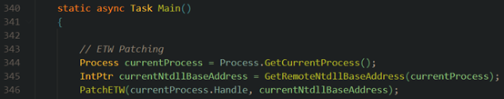
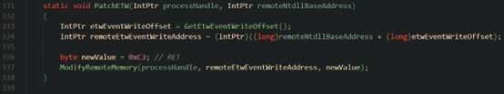
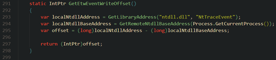
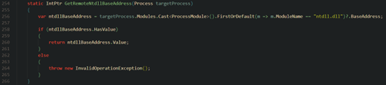
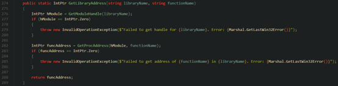
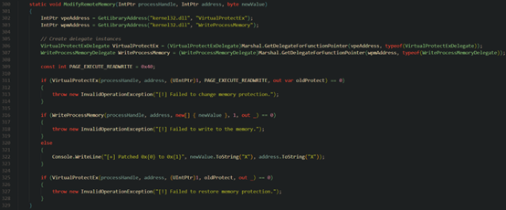
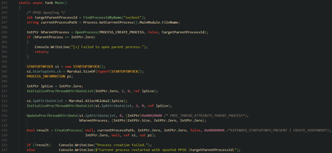
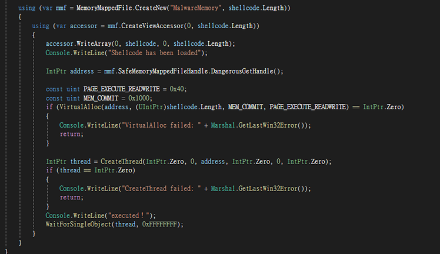
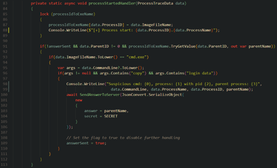

## 關於 BOMBE

高等資安攻防這門課的期末專題採用 attack & defense 的方式進行，平台是一個稱為 BOMBE 的競賽，BOMBE 全名 Battle of Malware Bypass ans EDR，主辦方會給予特定環境的 VM，參賽者需要開發 Malware 偷取指定位置的 flag，或開發 EDR 偵測 Malware 的攻擊，這是奧義智慧科技在今年的 DEFCON (DEFCON 32) 舉辦的競賽，這次拉到師大的課堂上，透過五個 challenge (Malware * 3, EDR * 2) 以及參賽組別間相互競技作為本次課程期末專題

專題差不多為期一個月左右，一個禮拜的時間寫基本 challenge、一個禮拜寫進階 challenge，一個禮拜進行最後開發，進行組別間的競賽，BOMBE 負責團隊甚至很用心地提供範例程式幫助我們著手專題，撰寫 [document](https://docs.bombe.top/) 說明環境建置、競賽規則以及學習資源，針對 Malware 和 EDR 都提供了不同技巧供我們做為入門

這次跟兩個碩班學長組隊進行，雖然分工比較像是各自寫各自的程式，有問題再討論，但最後還是拿下 EDR 組第一名；Malware 組第四名！

## Malware 開發

Malware 開發部分會針對嘗試的技術進行說明，雖然這部分剛好都沒成功

### ETW Patch

#### 思路

Challenge *File Access Monitor* 提到 EDR 會開 ETW 去監測 malware 的行為，要避免 ETW 的偵測其中一個做法是 ETW Patch，ETW 會透過 `EtwEventWrite` 在事件建立時寫入，過程中進行偵測，而 malware 可以透過修改 `EtwEventWrite`，阻止事件被寫入，進而讓 ETW 偵測不到。我們透過將 `ETWEventWrite` 第一個 instruction 改為 `RET`，在進入 `ETWEventWrite` 後就直接離開，避開原先 `ETWEventWrite` 會做的事情

#### 實作

344 行透過目前的 process 取得 process handle、355 行取得 *ntdll.dll* 位址，呼叫 `PatchETW` 進行後續任務

 
333 行會透過 `GetEtwEventWriteOffset` 尋找 `EtwEventWrite` 的位址，即尋找與 *ntdll.dll* 的 base address 差距 (`offset`)，並透過 `ModifyRemoteMemory` 將 `EtwEventWrite` 的第一個 byte 改成 `0xC3`，即 `EtwEventWrite` 第一個 instruction 為 `RET`

接下來要了解 `PatchETW` 中呼叫的自製兩個函式，一個是 `GetEtwEventWriteOffset`，一個是 `ModifyRemoteMemory`
`GetEtwEventWriteOffset` 會尋找 `EtwEventWrite` 與 *ntdll.dll* base address 的差距，函式中有兩個變數，一個是 `localNtdllAddress`，另一個是 `localNtdllBaseAddress`，兩個相減即為 `EtwEventWrite` 與 *ntdll.dll* base address 的差距

其中 `localNtdllAddress` 會透過 `GetLibraryAddress` 取得 *ntdll.dll* 中 `EtwEventWrite` 的位址

另一個是 `localNtdllBaseAddress`，它會透過 `GetRemoteNtdllBaseAddress` 從當前 process 中尋找 *ntdll.dll* module 的 base address，

`ModifyRemoteMemory` 函式會修改 `EtwEventWrite` 的第一個 instruction。311 行會將 virtual protect 打開，316 行會嘗試更改目標 byte

#### 結果

未成功，仍可從 process explorer 查看到 malware 程序。
 
### PPID Spoofing

#### 思路

這部分並不是為了 challenge 而設計，只是純粹 ETW Patch 寫不出來想要讓 malware 新增一些 feature 而進行的嘗試。PPID Spoofing 目標是把 malware 的 parent process 改掉，如果 EDR 有透過 parent process 辨別 malware，就有機會透過這種策略規避。

#### 實作

Parent process 的資訊會存在 process thread attribute list 中，這次做法主要是透過 `InitializaProcThreadAttributeList` 初始化創建一個經設計的 process thread attribute list，再透過 `UpdateProcThreadAttributeList` 更改 process 的 thread attribute list，達到更換 parent process 的效果。其中 311 行第一次呼叫 `InitializeProcThreadAttributeList` 的原因是需要得到 `lpSize`，真正執行初始化為 314 行第二次呼叫 `InitializeProcThreadAttributeList`

#### 結果

未成功，卡在 `CreateProcess` 遇到讀取不可讀的記憶體位置。
 
### Memory Mapping

> 這部分是兩位學長的嘗試

#### 思路

在編寫 malware 時，由於不清楚 EDR 的運作內容，所以在編寫程式時，假設 EDR 是以監控特定的 SYSCALL 以及特定路徑檔案的存取操作。嘗試 Memory Mapping 的方法，使用 shellcode 將檔案內容載入到記憶體中，避免掉 EDR 可能監控的 SYSCALL

#### 實作

建立一個名為 `MalwareMomory` 記憶體映射檔案，使用 `ViewAccessor` shellcode 寫入到記憶體映射的位置，搭配 `VirtualAlloc` 將虛擬記憶體空間進行分配， `CreateThread` 建立 thread 執行 shellcode。

#### 結果

未成功，在 VirtualAlloc 時遇問題，並在上傳後仍會被偵測。

## EDR 開發

EDR 的 challenge 中進階提剛好有寫出來，所以會針對解題策略與作法進行說明

### Bypass File Access Monitor

#### 題目

*Bypass File Access Monitor* 說到 malware 會產生一支子程序 *cmd.exe*，讓 *cmd.exe* 去複製目標檔案到其他地方，再去讀取內容，並把答案回傳

#### 思路

偵測 *cmd.exe* 這支程序，一旦被建立起來，就去檢查他的行為是否包含複製，且複製目標檔案是否為 challenge 的目標檔案，如果是則猜測其 parent process 為 malware，找出 parent process name 並回傳

#### 實作

`processStartedHandler` 會在所有 process 開始執行時被 ETW 偵測到，因為我需要偵測 *cmd.exe* 這支 process，所以在這個函式中新增了第 91 至 113 行的程式碼，93 行檢查如果這支 process 名字是 *cmd.exe*，那就需要進行更進一步的判斷，如果做的事情包含複製 (`args.Contains(“copy”)`) 且複製目標為 challenge 目標檔案，此處以 challenge2 為例 (`args.Contain(“login.data”)`)，則猜測其為惡意程式，需注意的是如果直接回傳該 process 會抓到 *cmd.exe*，真正的 malware 應該是它的 parent process，所以最後回傳 parent process name 即可通過 challenge

#### 結果

成功

## 心得

之前嘗試的資安競賽都是 Jeopardy 類型的 CTF，沒打過 attack & defense 或 KoH，這次的 BOMBE 算是我第一次有實際攻防的競賽。不同的點是 Jeopardy 可以直接享用一個完整的平台，但 attack & defense 需要事先準備一個環境，各種入侵手法也需要自己思考，比起 Jeopardy 更廣也更難實作，當然防禦層面也是 Jeopardy 比較少有機會玩到的，可以自己寫一個簡單的 EDR 偵測 malware，這次真的是一個很寶貴的經驗

其實一開始是想好好打 malware，因為比起 EDR 要猜測 malware 如何攻擊，malware 的目標很明確就是去偷 flag 而已，加上自己沒什麼試過當壞人的角色，想趁這個機會好好寫一個 malware 出來，~~然後哪一天晚上傳一句「學長，我寫了一支 malware，你要試試嗎？」~~，但很可惜的是寫 malware 的過程一直卡關，有時候是程式不會動，有時候是偷不到資料，或是 malware 的一些機制啟動不了，反而是心血來潮一個早上寫 EDR 的 challenge，非常順利的第一次就過關，這算是過程中意想不到的事情

這趟路途中也發現，當我寫好一支 malware 要進行測試其實是比較容易的，因為只要執行下去並觀察是否有依照預期行為動作即可，比如說 PPID Spoofing 的功能開發完，就跑下去執行並監控該 process 的 PPID 是不是有成功被我更改，但相對的當我寫好一支 EDR 想要檢測是否能抓到 malware，似乎還需要把 malware 開發出來才能測試，當然要測試 malware 是否會被 EDR 抓到也是一樣的概念，只是就功能的正確性而言，似乎對於開發 malware 的要求比較低。這是我在最後一週因為寫不出 malware 轉戰 EDR 的小心得，並於期末分享那天提出來，當天 NiNi 說如果要測 EDR 有沒有寫好，其實 malware 網路上找一大堆，因為之前為了訓練某些 detector，其實也有相對應資料集，不會怕找不到，EDR 的概念也一樣，我想逃過哪一家的 EDR，就直接買一台過來玩一玩就好，要測多少次都不是問題

不過最重要的應該是認知到**攻防是一體**的概念，不會說我想當純的紅隊或純的藍隊，畢竟攻擊方要知道藍隊怎麼防禦才能進化它的武器；防禦方要知道紅隊怎麼攻擊才能布好防禦網