## What is Fully Homomorphic Encryption?

Homomorphic encryption allows operations to be performed directly on encrypted data, so the results are the same as if the operations had been performed on the plaintext. Fully homomorphic encryption (FHE) extends this to allow operations of arbitrary depth and type.

## Motivation

Cloud computing allows users to overcome the limitations of local devices. Even if their hardware is not powerful enough, they can leverage cloud computing to process data via third parties and achieve the desired results. However, with the rise of cloud computing, security has become a critical issue.

I will use the following simple scenario to explain the motivation step by step.

Alice has a piece of data, say `a` is 3 and `b` is 5, that she needs to send to a third party, Bob, for processing. In a typical cloud computing, Alice sends the data to Bob, who processes it and returns the results 8 to Alice. 

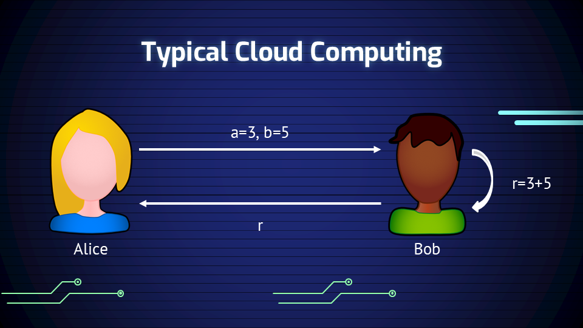

However, Alice worries that if someone intercepts the data during transmission, it could be exposed, posing a significant risk. To address this, Alice encrypts the data before sending it to Bob. Bob then decrypts the data, processes it, re-encrypts the results, and sends them back to Alice. Alice decrypts it and gain the final result. This is a standard encryption process. 

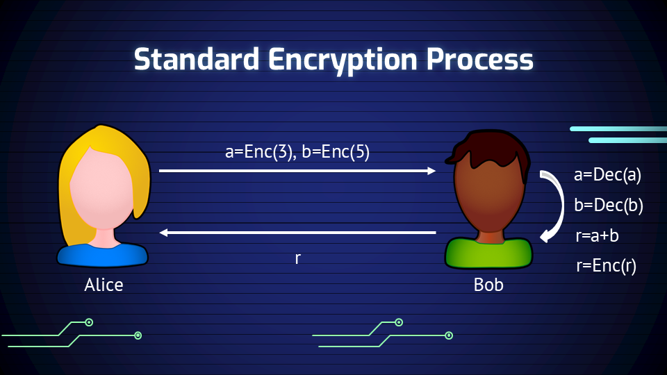

But Alice still feels that exposing the raw data to Bob is risky. She needs a way to process the data while it remains encrypted - here is where homomorphic encryption comes in.

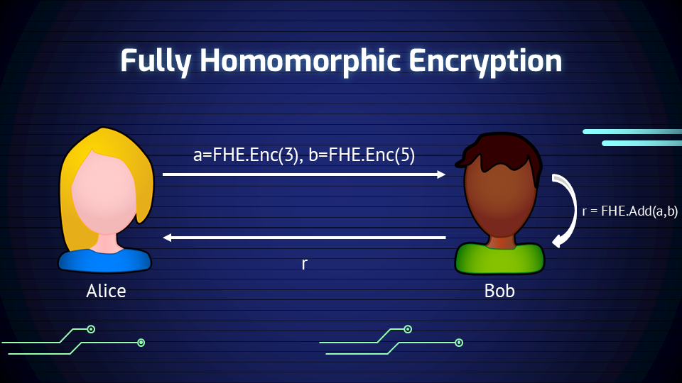

It seems everything is now more secure with FHE. Unfortunately, we figure out a potential risk as the following consideration describes. What if Alice wants Bob to perform an addition operation, but Bob performs a multiplication operation instead? Alice has no way to verify that Bob has performed the correct operation or not.

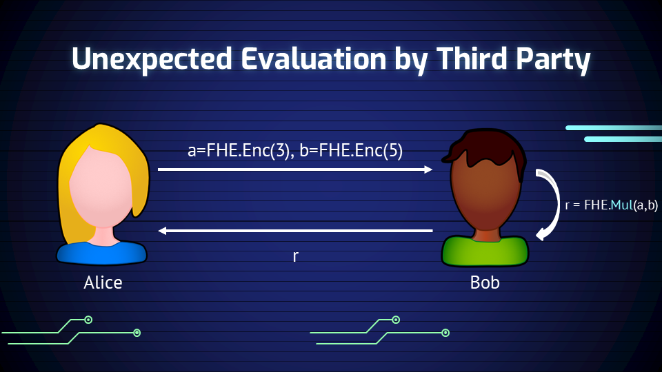

While FHE does help solve a significant security issue, there remains a potential loophole, how can we ensure that the third-party computation is exactly what the data owner intended? This is the core problem our research addresses. Let me summarize all requirement of this problem in three categories.

1. We need **the whole process to be performed under encryption** so that no one else can see the raw data between transmission.
2. We need **homomorphic encryption**, or fully homomorphic encryption to prevent the third party from seeing raw data.
3. We need an **additional validation step** to verify if the third party runs the operation as the data owner intends.

## Solution

FHEwEC involves five algorithms: **Setup**, **Encrypt**, **Evaluate**, **Decrypt**, and **Validate**. Unlike traditional FHE, we make several modifications at each step to enable the new validation mechanism in the final step. Overall, we achieve validation through data duplication and deconstruction.

First is Setup. The Setup phase generates three keys: a public key for encryption, a private key for decryption, and an evaluation key for FHE operations.

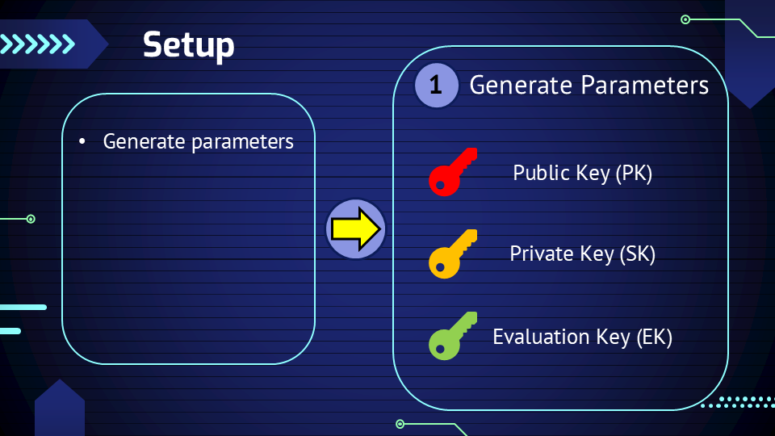

In the Encryption phase, there are four steps: **policy formulation**, **data duplication**, **data deconstruction**, and finally, **FHE encryption**.

The policy formulation uses a bloom filter to generate a number or bit array, which informs the third party of the number of message blocks and which ones are necessary. For example, as the slide shows, the bloom filter might indicate that under addition, eight message blocks will be used, with only the first four relevant, while the remaining four are random noise.

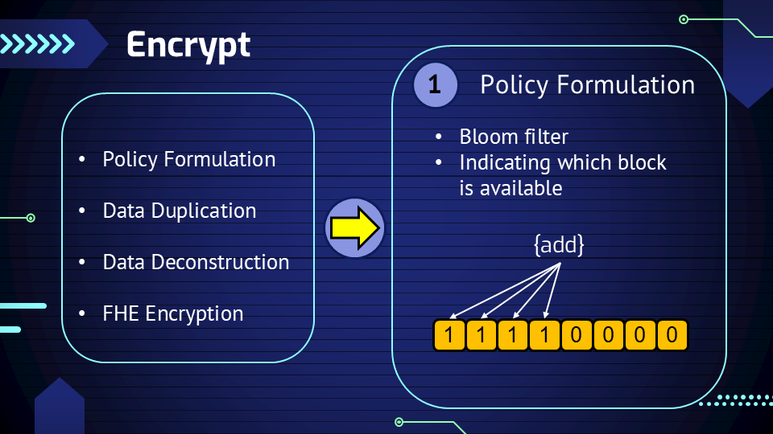

Next is data duplication. The data owner duplicates the original data into `s+t` copies, where `s` and `t` will be explained shortly. In the example, assume there is a data `8`, and we duplicate it 4 times.

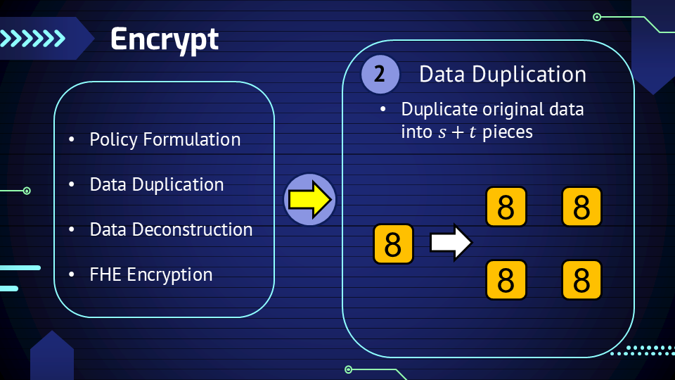

In the deconstruction step, the data duplications are deconstructed based on addition and multiplication operations. The number of duplications undergoes addition deconstruction is `s`, while the number of duplications undergoes multiplication deconstruction is `t`. Finally, the total number of message blocks is `N`. In the example, two copies are deconstructed using addition, and two using multiplication, with each deconstruction splitting the data into two parts.

For instance, `2 + 6`, `3 + 5`, `1 * 8`, and `2 * 4` are all equals `8`

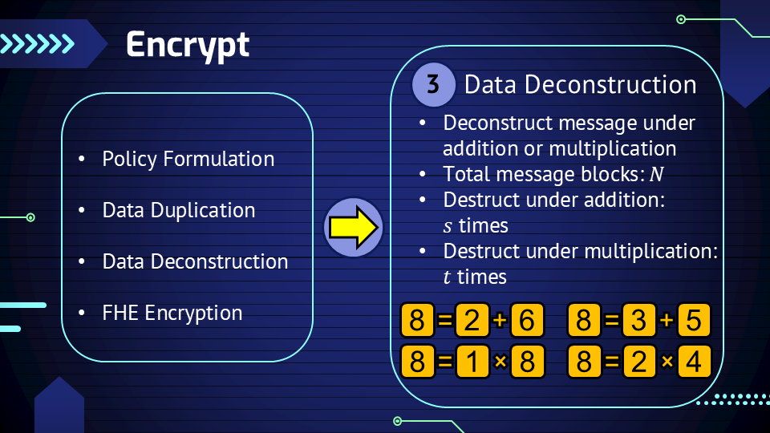

In this example, `s` is the number of additions, which is `2`, and `t` is the number of multiplications, also equals to `2`, while the total number of message blocks, `N`, is `8`.

Referring back to policy formulation, the policy indicated that the first four message blocks should be used, which corresponds to `2`, `6`, `3`, and `5`. These blocks were indeed created through addition, aligning with our intention to perform addition on the data.

Finally, all message blocks undergo FHE encryption, indicated by black background color in the slide.

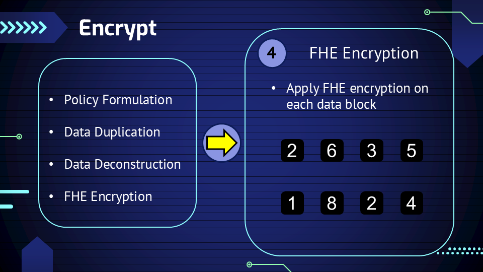

The third algorithm, Evaluate, is used by the third party.

This algorithm has two steps, **policy checking** and **fully homomorphic evaluation**.

During policy checking, the third party performs an **AND** operation on the policies of the two pieces of data, yielding the policy to be used for the upcoming operations. The AND operation is necessary because it identifies the data that both parties have agreed can be used. As the following picture shows, the first policy `p1` is the same as the one we previously showed. For convenience, I set all bits of the second policy `p2` into `1`. After AND operation, the result policy indicates that there are totally 8 message blocks, where the first four will be used later.

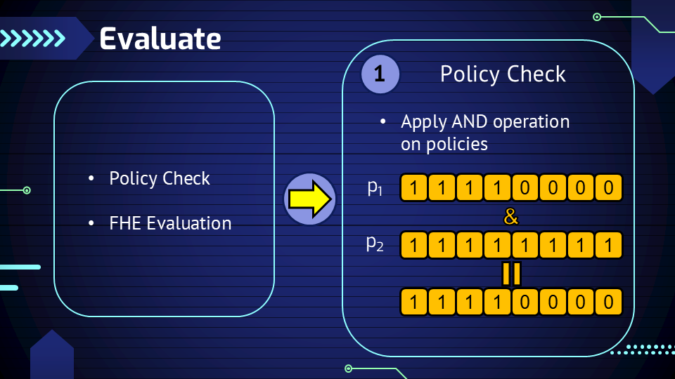

Next is homomorphic evaluation. The third party selects the relevant message blocks according to the policy and performs the corresponding operations, in this case, homomorphic addition. For example, suppose the first piece of data `m1` is `8` and the second `m2` is `20`, so the expected result is `28`. The second piece of data is deconstructed similarly to the first, with `17 + 3`, `10 + 10`, `4 * 5`, and `10 * 2` are all equal to `20`. It's important to note that the operations here are homomorphic because the data is still encrypted.

Since the policy says that the last four message blocks are unnecessary, so we’ll ignore those message blocks, as shown in gray background color in the picture. The encrypted result might look like this,
- `2 + 17 = 19`
- `6 + 3 = 9`
- `3 + 10 = 13`
- `5 + 10 = 15`

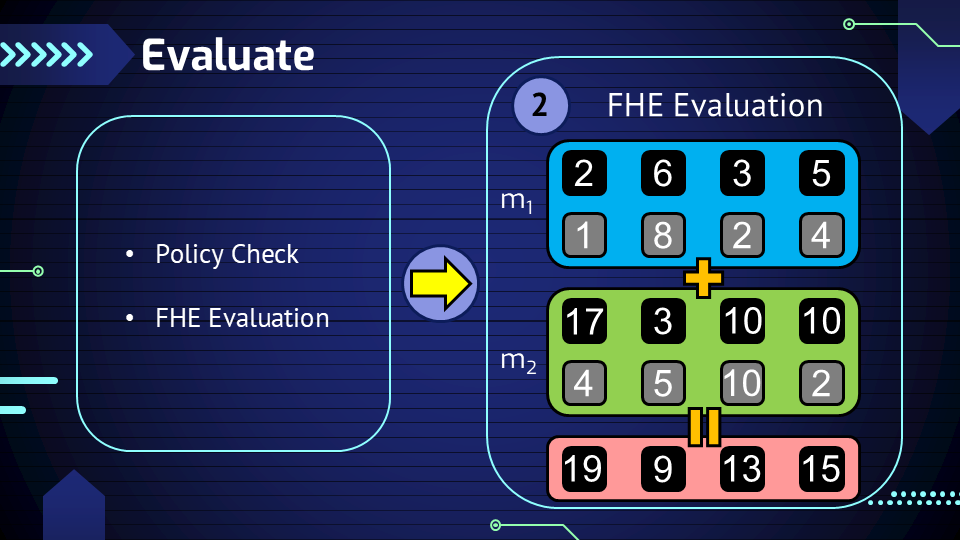

The third party sends this data back to the data owner.

The fourth step is Decrypt. First, all data is restored to plaintext.

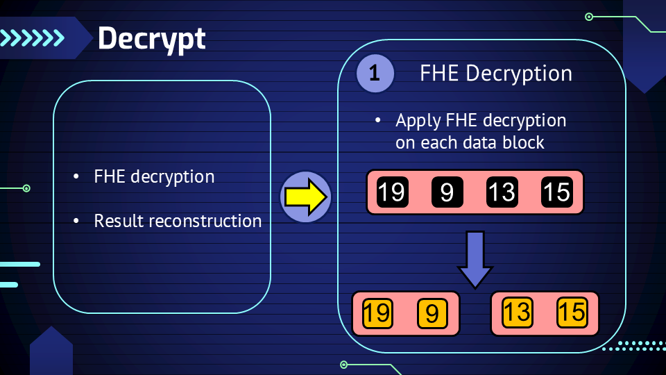

Next is reconstruction. Since the data has been deconstructed, the result won't be in its original form, so it must be reassembled. Reconstruction involves selecting one set of message blocks and performing the intended operation, in this case, addition. For instance, using the first returned set, `19 + 9 = 28`, which matches our expectation.

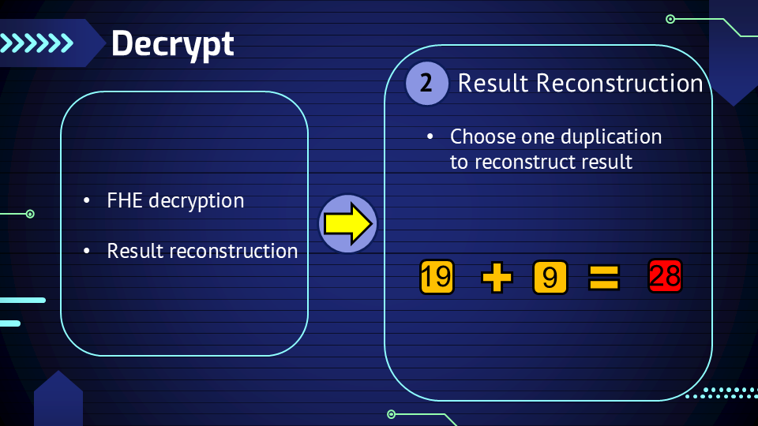

The final step is Validate. Validation requires reconstructing all returned message blocks. If the reconstructed results are consistent, the data is considered trustworthy; otherwise, the result is in trouble.
Consider this example: We also have a set with `13` and `15`. Adding them gives us `28`, consistent with the previous results, indicating that the data is trustworthy.

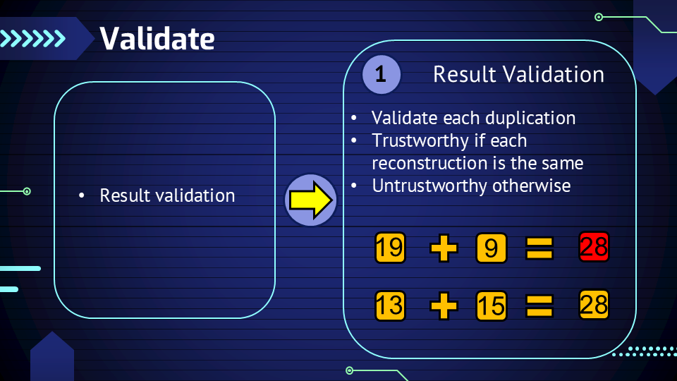

Now I’ll go through another example, when evaluation under multiplication.

In policy formulation, I set the policy to the last four bit.

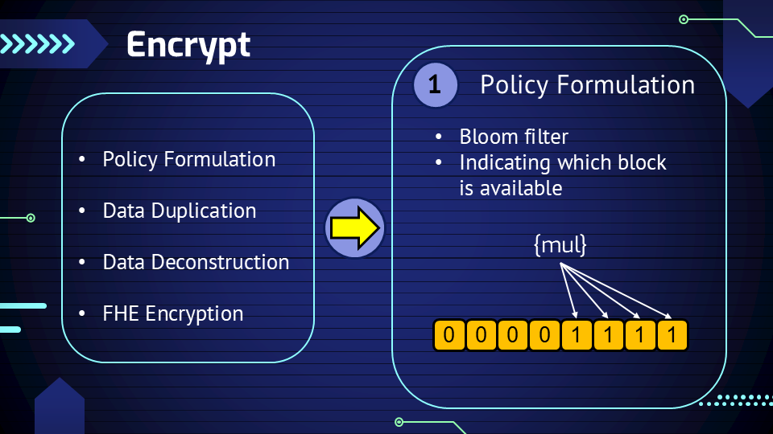

The rest of steps in Encrypt are the same as under addition, so I’ll skip them.

Evaluate is similar as well, but the result policy goes to the last four bits.

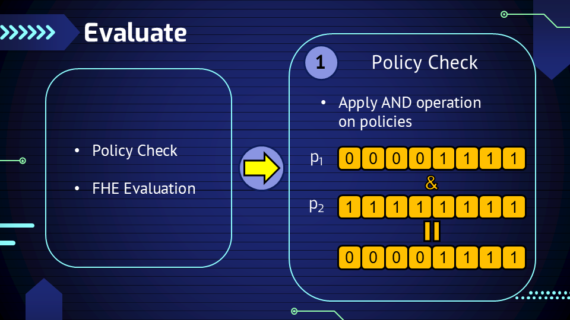

The FHE evaluation is taken under multiplication with `m1` equals to `8` and `m2` equals to `20`. So the expected result should be `8` times `20` equals to `160`. The result after FHE evaluation is as follows.
- `1 * 4 = 4`
- `8 * 5 = 40`
- `2 * 10 = 20`
- `4 * 2 = 8`

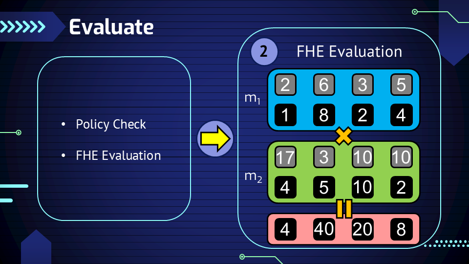

Again, we decrypt these results and reconstruct them. We use the first returned set `4` and `40` to gain the final result `160`, which matches our expectations.

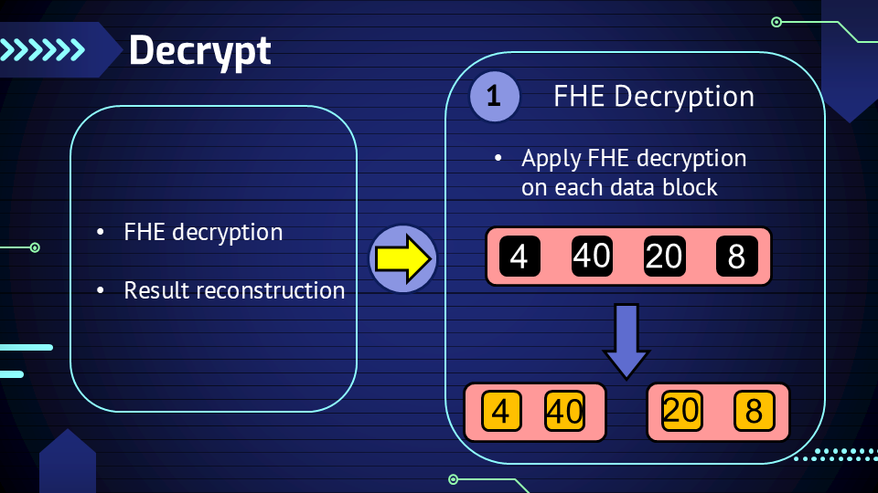
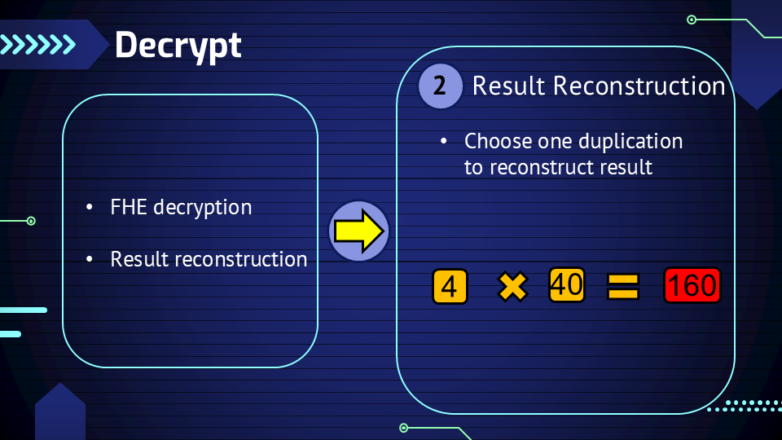

Validate will take the other set into consideration. So we take the `20` and `8`, multiply them together and gain the result, still equals to `160`. Thus, now we can say the result is trustworthy.

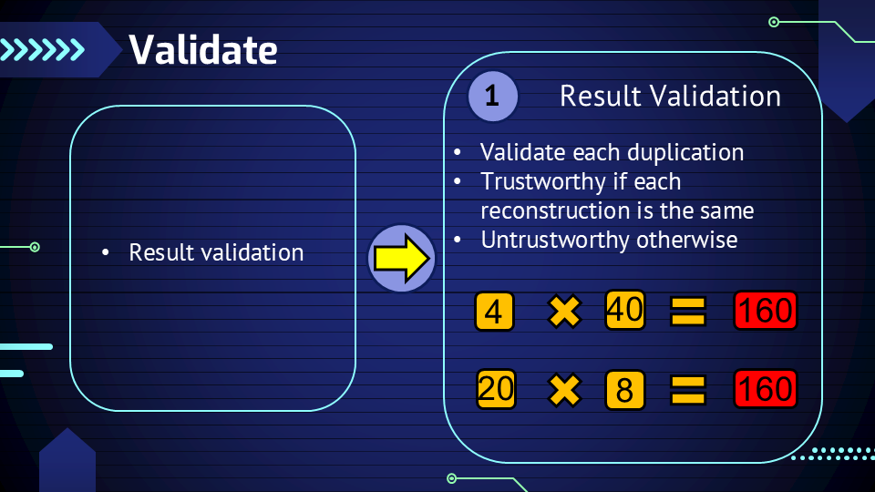

## Properties

FHEwEC has four key properties: **Correctness, Completeness, Soundness, and Security**.

### Correctness

Correctness means that **the results obtained using FHEwEC are consistent with those obtained using traditional FHE.** This was demonstrated in the earlier section and is formally proven in the paper. You may find that the core concept is due to the commutative law in mathematics.

### Completeness

Completeness means that **if the third party performs the expected operation correctly, the result will always pass the validation step.** This is also demonstrated in the previous section.

### Soundness

Soundness means that **if the third party performs an operation different from what the data owner intended, the result will not pass validation — or if it does, the probability is extremely low.**

Let’s see the first example we use in the previous section. Assume the data owner expect the third party to perform addition, and the third party runs multiplication. The third party will return result as
- `2 * 17 = 34`
- `6 * 3 = 18`
- `3 * 10 = 30`
- `5 * 10 = 50`
When data owner conducts the validation, it figures out that `34 + 18 = 52`, but `30 + 50 = 80`, which is not consistent. So the result is not trustworthy.

### Security

Security means that **the FHEwEC scheme is secure against chosen-plaintext attack.** This is because the validation process occurs outside of the FHE operations, adding an extra layer without altering the core FHE encryption or computation, ensuring that its security aligns with that of FHE.

## Performance

We conduct two experiments, one for testing the execution time with respect to the total number of message blocks N while the other for testing the number of duplication under addition `s` and multiplication `t`.

In both experiments, we conclude that when `N` increases, the execution time also increases. Additionally, the encryption time occupies the most. Most importantly, both experiments indicates that the total execution time of whole scheme is less than one second, which means that we can efficiently apply FHEwEC but solve the problem we mentioned previously.

Again, you can view the details in the full paper.

## Our Contribution

We **identified** that even in an environment secured by fully homomorphic encryption, there are still potential risks when delegating computation to a third party. To address this, we proposed the **FHEwEC scheme** and **successfully implemented** it.

## Future Works

1. Evaluation Type
    In FHEwEC, only ring operations are supported. However, true fully homomorphic encryption should support any operations it can performs. Therefore, our first goal is to generalize this scheme to support all operations supported by FHE.
2. Evaluation Depth
    Additionally, FHEwEC does not support the multi-hop feature, meaning it cannot handle operations with a depth greater than one, significantly limiting its applicability. That is also the reason that the execution time of FHEwEC is so fast.
3. Illegal Reason
    Finally, while this scheme can identify issues in third-party computation, it cannot guarantee the reason leads to this is really the third party. This is because pollution may occur between transmission. After pollution, the data must not pass the Validate algorithm and thus consider the result as not trustworthy.

## Comments

This work was authored by Kuan-Phing Wang and Bo-Yu Chen, under the supervision of professors Po-Wen Chi and Chao Wang.

The study has been published in 2024 Asia Joint Conference on Information Security (Asia JCIS) and gained best paper awards. It also has passed the 113 College Student Research Scholarship National Science Committee.