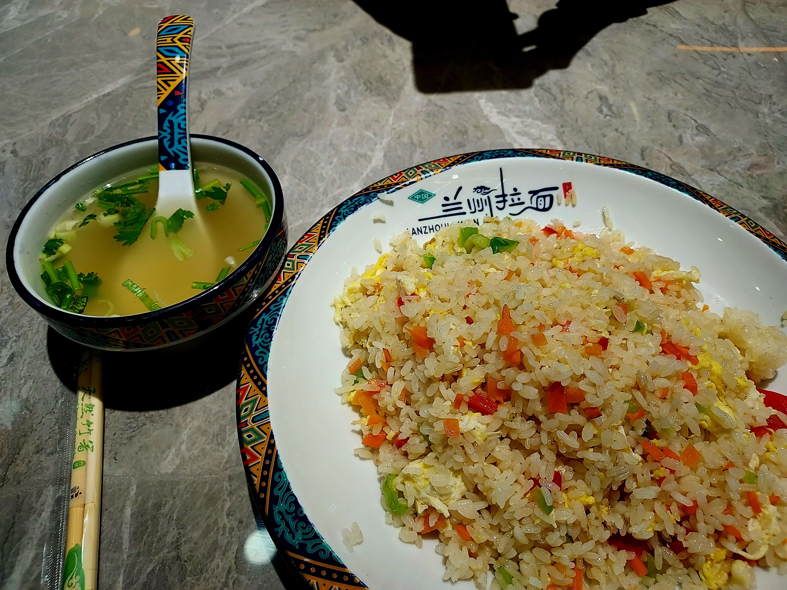

> 20250516 13:30 桃園國際機場 第二航廈集合

學期第十八週出國其實是個賭注，很怕學校突然有事要處理，尤其這學期又身兼兩門課助教，果然出國前一天資安攻防演練第七第八次作業才剛截止，我必須在一個禮拜內改完作業、給大家確認完所有作業、考試的成績，才能讓老師時限內跑完後續流程

* 上海畢旅：:x:
* 上海改作業：:o:

## 對於候機室的想像

初飛的我想像中是候機時有個舒服的候機室可以休息，旁邊有杯咖啡可以配著，等待登機時刻，所以行前討論時就有跟 Jo 討論到這一環

```
Me：是說登機前是不是有個候機室啊？這樣我提早到是不是可以在裡面改作業？
Jo：候機室在很裡面餒，要拖運完行李、安檢完等待登機前才會到
Me：ㄟ？是喔？但如果外面沒什麼事情了，提前進去是不是也可以啊？
Jo：對啊！我們可以早點處理完，讓你進去候機室改作業
Me：好ㄟ！
```

不過事實跟我想像不太一樣就是了，原來候機室就是有一排位置、有按摩椅、有廁所、有飲水機、有落地窗看飛機、有插座，沒了，或許我想像中的那個叫做貴賓室吧！不過看在有插座、有位置的份上，足夠讓我在登機前稍微整理一下需要批改的作業了，在這般順便說明一下，資安攻防的最後兩次作業 HW07 和 HW08 分別是 VPN 和 path traversal 的 lab 設計，比較出乎意料的是 VPN 那份完成人數多到超出預期，原本是要在機場就完成批改所有作業，看到這麼多人寫作業，也只能分次批改了 :)

## CI506 航班

接下來是初飛者的所見所聞，所以會有很蠢的發現並對很 normal 的事情感到驚訝

Jo 在事前有跟我說，可以注意有沒有寫機上有的飲料，除了熱的飲品咖啡熱茶不要喝以外，其他有看到的都可以點，比如說薑汁汽水，不過這次航班只看到被說不要拿的就是了

個人認為比較特別的有三件事情，一個是特殊飛機餐會先上，所以即便是經濟艙也會有 vip 感（~~這個人在做夢不要管他~~），一坐上去空姐就會過來問「是不是陳先生？有一個特殊餐點對嗎？」，餐點也會是該艙等數一數二先上的；第二個特別的是耳機吧！原來有些（有些？看到第五天就知道了）飛機的有線耳機是兩個孔的，而且剛好這班飛機的耳機孔是在手把，如果沒有旁邊乘客使用我可能要找好一陣子；最後就是飛機上的片單吧！其實我覺得滿新的，也滿懂多數人的口味，像是裡面就有吉伊卡哇，而且放眼望去是有一小部份的人在看的

如果說耳機孔有兩個，是不是可以插進兩台手機裡面做混聲？

【一張飛機餐】

```
[降落前]
飛機：加速
Me：？？？
[過一陣子]
機長：原定是準備降落，但因為前一班班機遇到鳥擊，所以跑到目前被占用中，我們會在上空再繞一圈等待塔臺告知可以降落時再行降落
Me：（看一下時間）是不是提早了 ... 半個小時左右？
```

下機後踏上上海這塊土地，又是陌生的開始，不過這次換兩個人都陌生了，畢竟兩個人都沒體驗過上海入境的流程，第一個尷尬的問題應該是入境要走外籍遊客還是中國公民吧！雖然怎麼想都覺得走中國公民就算錯了他們的立場也不能說我們有問題，好在公安很快就有告知我們怎麼走

```
Jo：請問拿台胞證的要走哪裡？
公安：這裡，中國公民
```

跟預想的一模一樣！

這邊第二次謝謝 bing 姐，差不多時間就透過微信問我們的狀況，甚至連網路可能翻不過去都設想好了，真貼心！

## 地鐵

又是一個第一次，第一次嘗試上海地鐵，跟臺灣這邊對比應該比較像臺北捷運，除了舒適度、乾淨度、班次和禁止飲食這些規定像北捷以外，網路圖也是我認為相向的原因，上海地鐵有約 20 條路線，每條路線都會有一些與其他路線交會的轉乘站，比如我們第一天從機場出發的二號線轉往酒店的一號線就是在人民廣場站進行轉乘，不過上海地鐵的常見轉乘距離就比較像環狀線這樣超級遠，像上下樓層就可以到不同路線、甚至是同個月台會有兩條路線選擇的情況少之又少，或許是因為地鐵站人流龐大，要在小月台同時塞入這麼多人也不是件容易的事吧！

相比下不一樣的點有兩個

1. **進出站透過支付寶乘車碼掃碼**
    其實就是透過各種行動支付方式付交通費，當然也有固定機台售票或是票卡式的支付方式，但大多數都是直接掃碼支付了
2. **每次進站都要安檢**
    只要是揹後背包或手提一個大一點的袋子就要放上輸送到過安檢機器，雖然是偏麻煩，但可以看出中國對於安全性是非常重視的，可能很怕一個不小心放不該放的東西進去會出大事，從[網路文章](https://www.xinmedia.com/article/301276)來看似乎可以追溯至 2008 年北京奧運防止恐怖攻擊而設立的規定

這趟旅程同時也紀錄很多用語、語錄、廣播，其中一個便是地鐵站聽到的總總，就在這個章節一併分享

* 「列車內嚴禁乞討、賣藝、兜售、散發小廣告等行為。使用電子設備時，禁止外放聲音。不得在列車車廂內飲食」
    * 對我們而言，賣藝這件事情滿酷的，但根據 bing 姐所述，會這麼廣播就代表之前有人這麼做過
* 「出站的乘客請手持車票，依次通過閘機（~~炸雞~~）驗票口出站」
    * 這句廣播似乎滿為人所詬病的，，就是因為那個閘機讓人很出戲

## 東方 ROSE 酒店

我們選擇酒店的規則大致如下
1. 四晚價格可以壓在 5000 新台幣
2. 有 24 小時免費 Wi-Fi 供我改作業
3. **可接受台胞證**
4. 看起來乾淨舒適

其實就是很基本的要求，唯獨第三點要特別注意，根據 bing 姐之前的敘述是有些酒店確實不收台胞證，如果事後才發現這種狀況，還要臨時找新的下榻處很麻煩，不過基本上正常的酒店是不會遇到這種問題的

```
bing：你們如果不想花大錢住高級酒店，也不用擔心花低價會住到不好的酒店，因為會收台胞證的酒店通常都不會差到哪裡去，所以你們也沒這個命住到
```

這四個晚上我們選擇入住的是靜安區的東方 ROSE 酒店，交通方式就是搭乘地鐵一號線至延長路站，再走路差不多 10 分鐘，交通是滿方便的，周遭飲食也全不用擔心，以早餐來說，有一間長記油條，市場內應該還有更多，而且麵店其實早上就開始營業，往地鐵站的路上也有一間瑞幸咖啡；以正餐來說基本上店家 21:00 都還燈火通明，有些甚至營業到晚上 12 點，一路上很多麵店；以宵夜來說，23:00 以後還能看到老長沙臭豆腐、雞排等等；以手搖飲來說，附近有間蜜雪冰城；以夜生活來說，至少有兩間 bar，晚上人士真的頗多（~~注意這個幹嘛？~~）；以機能來說，酒店對面有全家、走道路口有雜貨店（好德），往地鐵站走也有很多雜貨店，也有一間大間的一掃光零食。推測是因為附近有上海大學，加上住宅區的關係，生活機能是很好的（~~不過大家不是都叫美團外賣嗎？~~）

不過入住也是有遇到一些插曲，我們原本是透過 trip.com 這個網站預定，到現場才發現原來沒有刷成功，只是暫時保留而已，聽到這個消息是緊張的，主要是怕匯率漲了住宿費比預期貴，結果看了一下匯率應該是比預定當天便宜，不過加上國外交易手續費就更貴了 :(

房間內部就一張大小可睡兩人的單（雙？）人床、一個圓桌、一張椅子、一臺電視、乾溼分離的浴室，馬桶是免治馬桶，我的房間比較奇特，第一個點是浴室滿小的，洗手台甚至在床邊，猜是建築格局的因素才這樣設計，不過個人覺得這個設計偏爛，第二個是不需要插房卡就可以用電，包含冷氣，第三點是窗戶關不起來，雖然因為窗簾很厚不影響冷氣使用，但說實話路邊的說話聲和全家開門鈴聲在晚上非常清楚，要說影響睡眠是絕對有的

最後獨立出來說這間酒店的問題，也是我們一開始列條件沒注意到的：冰箱！這間酒店的房間沒有附冰箱，對於手搖飲、冰品或其他冰冰涼涼才好吃的點心非常不適合，可惜了

## 晚餐：蘭州牛肉麵平型關路店 蛋炒飯 + 香菜湯

Day 1 的晚餐是酒店附近的蘭州牛肉麵店，因為下榻時間差不多就八點半了，給我們放完行李收拾一下也差不多九點，剛好附近這家有素食又開到晚上 12 點，就成為我們的在上海的第一餐

我點了一盤蛋炒飯，隨餐附上了一碗香菜湯，價格是 13 人民幣，換算台幣約 54 元，也算是符合我們心裡的期待，果真上海物價在這種非都會區還是便宜的，至少平常的一餐不用台幣 80 以上



比較有趣的是在我們快吃完後，發現隔壁桌放了八盞茶，過一陣子又放上幾盤瓜子，頓時感覺到這間店等會會很熱鬧，再過一下連小蛋糕都出來了，老闆應該是新疆那一帶人，講話其實我們聽不太懂，猜測是同鄉準備開同樂會吧！

不過確實酒店附近一帶似乎很多新疆人，從販賣一堆新疆烤羊肉串就猜得出來了

## 蜜雪冰城

拿臺灣的飲料店對比，蜜雪應該是 Coco 的程度，差別是物價和賣的東西不太一樣，這次點的是新品蜜桃四季春，可能是因為新品特價的緣故，一杯只要差不多 32 台幣，認真覺得 Coco 要檢討一下，除了純茶很難找到這種物價了吧！

```
店員：[驚慌失措貌] 蟲子啊！
Jo：[過去幫忙：揮拖把 + 徒手把蟲子抓下來]
```

:heavy_check_mark: 每天一杯手搖飲 (1/5) 

## 改作業

第一天的最後一個行程是在睡前看看資安攻防第七次 VPN 的作業，沒想到的是有超過 20 個人交作業，這完全讓我沒辦法在短短一兩小時內改完，但有想到的是一定不乏直接使用 AI 產生的作業，雖然整份檔案都用 AI 產生著實有點過分，痕跡沒消除的更過分，但最後一次作業了，只要是正確的好像也沒辦法特別說什麼？

這邊可以分享一個有趣的事情，一開始知道飯店網路一定會被牆，所以電腦開機後有特別試了幾個網站，像 overleaf、GitHub 就是完全可以正常運作的，不過為了從中國的牆內翻出來，除了在手機網卡下心思，對電腦就需要 VPN 來做到，記得是 Jo 說可以試試看拿學校 VPN 翻，因為曾經有人成功過，所以這次同時準備好師大和交大的 VPN，沒想到交大 VPN 一試就成功了，只能說偉哉交大，還沒入學就給我這等待遇！