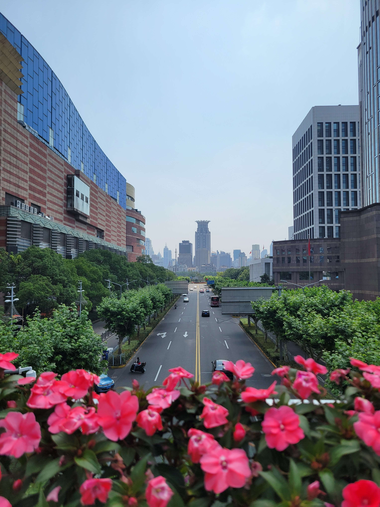
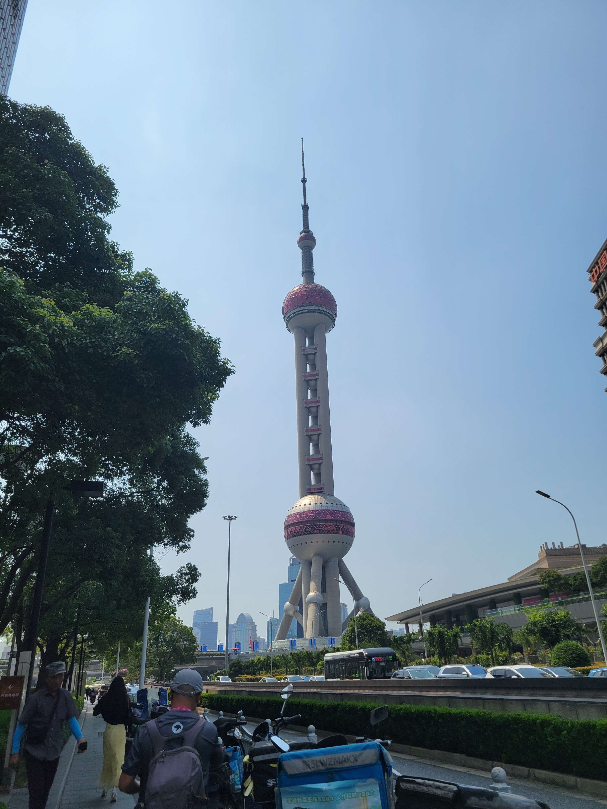
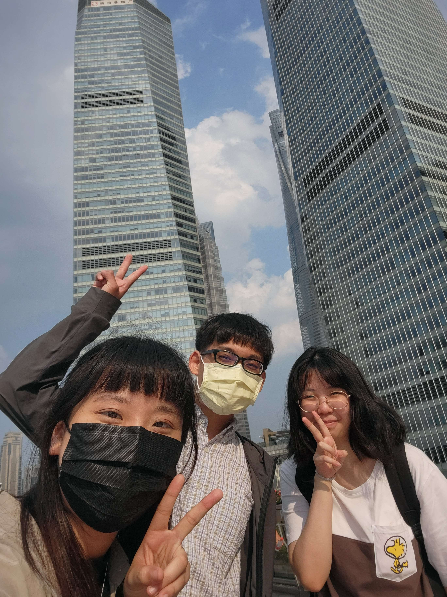

第一晚其實沒有睡好，可能是因為在陌生的城市、可能是因為認床、可能是因為窗戶關不起來所以一直聽到樓下有兩個阿伯聊天，總之因為這樣我六點爬起來改作業，很抱歉有瘋狂助教在早上 7:30 發公告，打擾大家了 :)

在開始第二天行程前，來說說之前耍笨的故事。其實這天的下午行程原本要塞米哈遊公司參訪，起因是跟 my bro 聊天時他提到既然都去上海為什麼不要順便去看一下原神的公司，身為有在玩原神的旅行者自然就不會錯過這個機會，於是上網找了好多人參訪的故事，發現不用門票，只要登記就可以進去參觀一樓，即便能看得不多還是覺得這是整趟旅程讓我最接近本科專業的地方，也很開心 Jo 和 bing 姐兩個沒有進入米哈遊教派的人願意花時間跟我一起去朝聖。但為什麼說這是耍笨？因為我沒看清楚開放時間，是假日和國定假日才有開放啊！平日並沒有開放我們這種路人參觀，所以這個插曲就這樣啪不見了

```
派蒙：前面的區域，以後再來探索吧！
```

## City Walk - 南京步行街

第二天的行程規劃是早八人民廣場集合，在一路從步行街走到豫園、外灘、搭地鐵過去陸家嘴，下午再到田子坊，簡單來說就是類似於行軍的城市旅行，一天的時間看遍上海最經典的景色

```
> 插曲：人民廣場一號出口就是個錯誤

[前一天]
bing：你們跟我說集合時間地點就好，我會準時出現在那邊，但要講清楚地鐵站哪個出口，因為上海地鐵的出口很多
我：好... 那就約個 8:00 在人民廣場站一號出口好了

[當天]
bing：為什麼選一個這麼遠的出口！
我：我不知道啊！我看高德覺得這邊最棒了！
```

不過八點的步行街是個錯誤，因為什麼都沒有，就是百貨公司前的小廣場會看到大媽大叔們在跳廣場舞，也是見識到當地小特色了！

早餐照計畫是步行街進去滿前面的 [Beigel Tree](https://tw.trip.com/moments/detail/shanghai-2-130993221/)，但正是因為時間太早了，所以還沒開，連下一間想逛的 [M&M 旗艦店](https://www.mms.com/en-us/explore/mms-stores/shanghai)也還沒開，所以給想 city walk 的未來旅客們建議，差不多 10:00 左右在這邊會比較適合，雖然一大早的步行街沒什麼人是真的很開心很舒服，但連店也沒有就很尷尬，不過如果為了沈大成這種排隊名店的話，看準營業時間早點來是好的，第五天的遊記會再提到為什麼

```
> 插曲：熱情的上海大姐

[尋找早餐途中]
大姐：你們是外地客吧！在找早餐嗎？說吧！你們想吃什麼？油條？豆漿？生煎？
Jo：呃... 生煎的話呢？
大姐：生煎吃 !@#$%^ 的，不要吃 !@#$%^& 的，那個是假的不好吃！我在這住久了，外地客都看的出來
```

接下來是文化衝擊的部分，低消和禁帶外食這件事在上海並不常見。
最後早餐的部分 Jo 在一間店買了粢飯糰，我在另一間店買了煎餅，bing 姐說粢飯糰的店有座位，可以直接待在裡面吃。畢竟我的煎餅是外食，在我的認知裡是覺得帶進去應該會被賣粢飯糰的姐姐瞪吧？不過 bing 姐一再保證不會有這件事發生，也確實姐姐根本沒對我們怎麼樣，還很好心的幫我收垃圾，總之謝謝姐姐！

走在步行街上，就像 YT 影片說的「排場很大」，放眼望去街道兩側的扛棒都滿大的，螢幕牆的大小和數量也絲毫不遜色，整體就是營造出現代的氛圍，但搭配著歐式老建築的風格，似乎也透露著一點點歷史氛圍。沿路走到外灘，每一段似乎都有代表性的主題，比如說最接近人民廣場那端就是百貨公司林立，也剛好起頭那端就是新世界百貨；中間有一小段會是伴手禮、土產集結的店面，除了上海伴手禮店以外，沈大成、大白兔等也會出現在這一區；再來到 MINISO 那段個人認為集結比較多次文化的元素，除了 MINISO 還有吉伊卡哇快閃店、百聯 ZX 創趣場螢幕牆上甚至一直閃出即將上映的柯南廣告，當然 POP MART 也是出現在這一帶的；最後一段就是從南京東路地鐵站到外灘一帶，這邊就偏高檔區，比如說一整排錶店、最顯眼的全季酒店就在這邊

也是因為這趟旅程讓我認識 MINISO 和 POP MART，MINISO 感覺是賣很多周邊商品的店家，讓我覺得比較酷的是因為裡面甚至有馴龍高手和哈利波特，很慶幸在支付非常方便的情況下理性還是有克制住自己的手，沒有帶走一隻沒牙或嘿美回家，~~不過身旁的 Jo 似乎是快克制不住了~~

## City Walk - 豫園

豫園是我在行前做功課時最想去的地方，首要原因是人工打造出的山水庭園感很吸我眼睛，其次是影片上看到過年期間金碧輝煌的豫園商場。不過商場真的有驚豔到我，相比在步行街覺得建築、招牌的排場很大，在豫園感受到的是為什麼銀樓這麼氣派，那邊的銀樓通常都是一整棟的，不然就是占據整個街角，而且不是偶爾出現一間，是整個商場內遍布，要說特色還是上海人真的喜歡逛這些金銀珠寶呢？

走在豫園的九曲橋上，美是美，但讓我在這邊吐槽一下，可以不要在每個漂亮的地方都置入廣告嗎？這樣其實滿煞風景的



美中不足的是午餐，我們決定在附近的路邊攤簡單品嘗一些上海小吃再繼續行程，因為天氣實在是太熱了，我點的是雪梨銀耳湯，首先它好甜，再來它很小碗，最後一小碗要價 75 台幣，我覺得我被坑了，果然看評價、看人潮是很重要的。Jo 品嘗的是排骨年糕，我們以為上海的排骨年糕是合在一起的，就像 wikipedia 上的那張照片一樣，不過端上來似乎是開箱到另一個版本的排骨年糕，它不是排骨年糕，而是排骨．年糕，簡單來說他們是分開來的，炸排骨是炸排骨、炸年糕是炸年糕，也算是一個嘗試啦！

最後還是決定付費參觀，看一下付費版本的豫園究竟多漂亮，和外面商場的差別就是裡面沒有商家、沒有推銷，只有滿滿的古物風景，人潮是一樣多，只是付費版豫園內部峰迴路轉，行走上更不容易了，但完全推薦第一次來豫園的人可以進來參觀一次！



這邊留個小叮嚀：一開始我們以為豫園是要購票的，因為網路上一直講門票多少，是 bing 姐跟我們說上海這種景點都不需要門票，除了特別的區域以外，而通常這些區域也不完全到有花錢進去的價值，在外面逛免費的其實就可以了，所以就見仁見智，想進去的再現場買票也行，記得臺灣學生證是可以用的，學生票可以折 20 人民幣下去，還是有差的，如果發現售票的姐姐看到台胞證和臺灣的學生證有點措手不及，請給他們一些時間

## City Walk - 陸家嘴

黃浦江西岸，也就是外灘，有著萬國建築博覽群，保留較多文化歷史感；浦東則是陸家嘴三件套，是現代化建設象徵，兩側差異頗大

出了地鐵站，近看東方明珠覺得滿呆的，或許夜景的東方明珠會更有意思



路家嘴這邊有間迪士尼旗艦店，預期我們是要在這邊找到木須龍，但才發現裡面一點木蘭的東西都沒有，反觀動物方程式和史迪奇是最熱門的，不過旗艦店裡面最低消費金額是 99 人民幣，消費前還是要衡量一下！


    
    
    


```
bing：你是鐵人吧！不坐也不喝水
bing：椅子！空調！冷氣！
```

為了避暑最後在圓環上的天橋繞一繞拐進正大廣場，某種程度上來說也是為了內部的飲料店 aka 我們的上海手搖護照第一位霸王茶姬，霸王茶姬的人潮真的很多，這次就點很多人推薦的伯牙絕弦，我很喜歡霸王茶姬很重的茶味，霸王茶姬和一般飲料店不同的是使用三品管（最近是不是越來越多飲料店用三品管了？），網路科普一下是說三品管設計靈感來自品茶概念：「一品茶香、二品茶味、三品茶韻」，可以喝到不同層次，~~就像網路一旦限流就會體會到它的美好~~

## 田子坊

上海田子坊的行程是因為米哈遊參訪的行程被取消而誕生的行程，剛好在日月光中心附近，所以吃飯前就進來晃了一圈。田子坊一開始應該是藝術家進駐形成的聚落，後來還是變成偏向一般老街性質，小店很多，但多少還是看的到一些些文創藝術感。bing 姐說上海的老街千篇一律，逛完豫園商場基本上其他地方都不太需要逛，就長那個樣子，到田子坊確實有這種感覺，千篇一律中展現自身風格的部分並不多

日月光中心只是為了吃飯，它就是百貨公司，行前做功課的時候一直在想它跟我認識的日月光有沒有關係，走到大門口就確定一模一樣了，這個熟悉的 logo...



晚餐選擇的是害我們一直鬼打牆的紅脣麻辣拌，不知道為什麼看著高德地圖但一直找不到店家，一開始以為這是串燒店，但沒想到性質改了，變成選好要吃的串燒在選擇要拌麵還是湯麵，沒變的是都是辣的（扣分），我是不太吃麻醬麵的人，主要原因是我不喜歡麻醬的感覺，就像涼麵的醬也不喜歡，但這間不錯的地方是麻醬好吃，撇除會辣會燙以外，其實我還滿喜歡的，啊還有價格不划算，讓我回到臺灣物價，（喔你問多少嗎？24.3 人民幣，差不多 100 台幣，但就是跟之前享受的物價差很多），不過這種店本來就這樣

五六點的上海和臺灣一樣艷陽高照，想看夜晚版本的琉璃藝術館還是一搓鬃毛而已，看不出燈光效果也拍不出好看的照片



```
[在附近的藥局]
Jo：請問這邊有正骨水嗎？
店員：這裡沒有正骨水喔！（一臉疑惑）
```

## 超市 - 大潤發

兩萬五千里長征的 city walk 到晚上還沒停歇，回到延長路後我和 Jo 繼續往地鐵站附近的大寧國際商業廣場，主要是尋找 Pop Mart 和其他伴手禮，不知道為什麼總之在這邊看到大潤發有一種奇妙的感覺，一部分是驚訝原來這邊也有，一部分是驚訝它怎麼還沒改名大全聯，一部分是驚訝大潤發開在這種地方很不搭

這也是這趟旅程學到的，不同地區的超市、雜貨店很值得進去逛一下，隨著地區的文化習慣不同，其實從這些日常生活會去的地方就能很明確看見當地人的習慣，像在大潤發裡面注意到除了飲食上的差異，另外就是超市 slogan 或一些警語，比如說海鮮區的警語在臺灣可能是「請勿動手」之類的，在那邊是寫「親～缸內有凶猛海鮮」，喜感剩餘警示意味