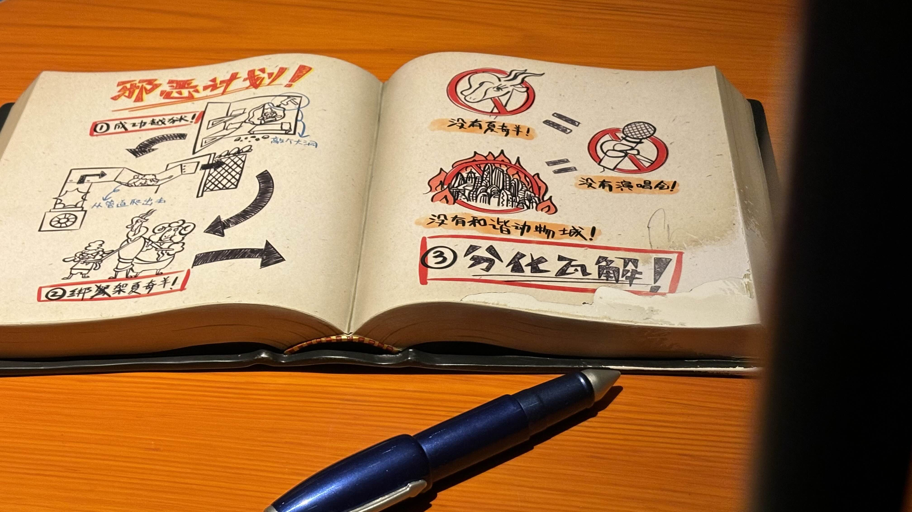
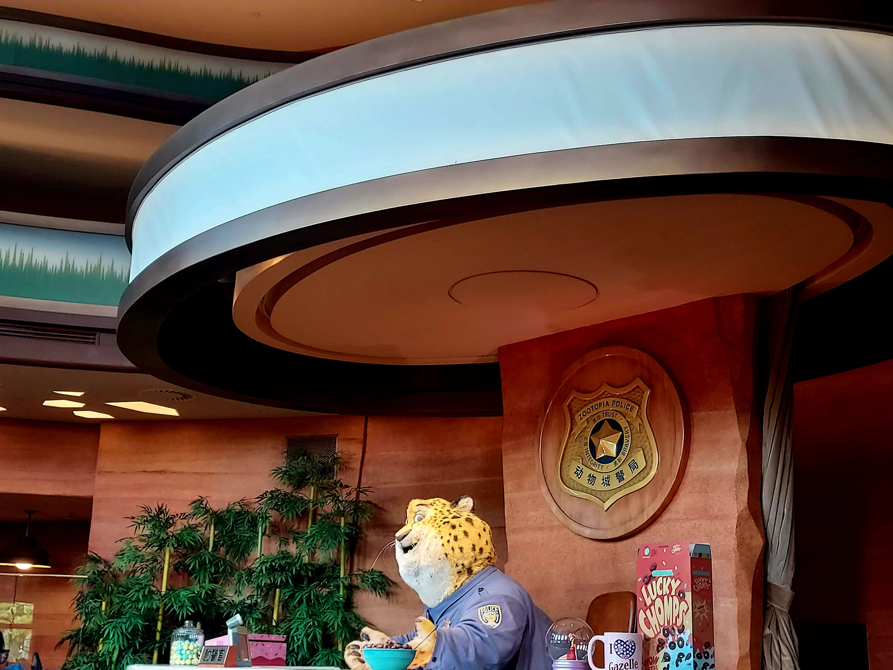
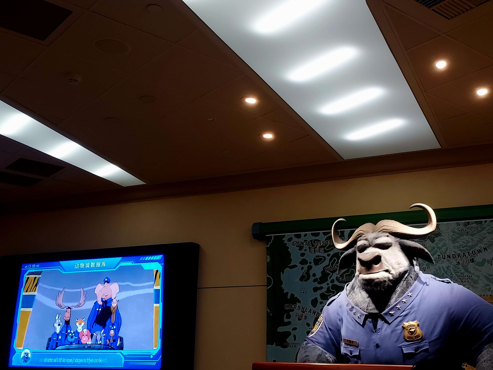
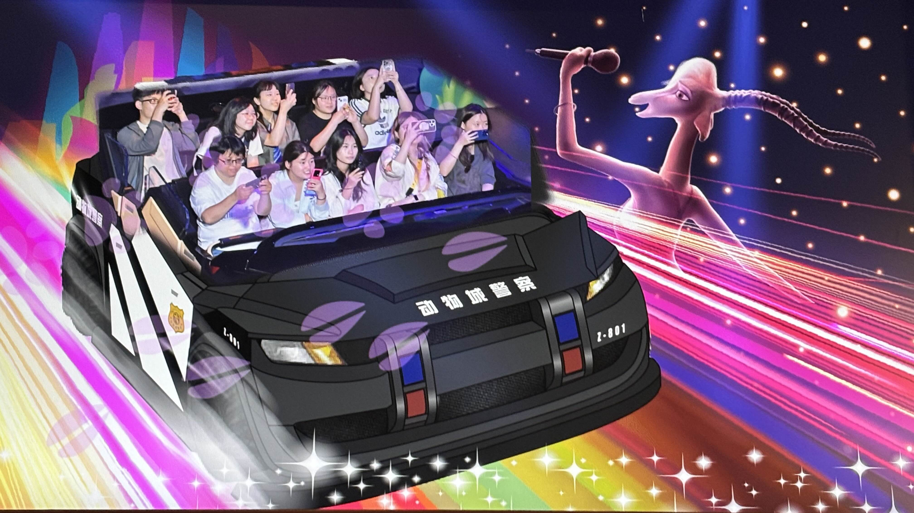
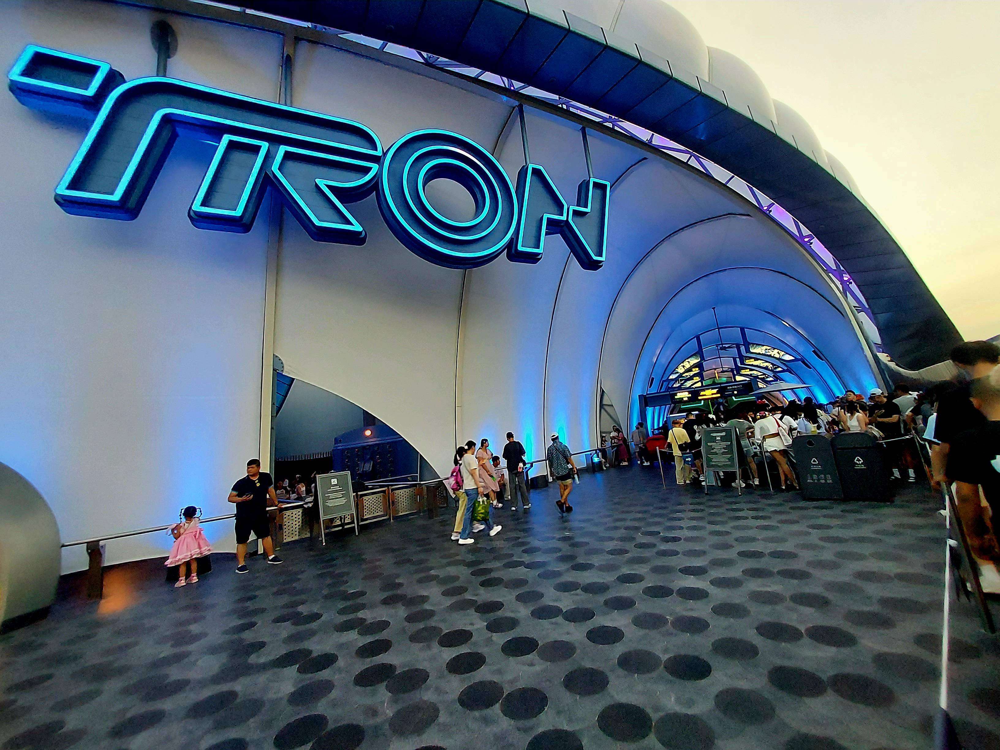
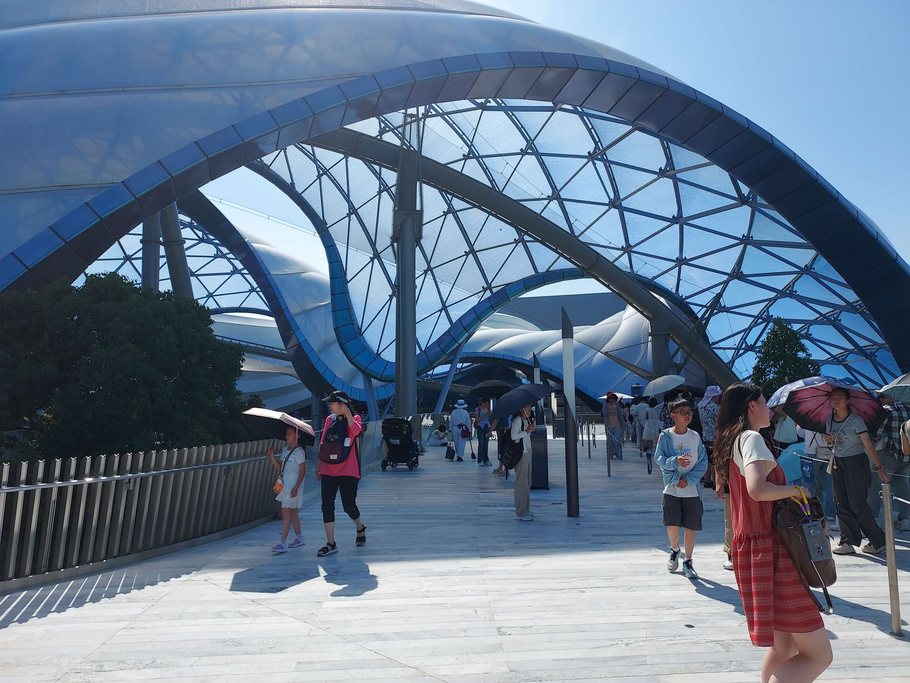
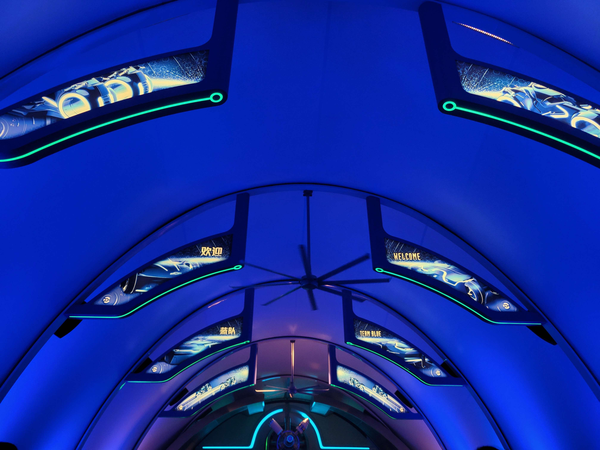
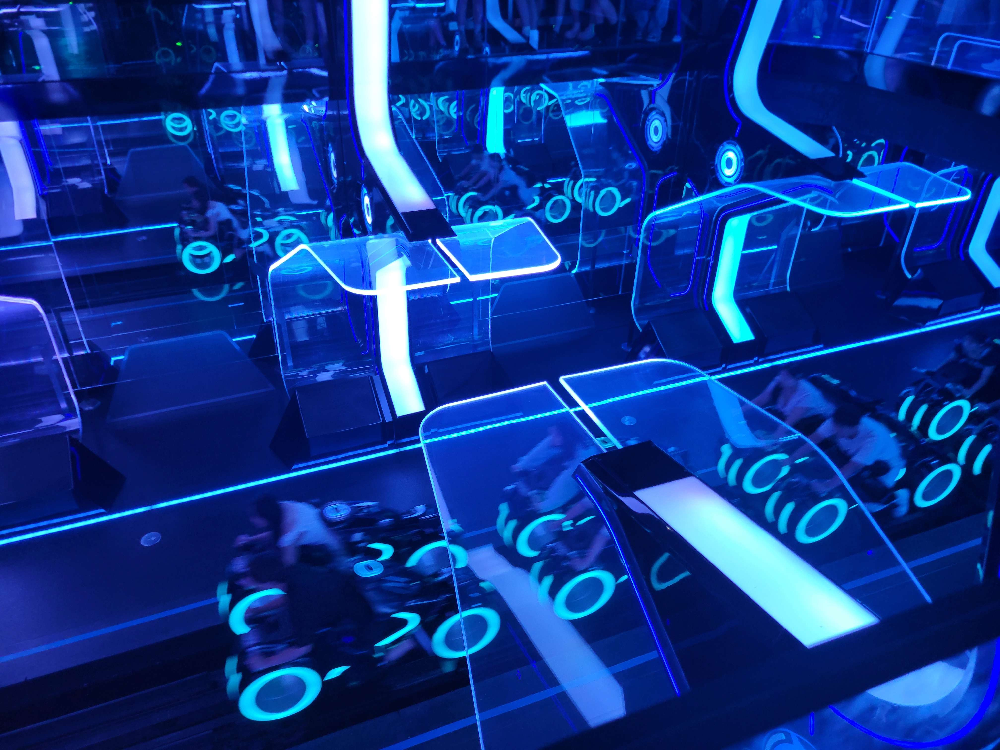

五天的行程最肝的一天：上海迪士尼，就像在肝原神一樣

六點半要出門，搭兩小時的車到迪士尼，玩到 21:30 再準備另一個兩小時回飯店，稍微可以懂為什麼有人花一樣的票價卻願意晚一點到迪士尼早一點離開，背後選擇都是有原因的

迪士尼雖然是西方的東西，卻沒有抹殺當地文化，比如上海迪士尼以中文版聞名，很出戲和尷尬是真的，但卻某種程度上保留了一些東方痕跡

## Stage 0. 入場開錨點

我們選擇在八點半前就到迪士尼門口一起進場，一路上需要經過三個傳送錨點，入園、安檢、過票，據說只要人群有在動就該慶幸了，因為在入園時間抵達，所以只花一個小時左右開完三個錨點成功進去（該高興嗎？一小時欸），不說我以為我在風之谷，入園真的像是一坨王蟲過境

迪士尼的安檢比我想像中還要仔細，每個人都像是機場被掃出可能藏有違禁品的嫌疑犯，包包被一層一層剝開，工作人員拿手電筒邊照邊問「這是什麼」，bing 姐帶了巨人的資料夾就被攔下來兩次，~~可能是因為怕 bing 姐拿著巨人嚇園區的小朋友吧~~

## Stage 1. 瘋狂動物城：熱力追蹤

第一關直奔最裡面的**瘋狂動物城：熱力追蹤**，這是只有上海迪士尼才有的園區

雖然排隊排了快一小時，但迪士尼的排隊除了外面曬太陽以外，進到室內就會有互動的子設施，比如說豹警官跟我打招呼，順便冠一個新進警員的身份讓我知道接下來要 cosplay 哪個角色，也經過警局的辦公區更沉浸在情節裡面，透過監獄的對話讓我知道這個設施的目標是要抓到逃跑的壞綿羊，還有脾氣暴躁的牛局長把我們趕上設施，可以說進到室內其實就開始享受了，這大概是迪士尼要排隊很久但大家還願意的其中一個小原因吧！

整體設施是一個沒有軌道的車子帶著我們追緝壞綿羊，搭配上車速、360° 都可能的移動方向、半圓形劇場螢幕，臨場感很逼真

不過迪士尼的物價也高到我很害怕，一支 zootopia 的冰棒要價 45 人民幣，甚至還有一個小攤位偷偷漲價賣 65，我要強力抵制！

在第一關結束前，讓我吐槽一下，其實我覺得臺灣對國外電影翻譯真的做的不錯，印象中翻譯團隊把動物方程式裡面的各個角色盡可能的 map 到真實人物，比如說洪金豹、獅明德、大明星志羚，但上海這邊就很直白的豹警官、牛局長，前期好人後期黑化的羊咩咩市長在這裡直接稱之為壞綿羊，就少了一點鋪陳的感覺，太直白了


    
    
    
    


## Stage 2. 加勒比海盜 - 沉落寶藏之戰

第二關還是排隊地獄：**加勒比海盜 - 沉落寶藏之戰**，有個警語是「可能會濕身」，但不到要穿雨衣的程度。這關排隊時間比較短，但它也是經典關卡，只是比對到晚上六七點的排隊時長看它 20 分鐘就排得到，反觀動物方程式或光輪還要將近兩小時，就知道熱門程度高低了

加勒比海盜有些人會稱作海盜船，但它跟認知中的海盜船一點關係都沒有，就一樣是乘坐交通工具一路漂流，並沉浸式的和傑克船長一起找寶藏的過程

至於為什麼會濕身？一開始以為因為他的交通工具是船，它是走水路的，所以會有向下衝刺讓水淹進來，加上當時我坐最邊邊，其實滿緊張的。事實證明不是，中間傑克船長和敵方開打時，有一個橋段是開砲，迪士尼為了模擬砲彈打到水面上的效果，還在水面下放機關讓某幾個位置會有水噴濺上來（好壞），如果迪士尼存心想搞我的話，這一 part 一個不小心真的會全濕，雷鳴山漂流還沒的衣服就濕了，雨衣也用不到了，不過這也是虛驚，迪士尼喜歡搞這種一而再再而三的騙局，在大家都以為水要從下面濺上來的時候，迪士尼讓水從上方噴下來，就是真的噴下來，但量不多，衰的人會全部接下去，才會全濕，不然只會滴到幾滴而已

除了整個過程和動物方程式一樣讓人驚豔以外，有一個很酷的是迪士尼把加勒比海盜這邊的餐廳放在設施旁邊，簡單來說當遊客搭著海盜船經過在那邊尖叫的時候，另一邊會有人看著你在吃飯，對於吃飯的人來說應該也是一種享受吧！

## Stage 3. 雷鳴山漂流

第三關是數一數二慘的排隊地獄：**雷鳴山漂流**，對我們這天就是要在時間內把幾乎所有經典關卡都走過一次。雷鳴山漂流是被強調要穿雨衣會濕的關卡，就連還沒上漂漂船就會被要求要先把雨衣套上，不然可能會被波及，但也是有勇者決心要濕身的啦！在我們前面就有兩個哥哥雨衣都沒穿就上船，給根大拇指

雷鳴山漂流就是漂漂河，對於這個關卡我非常興奮，主要是以前想玩但沒什麼機會玩（嗯以前畢業旅行去劍湖山我找不到它在哪裡，好笨），好玩是好玩，但體感不如前兩個關卡好，原因是要在大太陽底下玩，雨衣的味道滿臭的，還會遮視線，不是你把我視線遮住我會不知道攻擊從哪裡來啊

漂流過程一路上會經過幾個上下坡，有一個比較大的是由暗轉明的那個，那時候整船的三批人馬都很剉，怕自己是那個背朝後滑下去的那一位，不過真正該擔心的應該是出入口朝下，一艘船有兩出入個，非常幸運的情況下會是出入口朝下，對應的兩個人就成為守門員，基本上是守不住的，我跟 bing 姐就是那艘船上的幸運兒

```
bing 姐：邊關失守啦！陳 B 魚！
```

成就解鎖：鞋子襪子濕掉了，謝謝雷鳴山，謝謝迪士尼

至於濕身的時機，其實整場都會濕喔！所以上了賊船就放棄妥協吧！雖然太陽很大的情況下好像很容易乾，但還是盡可能不要，尤其是鞋子襪子，滿不舒服的。雨衣的話可以事先準備好，園區內其實也會有想賺錢的小販賣雨衣，根據那天的經驗，bing 姐在排隊入園開錨點的期間花 5 塊人民幣，雷鳴山排隊遇到的小販開價會到 10 塊，給個參考可以決定要不要園區內買

```
[下船後]
遊客：先生！你身上那件雨衣還要嗎？不要可以給我嗎？我這邊少一件
```

## Stage 4. 風暴來臨：傑克船長之驚天特技大冒險

第四關因為我們幾個都筋疲力盡，所以找了一個獎勵關：**風暴來臨：傑克船長之驚天特技大冒險**，這是迪士尼裡面幾個會有的室內表演，行前功課看迪士尼官網說當天只有遊行和晚上的煙火秀，其他表演都要假日才有，原本以為這場看不到了，結果不知道為什麼當天幾乎所有表演都有開放！

雖然說是室內、有椅子、有冷氣，不過還是要經過比較短的排隊和進場前的說明開場，迪士尼排隊的人潮沒有很兇，但也是有縫就會鑽，如果有想要挑好位置的人也是要花點心注意一下

講中文這點還是讓人想吐槽，但其實我滿想嘗試那個最讓人無語的冰雪奇緣：歡唱盛會，有中文版的隨他去聽完不知道是什麼感受

## Stage 5. 巴斯光年星際救援

第五關是 20 分鐘排隊獎勵關：**巴斯光年星際救援**，體驗一次獎勵關的甜頭就知道有多好，20 分鐘的概念基本上是一直往裡面走，有八成的時間都在室內參觀關卡前的佈置

巴斯光年這關算是給小孩玩的，會有一台兩人乘坐的車，可以調整視角方向和兩隻槍，一隻紅色一隻綠色，這關也會同時幫遊客記分，關卡結束似乎會幫忙做排名，把照片貼在外面。滿有趣的是我前面是 Jo 和 bing 姐，後面是一對情侶，簡單說就是我不知道我會怎麼被分配位置，以迪士尼要排隊的立場，浪費一個位置似乎不太好，但要我拆散後面的情侶更不好了，最後迪士尼工作人員讓我一個人乘坐一台，另一個位置給後背包，還記得前面說一台車上有兩隻槍嗎？沒錯，當下我立刻成為~~全場最帥的~~雙槍俠，感謝迪士尼讓我有這種尊榮體驗！

## Stage 6. 米奇與他的朋友們遊行

第六關是下午時段的**米奇與他的朋友們遊行**，也算是在迪士尼必參加的其中一項行程，聽廣播是說因為天氣因素，米奇童話專列改為米奇與他的朋友們遊行

天氣因素？就是天氣很熱，也沒下雨啊？那看來是穿玩偶裝的工作人員們中暑了，真的辛苦你們了！

網路上看到的影片是說遊行會有好幾個路線，只要在想看的路線上堵他們就好，不管是哪一種遊行其實都差不多，讓我比較感興趣的除了動物方程式裡的尼克以外，還有超人特攻隊那幾個主角

不過嘛。。可能是上海迪士尼的米奇人緣比較不好，說是米奇與他的朋友們，但出來的只有兩車，平常應該是一長串加上一批坐鎮的警衛在前後，結果這一次的遊行就只有兩車，可憐的上海迪士尼，米奇沒朋友了（沒，還是要再一次好好謝謝這些工作人員，大熱天穿玩偶裝跳來跳去真的好辛苦）

## Stage 7. 老樹藤餐廳

第七關是大獎勵關，晚餐的部分選擇的是仿魔髮奇緣中的小鴨子酒館：**老樹藤餐廳**，有一部分原因是照顧我這個吃素人

老樹藤的價位相比園區內其他餐廳並不算高，以我那份醬燒素鴨飯要 89 人民幣，應該是一般樂園餐廳常見的價格，而且迪士尼在食物上的處理並不隨便，說實話是不錯吃的，bing 姐對他那份牛排也是讚不絕口（~~不過不知道為什麼她要用野蠻人式吃法~~）



## Stage 8. 迪士尼小鎮

第八關我們選擇暫時離開園區，前往**迪士尼小鎮**找紀念品，算是彌補前一天在旗艦店沒購物的遺憾，迪士尼小鎮就是沒有遊樂設施，把整個場地佈置成真的小鎮的樣貌，有餐廳、有服飾、有紀念品店，不過餐廳服飾店基本上就是中國品牌，比如說中國李寧



科普時間，因為打遊記時查了才知道：


中國李寧是中國北京一家體育品牌民營企業，以經營李寧品牌專業及休閒運動鞋、服裝、器材和配件產品為主


我一直以為他是一般服飾店，原來是體育用品

滿意外的是小鎮還是沒出現木蘭和木須龍，究竟是因為木蘭不討喜還是木蘭已經不是上海迪士尼的賣點了？最後在店裡購入一隻動物方程式的閃電作為來過迪士尼的證明，書包上的 MSI 小恐龍要換樹懶了

只要當天門票還在，去小鎮是可以再回到園區的，只是一樣需要經過排隊、驗票、安檢幾個流程，小鎮的入口早上也有開放，10 點以後就可以從那邊入園，所以晚到的遊客或許可以選擇這個方向，但會不會比較快就不確定了

## Stage 9. 創極速光輪：雪弗蘭呈獻

第九關，也是迪士尼的倒數第二關，我們到了上海迪士尼最新的設施：**創極速光輪：雪弗蘭呈獻**，是源自於創・光速戰記這部迪士尼科幻電影設計的（資料來源：wikipedia），可以說是迪士尼前兩名刺激的設施（另一個是名字和藹可親的抱抱龍雲霄飛車，概念是一個 U 型軌道，有點像海盜船的概念，但來回蕩的次數沒幾次就結束了）

光輪是電影裡一個競賽的設施，分成紅藍黃三隊，要全隊一起騎乘光輪以最快速度經過八個能量環才算勝利，故事設定我們是藍隊，每個隊伍都有自己的核心理念，但都是中二的東西

設施是一輛摩托車，遊客會以騎乘重機的方式乘坐（有點半趴在光輪上，靠後面的椅背壓著），如果身上有什麼配件的，可以放在龍頭的一個小匣子，像我的眼鏡，不過那個匣子看起來超級不可靠的，感覺隨便翻一下就會打開東西飛出來

初始速度就很快了，軌道會從出發區先繞到另一側排隊時看得到的地方進行倒是，大概五秒之後就會衝刺出去找八個能量環，只能說光輪對我而言也是很刺激的設施，網路上是寫過程大約兩分鐘，體感上我不確定，但每個能量環之間的距離並不進，所以像 bing 姐沒在數的就覺得應該結束了，結果光輪還在那邊衝來衝去

恐懼感除了騎光輪時向下俯衝和超斜的角度，可能還有來自於排隊時聽到慘不忍睹的尖叫聲和等待一個多小時累積的焦慮。可以說這次真的是大突破啊！如果是要找 80 個能量環我可能就扛不住了。也感謝 Jo 和 bing 姐陪我一起突破！

按照迪士尼設施要排這麼久的陋習，就算排到了想放棄應該也會很嘔吧！迪士尼爸爸媽媽真的是把遊客拿捏住了


    
    
    
    


## Stage 10. 奇夢之光幻影秀

第十關，迪士尼晚上定期施放的燈光煙火秀。施放時間是 21:15，通常還沒八點就會有人在那邊排隊找位置，想要有舒服的位置又是要再次經歷排隊等待地獄

我們滿幸運的在城堡和出口中間的地方就有不錯的位置，前面還有一家三口跟我們坐下來聊天，這是第二次體驗到上海人的熱情

```
一家三口的媽媽：唉呦！年輕人就是好，欸這樣就坐下去，再欸一下就爬起來，非常輕鬆
```

Jo 也在看到妹妹嘗試拍城堡的時候過去給她一個技術指導，這邊給這位熱心的大姐姐一個讚！

不過不能以為現在坐好好的，等一下大家就會乖乖坐著欣賞煙火秀，完全沒這回事，想要拍照的、沒有好位置的會直接站起來亂竄，基本上只要有一個人站起來，所有人都會跟著起立往前面再靠近一些些

最後的煙火秀是讓我感嘆的，也是對迪士尼的信服，所有入園的人除了高昂的門票以外，還花了很多時間在排隊等待，也因此迪士尼除了提供遊客期待的設施以外，每場表演、遊行都精心準備，每個晚上放煙火是很燒錢的（雖然他們收了門票還有其他營收），但用這個夢幻的煙火秀為每個來到迪士尼的旅客畫下當天旅程的句點真的很感動

旅程的終點有一個小提醒：願意留下來看煙火秀的人，也要考慮一下回程的規劃，上海地鐵末班車差不多在 22:30 到 23:00 之間，迪士尼又是一個很偏僻的地方，如果不是在當地住一晚，或是有自己開車，地鐵在考慮轉乘的情況下，要趕搭到末班車著實有一點危險，煙火秀一結束就要瘋狂往外面鑽，也是因為這樣我和 Jo 在徐家匯站解鎖在上海地鐵站解趕倒數第二班末班車成就



## 一些迪士尼的心得

沒有這趟旅程的話，我不會那麼早進入迪士尼。單看門票和那些設施，只會讓我覺得這是大財團的陰謀。經歷這一天的迪士尼行程，好像稍微可以理解為什麼這麼多人願意在這麼高的金錢成本（門票）和時間成本（排隊）下，還願意一訪二訪三訪迪士尼。他們打造了一個在真實世界中很夢幻的地方，盡可能的 1:1 還原迪士尼場景，這對本身就熱愛迪士尼文化的人一定有很大的吸引力

謝謝上海的迪士尼出現在我現實人生，成為第一座現實生活參訪的迪士尼樂園，一整天雖然很累，腳整個燒起來，但完全感受的到你們歡迎每一位遊客的認真態度，謝謝你

認真說起來我童年的迪士尼比較偏向 high school musical 或 camp rock 那一類型，不知道有沒有哪個國家的迪士尼有這些園區