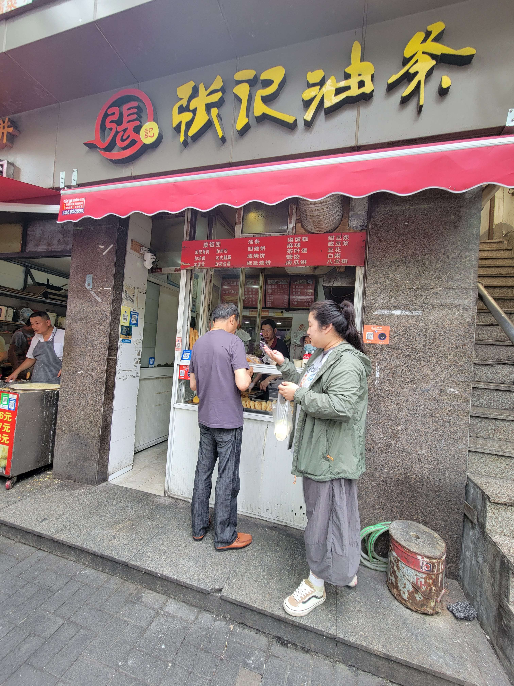
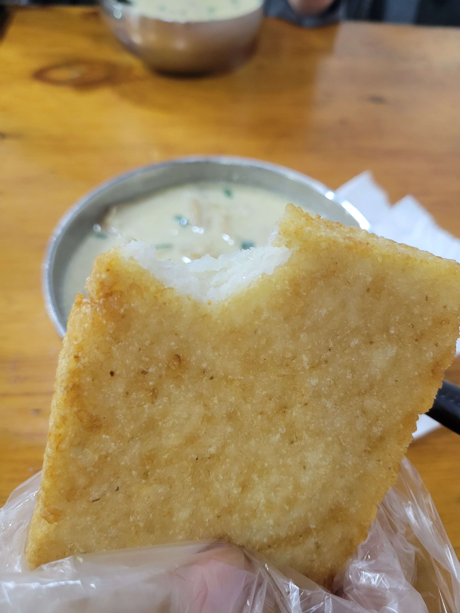
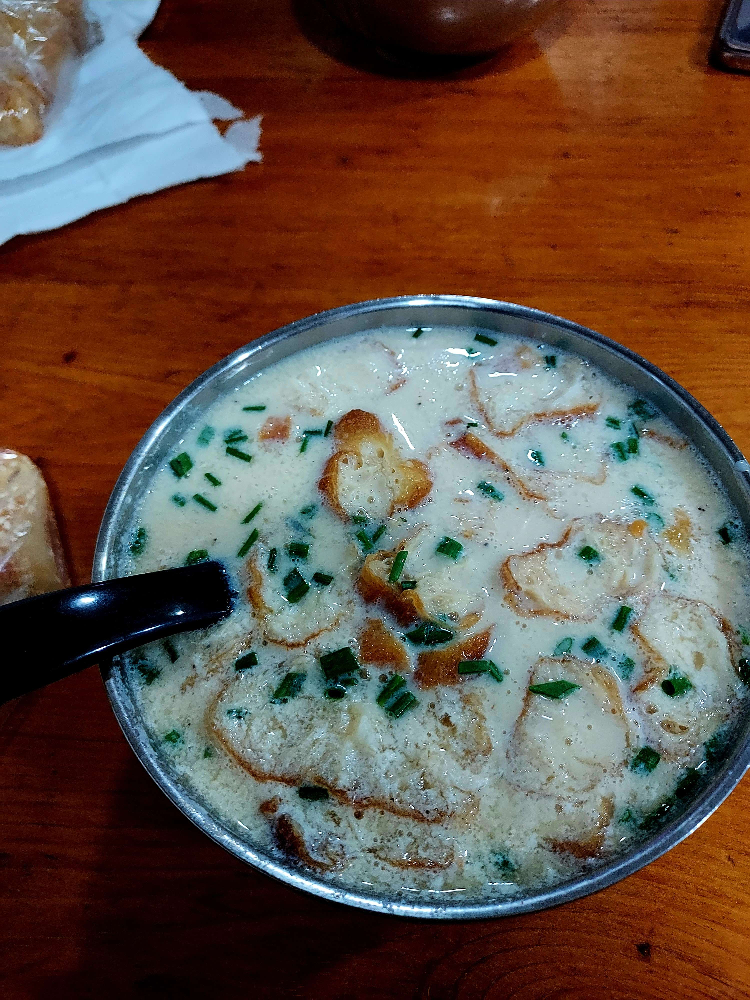
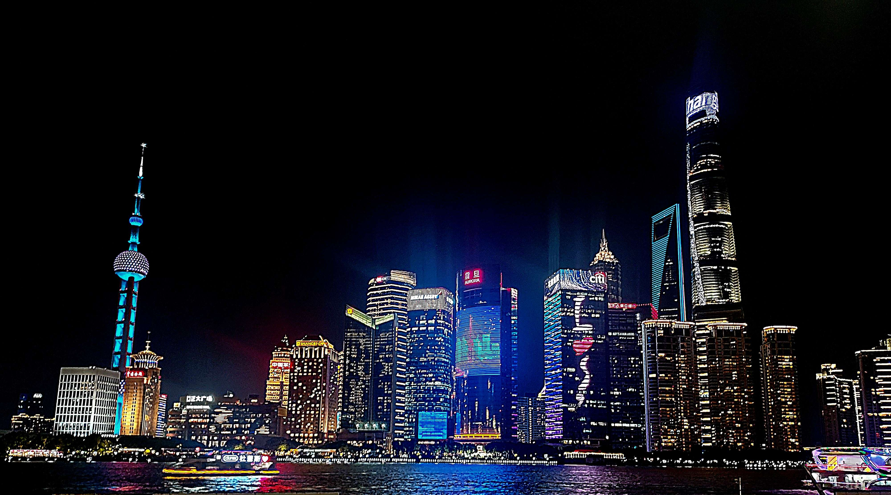
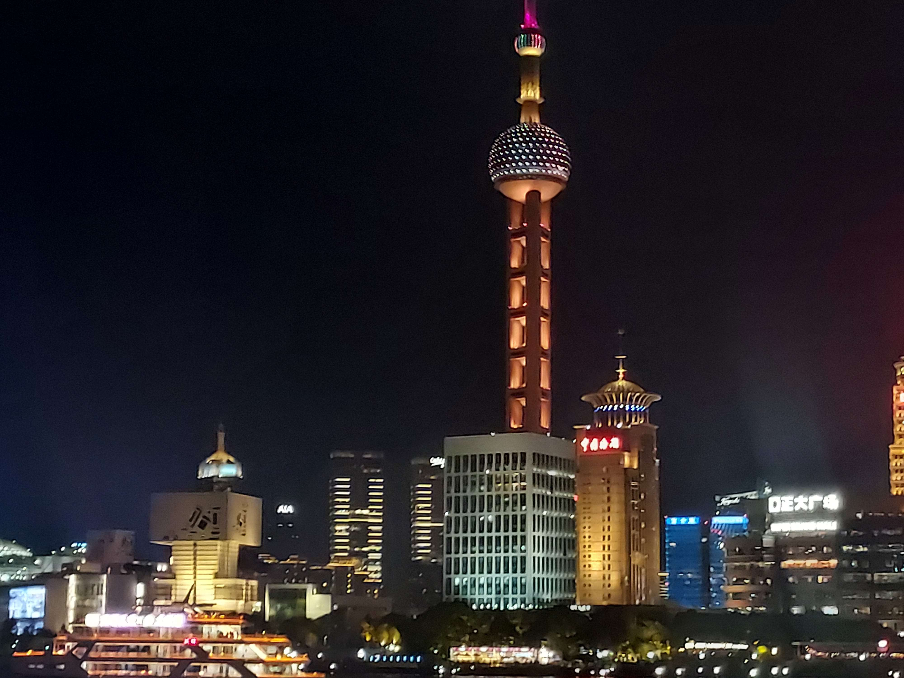
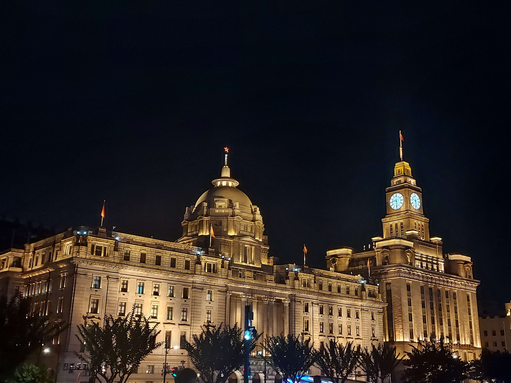

轉述 bing 姐的話：這是你們體驗到最上海人的一天

第四天的規劃是要體驗 bing 姐道地上海人的日常，所以直接到他家作客，順便參觀附近的南翔古鎮

## 早餐：張記油條

在上海品嚐豆漿油條作為早餐是我期待已久的事，除了本身就喜歡，bing 姐說上海一個菜包兩塊錢，這個物價就算不好吃我也要嘗試（？）

因為第四天的行程比（非）較（常）鬆散，所以我和 Jo 悠閒的選擇了酒店附近的張記油條作為早餐，算是在附近批發市場外面的一間小店，可以說是附近少數的豆漿店了，不過體驗上並不好，衛生不好以外好像沒什麼讓我驚豔的地方

這一餐也算是我的鹹豆漿初體驗，雖然說之前就聽過它的名諱，但一直都不太敢嘗試，他們的鹹豆漿並沒有結塊，要結塊應該要點鹹豆花，豆漿的話就像很碎的豆花屑屑飄著，我覺得吃起來很鹹，但 Jo 說這是小巫見大巫，可能長庚那邊的更恐怖？其實我點的是鹹豆漿加一份甜燒餅，想說一甜一鹹可以中和一下，不過老闆給我鹹燒餅，那一餐我覺得我要脫水了

價位的部分，燒餅 3.5 鹹豆漿 2.5，六塊人民幣吃這樣一頓早餐，還是覺得賺了


    
    
    


## 上海公交車

去 bing 姐家的路程會需要搭到上海的公交車，這也是我們的初體驗

跟習慣不一樣的除了上車開乘車碼給他以外，只需要刷上車，下車是直接下去就好。而車上沒有下車鈴，就算沒人上下車司機還是會靠站停一下，某種程度上不用擔心司機不停站直接開走的問題。上海公交車有規定前面上車後面下車，不過我們沒嘗試到客滿很難上下車的情況，說不定這會是前後門分流的 bug

還有一個很酷的點是他們的路是 `車道 | 停靠站 | 機車腳踏車道 | 人行道 |`，所以當人要到停靠站時需要先過一個小馬路，這個設計滿好的，因為保障了機車腳踏車的安全，至少不用和一般大車擠來擠去

## bing 姐家養的乖狗狗

滿慶幸早在大二去花蓮實習那時，就突破對狗狗的恐懼

金元寶是 bing 姐家養的一隻狗狗，很乖很聽話，但他的主人一直醜化他，真壞

```
bing 姐：你們不要看他這樣，他是很邪惡的
我：（我再怎麼看都覺得你比較... 咳咳咳沒事
```

根據 bing 姐所說，金元寶對陌生人都會吠一下，熟悉之後就沒事了，一開始很慶幸自己沒被吠（因為我不是站前面的），也很快被金元寶喜歡，想說看來貓緣和狗緣我還是在狗狗這邊比較吃的開，看金元寶會一直盯著我或靠著我睡覺其實滿開心的，結果 bing 姐一句：「金元寶喜歡老男人」讓我不是很開心，其實可以把老字去掉的，22 歲的工程師雖然可以獨立作業但並不老

來說說金元寶，雖然很乖很聽話，但其實是隻笨狗，那時候拿了一顆新的球給他玩，包裝袋還套著，所以金元寶玩的很盡興，後來他想把袋子拆開，從那刻開始，再也沒有人可以碰到那顆球，連幫忙也不行，就這樣四個人圍著一隻笨狗和一顆球，一直給他鼓勵，一直口頭指導要怎麼有效的把袋子扯開，但那隻小笨狗就只會用牙齒咬而已，咬到自己累了，但旁邊的人都還在，礙於面子又不能妥協，直到最後學會用扯的才成功把袋子拆掉，看著狗狗這樣學習其實成就感滿高的耶！

## 成為一名好獵人的訓練課程

bing 姐說他的日常就是為了成為一名好獵人在做訓練，所以今天也要帶我們體驗魔物獵人一日訓練營，剛好第二天在豫園時他的新武器手柄到貨，這天順便拿給我們玩玩

就我玩過的遊戲，高中時期比較常玩的就 random dice 這種動腦的塔防（雖然我也沒在動腦），考驗操作的最高層級就元氣騎士這種，為了訓練走位花了我超多時間，因為加了走位等於我從 1D 變 2D，多一個維度多了很多資訊

上大學開始接觸原神，硬生生被強加了一個維度，那是視角，要自己調整視角，而不像元氣騎士以上帝視角玩 2D 遊戲，到現在或許我也還沒很熟悉攻擊時要走位，還要調整適合的視角，只能瘋狂的轉到適合的位置而已

```
bing 姐：看你玩我都暈了
```

魔物獵人之前沒玩過，一個全新的遊戲還要搭配手柄，那真的是考驗 (for me)。不過我覺得魔物獵人做的真的不錯，尤其是在刻畫每個小角色的動畫和生態的部分，可能這就是魔物獵人的賣點吧！就像原神在賣~~派蒙~~元素反應一樣

到現在 bing 姐還是會在 DC 推薦我們加入獵人的行列，看來一個人的獵人是孤單的

最後來謝謝 bing 姐請的午餐和上海的第二杯霸王茶姬

## 南翔古鎮

南翔可能是我們的行程中相對古色古香的景點，類比於郊區的豫園，講到南翔有名的就是饅頭小籠包店

和豫園不一樣的是南翔河道景色滿美的，但也就是遠景漂漂亮亮，如果走在街道上看到那個 100 分的景配上 0 分的衛很衝突。沒錯，南翔這邊衛生真的滿糟糕的，很像一個很多阿公阿嬤在的大公園

不過那是我們拍照的南翔，比較多人的那邊，也就是有餐廳的商圈那邊，其實就不會有這個問題，還是回到大都市的氛圍，水道景色依舊

雖然晚餐選擇了附近的小籠包館吃飯，不過 bing 姐說那不是道地的小籠包

```
bing 姐：沒關係，你們沒嘗試到道地的小籠包，但體驗了道地上海人的生活（叫外賣、打遊戲）
```



## 外灘夜景

畢竟是在上海的最後一個晚上，我和 Jo 臨時起意在晚上的時候於朝聖一下眾人激推的外灘夜景

夜晚的上海跟白天真的不一樣，第二天在外灘一帶沒什麼人，遠眺東方明珠三件套就是建築物的壯觀，夜晚的外灘遊客很多，除了遊客還有想賺觀光財幫忙拍照的攝影師，夜景不僅僅是陸家嘴那邊建築，其實外灘西岸的萬國建築群也很美

不免俗的吐槽時間：可以不要在黃浦江上的渡輪還放超級大的廣告嗎？真的很煞風景，當我在欣賞夜晚版本的東方明珠時，一個大白兔從下面跑過去非常的奇怪，不過大白兔到底付了多少錢才可以有這種待遇呢？


    
    
    


## LE LABO

這天還有一個見世面的行程：Jo 帶我去步行街裡面的 LE LABO

LE LABO 是一個香水品牌，主打，在南京步行街裡面有一間，所以我們進去看看屬於上海的味道

上海的味道的是[末藥 55](https://www.lelabofragrances.com.tw/about-myrrhe-55.html)，在西方有神聖的意味，在東方則是中藥的活血劑，有種同時體現出東方和西方、古典和現代並行，正如上海城市一樣