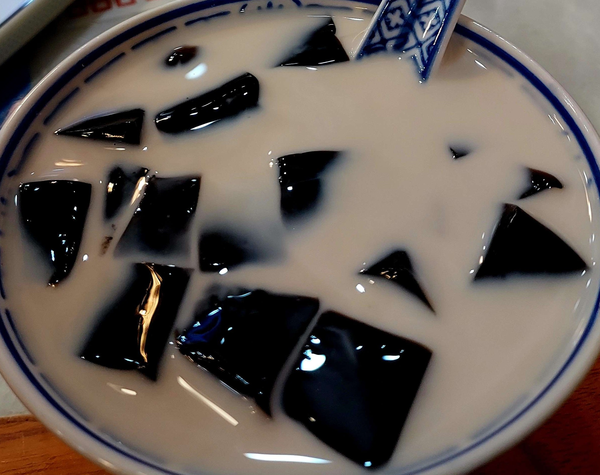

最後一天的行程是蠟像館、步行街買伴手禮然後浦東機場準備回程，也是輕鬆的行程

## 早餐：瑞幸咖啡

在上海這邊瑞幸咖啡是很大的咖啡連鎖品牌，就像第一天嘗試蜜雪一樣，最後一天也來嘗試看看這邊的大品牌瑞幸咖啡

生椰拿鐵是比較著名的，算是第一次嘗試這個品項，平常看到生椰應該就不會主動去點，但這次喝完我覺得是好喝的

一個小插曲是我們一如既往的使用支付寶付款，但不知道為什麼點餐完要付錢卻頻頻報「信息異常」的錯誤，最後是靠店員掃我們才解決（這個問題留到下個篇章談）

BTW 在這邊跟千璽說聲對不起，一個代言人人形立牌大大的站在瑞幸店裡，但我一直我沒認出來

早餐的部分再感嘆一下一片韭菜餅 2.5 人民幣，但好好吃，我愛死這裡的物價了


    
    


## 地鐵站的寄物櫃

最後一天扛著行李出來，所以到人民廣場後把行李寄放在地鐵站的置物櫃，遇到的大問題是完全不能寄放，原因不是沒櫃子了，而是實名制的時候一直無法成功，使用護照或台胞證都一樣，我們照慣例是拿支付寶掃 QR code，整個流程上應該是沒有問題的

後來工作人員的解決方法是一句「用谷歌唄」，倒不是沒想過這個方法，只是不會第一時間想到在這邊用 Google 就是了

bing 姐說應該是因為臺灣手機號碼的關係，這和早上瑞幸咖啡付款失敗或許是有點關聯的

## 杜莎夫人蠟像館

最後一天第一個行程是杜莎夫人蠟像館，在人民廣場的新世界大丸百貨裡面，這個行程我是期待的，想像中就是看看蠟像，走完就結束了，但蠟像館設計了很多互動式遊戲，還有服裝 cosplay，簡單來說會是一個拍照聖地，如果認真走完是可以花兩三個小時的

展區大概分成一開始的紅毯、美妝區、古裝區、三體、盜墓筆記、東西方演藝圈、政治人物、運動員、科學家等等，同時當作認臉挑戰也滿好玩的


    
    
    
    
    
    
    
    
    
    
    


我這才知道原來盜墓筆記真人版是吳磊演的，我找時間去看

要注意的是門票小貴，有分一般展區和漫威展區，有去漫威那邊需要加價

## 很久以前羊肉串

午餐是對面百貨公司裡面的很久以前羊肉串，如果是我自己是完全不會進串烤店的，不過串烤店一定有蔬菜這個理由完全說服了我

這間主打是新疆呼倫貝爾大草原上的羊肉，幾個比較酷的設計來列點寫好了

* 店外有自助的飲料和小點心給等待的客人可以先食用，比如說爆米花或是冰水
* 這是串烤店小白的驚訝點：原來串烤店會提供退熱貼貼在臉上，用來解決火在下面燒額頭很燙的問題，還提供了髮圈，真貼心
* 這間店的店員會幫忙把食材放到烤架上，也會跟你說多久可以吃，可以吃會再過來幫忙放到上層，所以不要像我一樣覺得好了就拿起來，店員會跑過來跟你說「還沒好喔！請稍等」。沒錯客人要做的除了吃以外就是看烤串在烤架上轉圈圈
* 結束後有一隻小雪糕可以吃
* 店外也有一台清淨機會噴大草原的香氣（他們自己寫說一秒帶你到呼倫貝爾大草原，不是我說我），主要是讓客人可以把身上的味道淡化掉，但 Jo 說有可能變成很奇怪的綜合味道就是了

我想特別獨立說的是冷麵好好吃，在大熱天吃微酸的冷麵超級適合的，我回來一定要自己做一碗（冷麵 >>> 涼麵，因為他是清爽的）


    
    
    


## 步行街 part 2

第二次逛步行街，這次不再是一大早的版本，人潮全部湧現，前一晚夜景人潮和最後一天白天的步行街讓我們知道原來紅綠燈是有用的，在人多的時候大家還是會看那個號誌行動

最後一天安排步行街主要就是為了伴手禮，加上在蠟像館玩太久，還要注意去機場的時間，有滿多小遺憾的，比如說 Jo 推薦的 Beigel Tree 就只有進去晃一圈，沒有真的品嚐到；MM 旗艦店也是因為在最後一天逛，所以沒有特別裝幾個豆豆，不過 MM 旗艦店真的是一進去就滿滿的甜味，我覺得裡面一定會有很多螞蟻

人多就是能看到亂源，我們在沈大成買團子時就見識到上海大媽的插隊能力，技能「你不尷尬，尷尬的就是別人」開下去，直接插到櫃檯完全不是問題，雖然 bing 姐表示遇到這種人就要跟他吵，但我不敢，我只是小小的觀光客而已，不用鬧事

既然提到沈大成了，就順便說說事後吃完的感想，這次主要買了青團、金團、雙釀團、桂花條頭糕這幾個。青團裡面是包豆沙、金團是有黃豆粉、雙釀團是紅豆和 芝麻，外面有椰子粉、桂花條頭糕就是一般條頭糕，但皮是桂花和茉莉綠茶口味的，比起來我最喜歡雙釀團，雖然不知道釀在哪裡，但他好好吃。桂花條頭糕味道滿香的，就是很濃厚的茶味

```
[科普時間]
：條頭糕是如懿愛吃的那個甜點
```

遺憾是沒看到薄荷方糕，而且沒買各種鬆糕，以我們在人潮多的時候去，要買什麼還真多要先想好，到櫃檯還要想感覺櫃檯裡的人和後面等的人都會不耐煩

離開前找了冰品店休息一下，因為吃的東西看起來很特別所以想來科普，我是點一碗仙草凍水牛奶，可以猜猜看水牛奶是什麼


    
    


好他就是水牛產的奶，我以為是什麼比較水的牛奶還是特別處理過的牛奶，原來斷句是水牛・奶

## 回程

回程來談談中國的安檢，從地鐵站出來往機場走，按照慣例所有東西都還是得上安檢機器掃一下，辦理出境的規矩和桃園機場也不太一樣，比如說後背包裡面的筆電、行動電源、折疊傘都要拿出來，因為一開始不懂他是大支的雨傘還是折疊傘，所以折疊傘就丟在包包裡面，結果被要求再掃一次，行李掃的同時，人的安檢也很嚴格，我覺得安檢人員可以去行天宮當幫忙收驚的工作人員，那個手法... 像是進階版的

在上海的最後幾小時，我和 Jo 買了一瓶青島啤酒等待登機，會講這個是因為我又在耍笨了，真的是啤酒開下去才想到啊等一下暈機藥難道要配啤酒嗎？


    
    


回程搭的是小台的華航，位置比較擠，機位也少了一些，耳機恐只剩一個（這應該跟大小台沒關係），但不知道為什麼，其實我覺得小飛機對耳朵的壓力相對小，去程我覺得機上的聲音滿大的，但回程就還好，不過讓我挑我還是會想搭大台一點的吧！不知道大小台飛機餐有沒有差，個人覺得兩次落差有點大