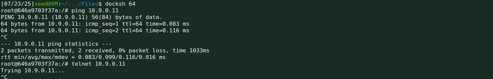
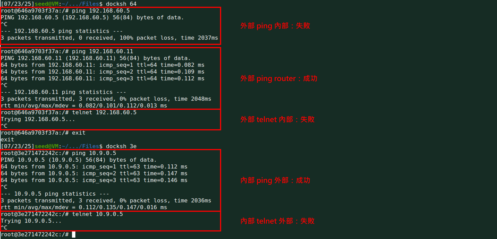
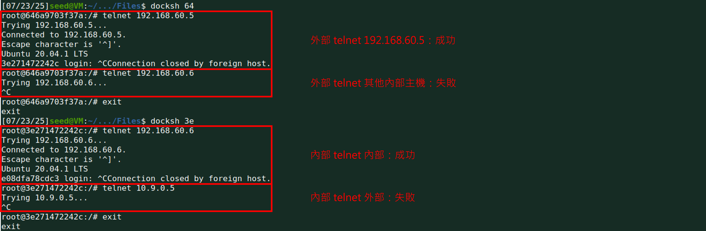
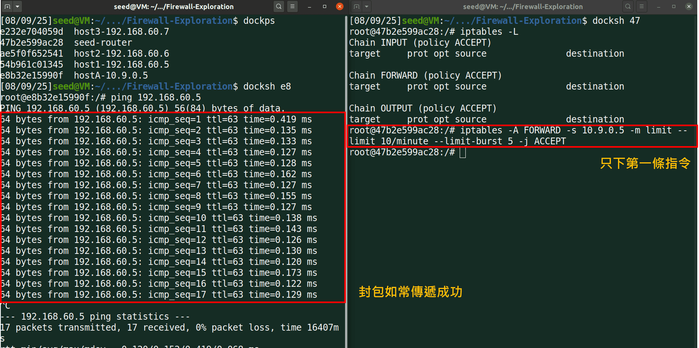
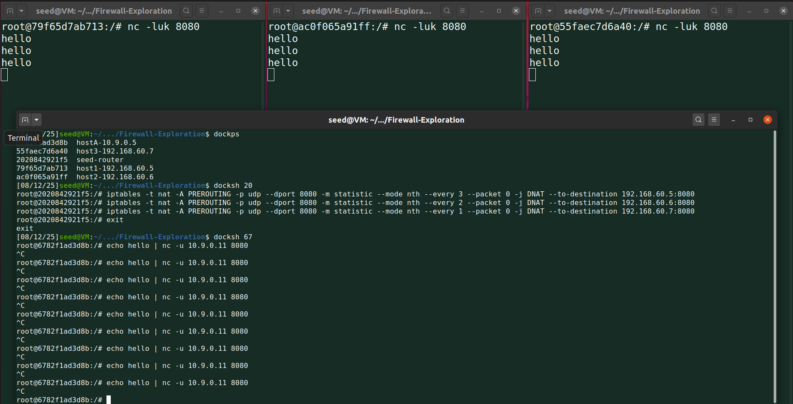
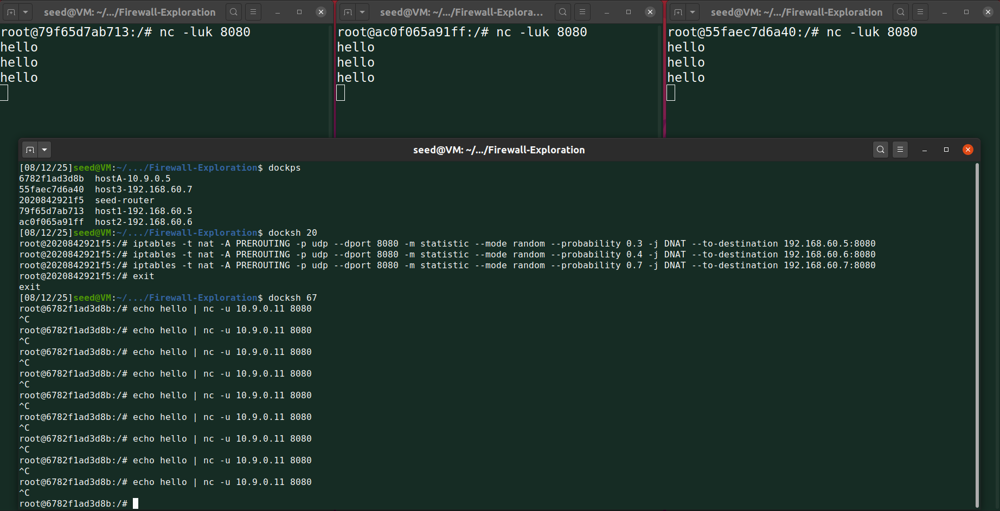

## Lab Setup

輸入下面的指令建立環境

```shell
$ dcbuild    # 建立環境。完整指令：docker-compose build
$ dcup -d    # 在背景執行環境。完整指令：docker-compose up -d
$ dockps     # 查詢正在執行的 containers。完整指令：docker ps --format "{{.ID}} {{.Names}}"
```

這個 lab 使用六台機器

| IP | 說明 |
| --- | --- |
| 10.9.0.1 | 攻擊者 |
| 10.9.0.5 | Host A |
| 192.168.60.11 | Router |
| 192.168.60.5 | Host 1 |
| 192.168.60.6 | Host 2 |
| 192.168.60.7 | Host 3 |

## Task 1. Implementing a Simple Firewall

因為封包處理是透過 kernel，因此如果要設計防火牆就必須更改 Linux kernel。確實過去是透過重編 Linux kernel 做到，但現今 Linux 提供不需要重編 kernel 的新機制來操縱封包，包含 Loadable Kernel Module (LKM) 和 Netfilter

### Task 1A. Implementing a Simple Kernel Module

Task 1A 要熟悉 LKM 的使用，使用到的檔案包含  *Files/kernel_module*  下的兩個檔案： *hello.c*  以及  *Makefile*

LKM 讓使用者在程式運行時新增新的 module 到 kernel。 *hello.c*  中時做了兩個 functions `initialization` 和 `cleanup`，兩個 function 都會在 kernel log 以 informational level 輸出一段訊息（log 在  */var/log/syslog* ，可以透過 `dmesg` 指令印出）。第 15 行設定當 module 被初始化時要執行 `initialization` 函式，第 16 行設定當 module 被移除時要執行 `cleanup` 函式

```c
#include <linux/module.h>
#include <linux/kernel.h>

int initialization(void)
{
    printk(KERN_INFO "Hello World!\n");
    return 0;
}

void cleanup(void)
{
    printk(KERN_INFO "Bye-bye World!.\n");
}

module_init(initialization);
module_exit(cleanup);

MODULE_LICENSE("GPL");
```

Makefile 將  *hello.c*  編成 LKM，使用 `make` 指令編譯，使用 `make clean` 移除相關檔案

```makefile
obj-m += hello.o

all:
	make -C /lib/modules/$(shell uname -r)/build M=$(PWD) modules

clean:
	make -C /lib/modules/$(shell uname -r)/build M=$(PWD) clean
```

編譯完成後的 kernel module 為  *hello.ko* ，接著依序執行下列指令測試 module 是否正常運行
| 指令 | 說明 |
| --- | --- |
| `sudo insmod hello.ko` | 插入 module (insert module) |
| `lsmod \| grep hello` | 列出所有 modules |
| `sudo rmmod hello` | 移除 module (remove module) |
| `dmesg` | 印出 log 訊息 |

會在最下方看到兩則訊息 "Hello World!" 以及 "Bye-bye  World!" 的訊息。"Hello World!" 是在插入 module 時將 module 初始化而印出，"Bye-bye  World!" 則是在移除 module 時印出，也證實新增的 module 有正常運行

### Task 1B. Implementing a Simple Firewall Using Netfilter

Task 1B 會透過 netfilter 實作一個 packet filter LKM。Netfilter 是在 Linux kernel 上實作一系列的 hook functions，當 packet 經過特定位置，就會觸發 hooks 上的函式，而使用者只要設計 hook 上的 funciton logic 即可

以提供的程式碼為例，在  *Files/packet_filter*  中一樣有兩個檔案： *seedFilter.c*  和  *Makefile*

在  *seedFilter.c*  中

第 12 行建立了 nf_hook_ops 結構的兩個 hooks，nf_hook_ops 結構包含 protocol、hook 執行點、執行動作等等

第 15 行是自定義的 hook function `blockUDP`，會去檢查封包 protocol，如果是 UDP 封包且符合 IP `8.8.8.8` port 53 則 drop 掉，否則放行。換句話說，這個函式在阻擋內部傳送 DNS query 到 `8.8.8.8`

第 41 行也是自訂義的 hook function `printInfo`，會去讀取封包資訊並印出，讀取資訊包含 hook 狀態、來源與目的位址以及 protocol，因為這個 hook function 並不是在做過濾，所以執行完一律放行封包

第 74 行 `registerFilter` 函式註冊了兩個 hooks，`hook1` 在 IPv4 (`PF_INET`) 封包從內部傳送出去時會觸發 (`NF_INET_LOCAL_OUT`)，觸發時會呼叫 `printInfo` 這隻函式，hook 優先級設為最先；`hook2` 在 IPv4 (`PF_INET`) 封包從內部傳送或轉發時會觸發 (`NF_INET_POST_ROUTING`)，觸發時會呼叫 `blockUDP` 這隻函式，hook 優先級同樣設為最先。要注意的是第 81 和第 87 行的 `nf_register_net_hook` 函式才是真的將 function 掛到 hook 上。第 98 行提到 `registerFilter` 函式會在 module 初始化時被呼叫。

第 92 行 `removeFilter` 函式取消註冊上述提到的兩個 hooks。第 99 行提到 `removeFilter` 函式會在 module 被移除時被呼叫。

```c
#include <linux/kernel.h>
#include <linux/module.h>
#include <linux/netfilter.h>
#include <linux/netfilter_ipv4.h>
#include <linux/ip.h>
#include <linux/tcp.h>
#include <linux/udp.h>
#include <linux/if_ether.h>
#include <linux/inet.h>


static struct nf_hook_ops hook1, hook2; 


unsigned int blockUDP(void *priv, struct sk_buff *skb,
                       const struct nf_hook_state *state)
{
   struct iphdr *iph;
   struct udphdr *udph;

   u16  port   = 53;
   char ip[16] = "8.8.8.8";
   u32  ip_addr;

   if (!skb) return NF_ACCEPT;

   iph = ip_hdr(skb);
   // Convert the IPv4 address from dotted decimal to 32-bit binary
   in4_pton(ip, -1, (u8 *)&ip_addr, '\0', NULL);

   if (iph->protocol == IPPROTO_UDP) {
       udph = udp_hdr(skb);
       if (iph->daddr == ip_addr && ntohs(udph->dest) == port){
            printk(KERN_WARNING "*** Dropping %pI4 (UDP), port %d\n", &(iph->daddr), port);
            return NF_DROP;
        }
   }
   return NF_ACCEPT;
}

unsigned int printInfo(void *priv, struct sk_buff *skb,
                 const struct nf_hook_state *state)
{
   struct iphdr *iph;
   char *hook;
   char *protocol;

   switch (state->hook){
     case NF_INET_LOCAL_IN:     hook = "LOCAL_IN";     break; 
     case NF_INET_LOCAL_OUT:    hook = "LOCAL_OUT";    break; 
     case NF_INET_PRE_ROUTING:  hook = "PRE_ROUTING";  break; 
     case NF_INET_POST_ROUTING: hook = "POST_ROUTING"; break; 
     case NF_INET_FORWARD:      hook = "FORWARD";      break; 
     default:                   hook = "IMPOSSIBLE";   break;
   }
   printk(KERN_INFO "*** %s\n", hook); // Print out the hook info

   iph = ip_hdr(skb);
   switch (iph->protocol){
     case IPPROTO_UDP:  protocol = "UDP";   break;
     case IPPROTO_TCP:  protocol = "TCP";   break;
     case IPPROTO_ICMP: protocol = "ICMP";  break;
     default:           protocol = "OTHER"; break;

   }
   // Print out the IP addresses and protocol
   printk(KERN_INFO "    %pI4  --> %pI4 (%s)\n", 
                    &(iph->saddr), &(iph->daddr), protocol);

   return NF_ACCEPT;
}


int registerFilter(void) {
   printk(KERN_INFO "Registering filters.\n");

   hook1.hook = printInfo;
   hook1.hooknum = NF_INET_LOCAL_OUT;
   hook1.pf = PF_INET;
   hook1.priority = NF_IP_PRI_FIRST;
   nf_register_net_hook(&init_net, &hook1);

   hook2.hook = blockUDP;
   hook2.hooknum = NF_INET_POST_ROUTING;
   hook2.pf = PF_INET;
   hook2.priority = NF_IP_PRI_FIRST;
   nf_register_net_hook(&init_net, &hook2);

   return 0;
}

void removeFilter(void) {
   printk(KERN_INFO "The filters are being removed.\n");
   nf_unregister_net_hook(&init_net, &hook1);
   nf_unregister_net_hook(&init_net, &hook2);
}

module_init(registerFilter);
module_exit(removeFilter);

MODULE_LICENSE("GPL");
```

Makefile 將  *seedFilter.c*  編成 LKM，使用 `make` 指令編譯；使用 `make clean` 移除相關檔案；使用 `make ins` 插入 `seedFilter` 模組；使用 `make rm` 移除 `seedFilter` 模組

```makefile
obj-m += seedFilter.o
all:
	make -C /lib/modules/$(shell uname -r)/build M=$(PWD) modules

clean:
	make -C /lib/modules/$(shell uname -r)/build M=$(PWD) clean

ins:
	sudo dmesg -C
	sudo insmod seedFilter.ko

rm:
	sudo rmmod seedFilter
```

1. Subtask 1. 嘗試傳送 DNS query 到 `8.8.8.8`
    ```shell
    seed@VM:~/.../packet_filter$ dig @8.8.8.8 www.example.com
    ^C
    ```
    發現 Query 不到
2. Subtask 2. Hook `printInfo` 函式到其他 hook numbers，也就是 `NF_INET_PRE_ROUTING`, `NF_INET_LOCAL_IN`, `NF_INET_FORWARD`, `NF_INET_LOCAL_OUT`, `NF_INET_POST_ROUTING`
    | Chain | hook number | 說明 |
    | --- | --- | --- |
    | PREROUTING | NF_IP_PRE_ROUTING | 封包進入 router 前 |
    | INPUT | NF_IP_LOCAL_IN | 通過 router 後，目的地為本機 |
    | FORWARD | NF_IP_FORWARD | 通過 router 後，目的地不為本機 |
    | OUTPUT | NF_IP_LOCAL_OUT | 由本機產生向外轉發 |
    | POSTROUTING | NF_IP_POST_ROUTING | 發送到網卡接口之前 |
3. Subtask 3. 開發另外兩個 hooks 來假裝其他電腦去 ping / telnet VM
    設計概念是如果遇到 ping 或 telnet 封包的 destination IP 是 host VM，就把 source ip 改為其他值。這邊 host VM 的 IP address 是 10.9.0.1，我會用 10.9.0.5 這台機器去執行連線，如果收到這個 IP，就將其改為 10.9.0.6，最後一樣將相關資訊印在 log 檔
    判斷 ping 封包的方式是透過 protocol 是否為 ICMP，而判斷 telnet 封包則是以 destination port 為 23
    修改部分的程式碼如下，詳細資訊請見註解
    ```c
    // 開頭需要新增兩行 include library，因為 pretend() 會用到 TCP 和 ICMP header 的定義
    #include <linux/tcp.h>
    #include <linux/icmp.h>

    // 原程式碼需新增 hook3 為 pretend 所用
    static struct nf_hook_ops hook1, hook2, hook3;

    // 新增 pretend function 實作 task 要求
    unsigned int pretend(void *priv, struct sk_buff *skb,
                           const struct nf_hook_state *state)
    {
       struct iphdr *iph;
       struct udphdr *udph;
       struct tcphdr *tcph;
       struct icmphdr *icmph;

       u16  port   = 23;
       char target_ip[16] = "10.9.0.1";
       u32  target_ip_addr;
       char src_ip[16] = "192.168.60.5";
       u32  src_ip_addr;
       char fake_ip[16] = "192.168.60.7";
       u32  fake_ip_addr;
       
       if (!skb) return NF_ACCEPT;

       iph = ip_hdr(skb);
       in4_pton(target_ip, -1, (u8 *)&target_ip_addr, '\0', NULL);
       in4_pton(src_ip, -1, (u8 *)&src_ip_addr, '\0', NULL);
       in4_pton(fake_ip, -1, (u8 *)&fake_ip_addr, '\0', NULL);

       // Pretending ping
       if (iph->protocol == IPPROTO_ICMP) {
           icmph = icmp_hdr(skb);
           if (iph->saddr == src_ip_addr && iph->daddr == target_ip_addr){
                iph->saddr = fake_ip_addr;
                printk(KERN_WARNING "*** Pretending as %pI4 (ICMP) as ping\n", &(iph->saddr));
            }
       }
        
       // Pretending telnet
       if (iph->protocol == IPPROTO_TCP) {
           tcph = tcp_hdr(skb);
           if (iph->saddr == src_ip_addr && iph->daddr == target_ip_addr && ntohs(tcph->dest) == port) {
                iph->saddr = fake_ip_addr;
                printk(KERN_WARNING "*** Pretending as %pI4 (ICMP) as telnet\n", &(iph->saddr));
            }
       }
        
       if (iph->protocol == IPPROTO_UDP) {
           udph = udp_hdr(skb);           
           if (iph->saddr == src_ip_addr && iph->daddr == target_ip_addr && ntohs(udph->dest) == port) {
                iph->saddr = fake_ip_addr;
                printk(KERN_WARNING "*** Pretending as %pI4 (ICMP) as telnet\n", &(iph->saddr));
            }
       }
    
       return NF_ACCEPT;
    }

    // registerFilter 函式新增 hook3 的操作，並將 hook 掛到 POSTROUTING 上
    int registerFilter(void) {
       ...
       hook3.hook = pretend;
       hook3.hooknum = NF_INET_POST_ROUTING;
       hook3.pf = PF_INET;
       hook3.priority = NF_IP_PRI_FIRST;
       nf_register_net_hook(&init_net, &hook3);

       return 0;
    }

    // removeFilter 也需要新增 hook3 的移除
    void removeFilter(void) {
       ...
       nf_unregister_net_hook(&init_net, &hook3);
    }    
    ```
    結果如下，為了方便觀察，我將 hook1 的 printInfo 掛到 POSTROUTING 上，可以看到雖然我是進 192.168.60.5 機器進行 ping 和 telnet 主機，但 source 都轉成 192.168.60.7
    
    下面這張執行結果顯示一個小問題：如果要讓 192.168.60.5 收到回傳訊息，就要多在 router 設定當收到給予 192.168.60.7 的 ping 或 telnet 回傳封包，需要將 destination IP 轉回 192.168.60.5，否則 192.168.60.5 會收不到回應封包，不過這邊我沒實作，所以 192.168.60.5 收不到回傳結果
    


每次重編記得要 `make rm` 把 module 清除，重編後再透過 `make ins` 把 module 插進去


## Task 2. Experimenting with Stateless Firewall Rules

Linux 有基於 netfilter 內建好的防火牆叫做 `iptables`，原則上 `iptables` 是 user-space 而 `Xtables` 是 kernel space，但實際上 `iptables` 常被拿來做兩者的開發

`iptables` 並不是只拿來過濾封包，它可以用來做階層式的規則，包含 **表 (table)、鏈 (chain)、規則 (rules)**。

* 每張「表」指的是不同類型的封包處理流程，系統按照預訂的規則將封包通過某個內建「鏈」
* 「鏈」中可以存在多條「規則」，這些規則會被逐一進行過濾，一旦滿足規則可以執行相應的動作
* 當鏈中所有規則都執行完仍然沒有跳轉時，將根據該鏈的預設策略 (policy) 執行對應動作
- 如果也沒有預設動作，則是返回呼叫者鏈

詳細資訊如下表所示

| Table | Chains | Functionalities |
| :-- | :-- | :-- |
| Filter | INPUT<br/>FORWARD<br/>OUTPUT | 預設 table，通常用於封包過濾 |
| NAT | PREROUTING<br/>INPUT<br/>OUTPUT<br/>POSTROUTING | 來源 / 目標 IP 位址轉換 |
| Mangle | PREROUTING<br/>INPUT<br/>FORWARD<br/>OUTPUT<br/>POSTROUTING | 更改封包內容 |
| Raw | PREROUTING<br/>OUTPUT | 處理異常 |

每張 table 有多條 chain，每條 chain 都對應到 netfilter 中的不同 hook，如下表所示

| Chain | Netfilter Hook | Note |
| :-- | :-- | :-- |
| PREROUTING | NF_INET_PREROUTING | 處理路由規則前通過，通常用於目的位址轉換 (DNAT) |
| INPUT | NF_INET_LOCAL_IN | 發送往本機的封包 |
| FORWARD | NF_INET_FORWARD | 本機轉發的封包 |
| OUTPUT | NF_INET_LOCAL_OUT | 從本機發送出的封包 |
| POSTROUTING | NF_INET_POSTROUTING | 完成路由規則後通過，通常用於來源位址轉換 (SNAT) |

每條 chain 上都能制定不同規則，比如要阻擋外部主機 ping 內部主機，可以在 filter table 中的 INPUT chain 上制定一條規則，阻止所有 ping 封包

要在 chain 上新增規則會使用到 `iptables` 指令，基本架構如下

```shell
iptables -t <table> -<operation> <chain> <rule> -j <target>
```

各項參數詳細資訊如下表

| Operation | 說明 |
| :-- | :-- |
| `-A`, `--append` chain rule-specification | 附加一條規則至某條 chain 上 |
| `-C`, `--check` chain rule-specification | 檢查某規則是否存在於某 chain 中 |
| `-D`, `--delete` chain rule-specification<br/>`-D`, `--delete` chain rulenum | 刪除 chain 上的特定規則 |
| `-I`, `--insert` chain (rulenum) rule-specification | 新增規則至特定 chain |
| `-R`, `--replace` chain rulenum rule-specification | 更新 chain 上的某條規則 |
| `-L`, `--list` (chain) | 顯示指定 chain 的所有規則 |
| `-S`, `--list-rules` (chain) | 顯示指定 chain 的所有規則 |
| `-F`, `--flush` (chain) | 刪除指定 chain 的所有規則 |
| `-N`, `--new-chain` chain | 創建新的 chain |
| `-X`, `--delete-chain` (chain) | 刪除指定 chain <br/>內建 chain 僅能透過 `iptables-nft` 刪除 |
| `-P`, `--policy` chain target | 指定內建 chain 的 policy target<br/>target 只能是 ACCEPT 或 DROP，且僅適用於內建 chains |
| `-E`, `--rename-chain` old-chain new-chain | 重新命名 chain |
| `-V`, `--version` | 顯示 `iptables` 版本 |
| `-h` | 顯示 help message |
| `-p`, `--protocol` protocol | 指定 protocol<br/>包含 tcp, udp, udplite, icmp, icmpv6, esp, ah, sctp, mh 或 "all" 或其他於 `/etc/protocols` 紀載的協定<br/>可使用數值指定<br/>`!` 可用來反轉過濾邏輯 |
| `-s`, `--src`, `--source` address | 指定來源，如 `-sport`<br/>`!` 可用來反轉過濾邏輯 |
| `-d`, `--dst`, `--destination` address | 指定目的地，如 `--dport`<br/>`!` 可用來反轉過濾邏輯 |
| `-m`, `--match` match |  |
| `-j`, `--jump` target | 指定當滿足特定 rules 時須執行的 target action<br/>target 包含 ACCEPT、REJECT、DROP、LOG、SNAT、MASQUERADE、DNAT、REDIRECT、RETURN |
| `-g`, `--goto` chain | 跳至指定 chain |
| `-v`, `--verbose` | 顯示更多資訊 |

| Target | 說明 |
| :-- | :-- |
| ACCEPT | 放行，結束後跳至下一規則鏈 |
| REJECT | 攔截，並通知傳送方<br/>通知選項包含 ICMP port-unreachable、ICMP echo-reply 或是tcp-reset<br/>結束後中斷過濾程序 |
| DROP | 丟棄，結束後中斷過濾程序 |
| REDIRECT | 導向另一個 port (PNAT)<br/>結束後繼續進行其他規則檢查 |
| MASQUERADE | 改寫封包來源 IP 為防火牆 NIC IP，可指定 port 對應範圍<br/>結束後跳往下一規則 |
| SNAT | 改寫封包來源 IP 為某特定 IP 或 IP 範圍<br/>可指定 port 對應範圍<br/>結束後跳往下一規則 |
| DNAT | 改寫封包來源 IP 為某特定 IP 或 IP 範圍，可指定 port 對應範圍<br/>結束後跳往下一規則鏈 |
| MIRROR | 鏡射，將來源 IP 與目的地 IP 做對調並送回<br/>結束後中斷過濾程序 |
| QUEUE | 中斷過濾程序，放入 queue 中並返回主規則鏈<br/>白話文：提前結束返回主規則鏈 |
| RETURN | 結束在目前規則鏈中的過濾程序，返回主規則鏈 |
| LOG | 將封包相關訊息紀錄於 `/var/log`<br/>可於 `/etc/syslog.conf` 中設定<br/>結束後繼續進行其他規則檢查 |
| MARK | 將封包標上做標記，供後續使用<br/>結束後繼續進行其他規則檢查 |

### Task 2A. Protecting the Router

Task 2A 要防止其他外部主機透過 ping 以外的方式存取到 router，指令如下

```shell
# 新增一條規則：進來的封包如果是 ping 就放行
iptables -A INPUT -p icmp --icmp-type echo-request -j ACCEPT
# 新增一條規則：出去的封包如果是 ping 就放行
iptables -A OUTPUT -p icmp --icmp-type echo-reply -j ACCEPT
# 設定 OUTPUT chain 上的 policy：預設丟棄所有封包
iptables -P OUTPUT DROP
# 設定 INPUT chain 上的 policy：預設丟棄所有封包
iptables -P INPUT DROP
```

實驗結果發現可以從外部 ping 到 router，但無法 telnet 進去。可以 ping 的原因是防火牆第一二條規則設定允許 ping 封包進入，並允許 ping 封包回應，所以外部主機收的到結果；但 telnet 不屬於 ping 封包，所以會在第三四條規則被阻擋




Task 實作完要輸入以下指令清除新增的規則
```shell
# 清除所有在 filter table 上的規則
iptables -F
# 設定 OUTPUT chain 上的 policy：預設放行
iptables -P OUTPUT ACCEPT
# 設定 INPUT chain 上的 policy：預設放行
iptables -P INPUT ACCEPT
```
或直接透過重啟 docker (`docker restart <docker ID>`) 清除規則



### Task 2B. Protecting the Internal Network

Task 2B 要在 router 上設定規則保護內網 (192.168.60.0/24)，因為是從 router 轉出去，所以會用到 FORWARD table。Task 2B 要做到的事情如下

1. 外部主機無法 ping 內部主機
2. 外部主機可以 ping router
3. 內部主機可以 ping 外部主機
4. 其他來往外部、內部的封包都應該被阻擋

指令如下

```shell
# 外部主機無法 ping 內部主機
iptables -A FORWARD -p icmp --icmp-type echo-request -d 192.168.60.0/24 -j DROP
# 外部主機可以 ping router
iptables -A INPUT -p icmp --icmp-type echo-request -j ACCEPT
iptables -A OUTPUT -p icmp --icmp-type echo-reply -j ACCEPT
# 內部主機可以 ping 外部主機
iptables -A FORWARD -p icmp --icmp-type echo-request -s 192.168.60.0/24 -j ACCEPT
iptables -A FORWARD -p icmp --icmp-type echo-reply -d 192.168.60.0/24 -j ACCEPT
# 其他來往外部、內部的封包都應該被阻擋
iptables -P FORWARD DROP
```

實驗外部主機採用 10.9.0.5，內部主機採用 192.168.60.5，總共個實驗
| 實驗 | 預期結果 |
| :-- | :-- |
| [1] 外部 ping 內部 | 失敗 |
| [2] 外部 ping router | 成功 |
| [3] 內部 ping 外部 | 成功 |
| [4] 外部 telnet 內部 | 失敗 |
| [4] 內部 telnet 外部 | 失敗 |

實驗結果如下圖所示



### Task 2C. Protecting Internal Servers

Task 2C 要保護內網的 TCP 服務，要做到的事情如下

1. 外部主機只能 telnet 到 192.168.60.5，其他內部主機不行
2. 外部主機無法存取其他內部主機
3. 內部主機可以存取到其他內部主機
4. 內部主機無法存取到外部主機
5. 禁止使用 connection tracking 機制

指令如下
```shell
# 外部主機只能 telnet 到 192.168.60.5
iptables -A FORWARD -p tcp --dport 23 -d 192.168.60.5 -j ACCEPT
iptables -A FORWARD -p tcp --sport 23 -s 192.168.60.5 -j ACCEPT
# 外部主機無法存取其他內部主機
iptables -A FORWARD -p tcp -d 192.168.60.0/24 -j DROP
# 內部主機可以存取到其他內部主機
iptables -A FORWARD -p tcp -s 192.168.60.0/24 -d 192.168.60.0/24 -j ACCEPT
# 內部主機無法存取到外部主機
iptables -A FORWARD -p tcp -s 192.168.60.0/24 -j DROP
```

實驗外部主機採用 10.9.0.5，內部主機採用 192.168.60.5、192.168.60.6，總共四個實驗

| 實驗 | 預期結果 |
| :-- | :-- |
| [1] 外部 telnet 192.168.60.5 | 成功 |
| [2] 外部 telnet 192.168.60.6 | 失敗 |
| [3] 192.168.60.5 telnet 192.168.60.6 | 成功 |
| [4] 內部 telnet 外部 | 失敗 |

實驗結果如下圖所示





Task 實作完要輸入以下指令清除新增的規則
```shell
# 清除所有在 filter table 上的規則
iptables -F
# 設定 FORWARD chain 上的 policy：預設放行
iptables -P FORWARD ACCEPT
```
或直接透過重啟 docker (`docker restart <docker ID>`) 清除規則



## Task 3. Connections Tracking and Stateful Firewall

Task 3 和 task 2 不同的是要建立 stateful 防火牆

### Task 3A. Experimenting with the Connection Tracking

要做到 stateful firewall，會需要追蹤 connections 資訊，這可以透過 kernel 裡面的  **conntrack**  機制做到

1. ICMP
    第一個實驗是 ping 封包，首先分別進到 router 與 10.9.0.5 兩台機器，從 10.9.0.5 ping 到 12.168.60.5，再透過 router 觀察連線狀況，實驗如下
    
    * 實驗開始前，先在 router 觀察當前連線狀況，發現沒有連線
    * 開始 ping 之後，從 `conntrack -L` 指令結果可以看到有一條連線
    * ping 結束後仍繼續透過 `conntrack -L` 觀察連線狀況，約莫 30 秒連線關閉
2. UDP
    第二個實驗是 UDP 封包，分別進到 router（左）、10.9.0.5 （右上）與 192.168.60.5（右下）三台機器，實驗如下
    
    * 實驗開始前，先在 router 觀察當前連線狀況，發現沒有連線
    * 啟動 UDP server 後，也透過 router 觀察當前連線狀況，發現沒有連線
    * 啟動 UDP client 後，也透過 router 觀察當前連線狀況，發現沒有連線
    * 從 client 端傳送訊息到 seerver 端，連線開始出現
    * 停止傳送訊息後約莫 30 秒，連線消失
3. TCP
    第三個實驗是 TCP 封包，分別進到 router（左）、10.9.0.5 （右上）與 192.168.60.5（右下）三台機器，實驗如下
    
    * 實驗開始前，先在 router 觀察當前連線狀況，發現沒有連線
    * 啟動 TCP server 後，也透過 router 觀察當前連線狀況，發現沒有連線
    * 啟動 TCP client 後，也透過 router 觀察當前連線狀況，此時已建立一條連線
    * 從 client 端傳送訊息到 seerver 端，連線一直出現
    * 停止傳送訊息，連線仍在
    * 當雙方都離開，連線才會終止

### Task 3B. Setting Up a Stateful Firewall

這個 task 要根據連線完成 task 2C 所做的任務，除了內部主機現在是可以存取到外部主機的，詳細要求如下

1. 外部主機只能 telnet 到 192.168.60.5，其他內部主機不行
2. 外部主機無法存取其他內部主機
3. 內部主機可以存取外部主機
4. 內部主機可以存取其他內部主機

指令如下
```shell
# 外部主機只能 telnet 到 192.168.60.5
iptables -A FORWARD -i eth0 -p tcp -d 192.168.60.5 --dport 23 --syn -m conntrack --ctstate NEW -j ACCEPT
# 內部主機可以存取外部主機、其他內部主機
iptables -A FORWARD -i eth1 -p tcp --syn -m conntrack --ctstate NEW -j ACCEPT
iptables -A FORWARD -p tcp -m conntrack --ctstate ESTABLISHED,RELATED -j ACCEPT
# 預設 DROP，同時也設定了外部主機無法存取其他內部主機
iptables -A FORWARD -p tcp -j DROP
```

實驗外部主機採用 10.9.0.5，內部主機採用 192.168.60.5，總共四個實驗

| 實驗 | 預期結果 |
| :-- | :-- |
| [1] 外部 telnet 192.168.60.5 | 成功 |
| [2] 外部 telnet 192.168.60.6 | 失敗 |
| [3] 內部 telnet 外部 | 成功 |
| [4] 192.168.60.5 telnet 192.168.60.6 | 成功 |

實驗結果如下圖所示


## Task 4. Limiting Network Traffic

Task 4 提到 `iptables` 限制流量的方式可ˇ透過 `limit` 模組做到，這題提供了兩個指令

1. `iptables -A FORWARD -s 10.9.0.5 -m limit --limit 10/minute --limit-burst 5 -j ACCEPT`
2. `iptables -A FORWARD -s 10.9.0.5 -j DROP`

第一個實驗只帶第一條指令，第二個實驗則是再加上第二條指令，觀察其行為差異，執行結果如下



在下完第一條指令後，router 平均每分鐘會接受 10 個來自 10.9.0.5 的封包，其中允許最一開始的五個封包不在此限制，也就是說最一開始的五個封包可能導致平均接受超過 10 個來自 10.9.0.5 封包，但沒關係，在這五個之後就會認真落實這條規則

會發現執行結果似乎還是讓封包很正常的通過了，並沒有出現預期限流的狀況，這是因為對於 not match（即非來自 10.9.0.5 或同樣來自 10.9.0.5 但已超出平均 10 個）的封包會由其他規則判定是否阻擋，而因為沒有其他規定說要阻擋下來，這些封包就會跟著通過 firewall


加上第二條指令後，告訴 firewall 同樣來自 10.9.0.5 的封包要擋下來，就會讓邏輯變成超過原本接受這平均 10 個來自 10.9.0.5 的封包之後，剩下的就會被阻擋下來，也成功達成限流的目的

## Task 5. Load Balancing

Task 5 是負載平衡，會把封包轉發到不同 host 上以避免單一 host 接收太多封包負載過重影響可用性，這題會在 router 上設計並實驗兩種規則，一種是 nth mode；另一種是 random mode，實驗流程從 10.9.0.5 發送 UDP 封包至 10.9.0.11 (router)，router 會將封包轉發至 192.168.60.5/6/7，需要設計規則讓這兩種模式 192.068.60.5/6/7 接收到的封包是平均的

第一項實驗是在 nth mode 上進行，nth mode 就是 round robin，規則如下

```shell
iptables -t nat -A PREROUTING -p udp --dport 8080 -m statistic --mode nth --every 3 --packet 0 -j DNAT --to-destination 192.168.60.5:8080
iptables -t nat -A PREROUTING -p udp --dport 8080 -m statistic --mode nth --every 2 --packet 0 -j DNAT --to-destination 192.168.60.6:8080
iptables -t nat -A PREROUTING -p udp --dport 8080 -m statistic --mode nth --every 1 --packet 0 -j DNAT --to-destination 192.168.60.7:8080
```

上述指令告訴 router 每三個封包可以有一個進來 192.168.60.5，也就是說另外兩個會跑到其他 host 那邊，根據第二條規則又說每兩個封包可以進到 192.168.60.6，剩下的最後一個就會走到第三條規則，第三條規則說所有封包都可以來 192.168.60.7，這樣就完成題目要求每三個封包都會平均去各自不同的 host，執行結果如下圖



第二項實驗是在 random mode 下進行，規則如下

```shell
iptables -t nat -A PREROUTING -p udp --dport 8080 -m statistic --mode random --probability 0.3 -j DNAT --to-destination 192.168.60.5:8080
iptables -t nat -A PREROUTING -p udp --dport 8080 -m statistic --mode random --probability 0.4 -j DNAT --to-destination 192.168.60.6:8080
iptables -t nat -A PREROUTING -p udp --dport 8080 -m statistic --mode random --probability 0.7 -j DNAT --to-destination 192.168.60.7:8080
```

上述指令告訴 router 有 30% 的機率可以進到 192.168.60.5，也就是說另外 70% 跑到其他 host 那邊，根據第二條規則又說有 40% 的機率可以進到 192.168.60.6，表示 192.168.60.6 接受封包的機率為 70% × 40% = 28%，也是接近 30%，最後說有 30% 的機率可以進到 192.168.60.7，表示封包進到 192.168.60.7 的機率為 70% × 60% × 30% = 29%，也差不多接近 30%，這樣就完成題目要求每三個封包會平均去各自不同的 host，執行結果如下圖

