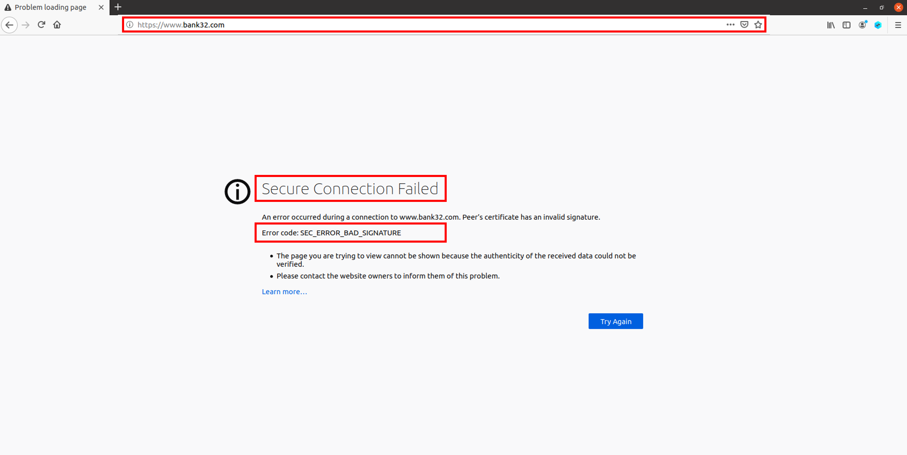
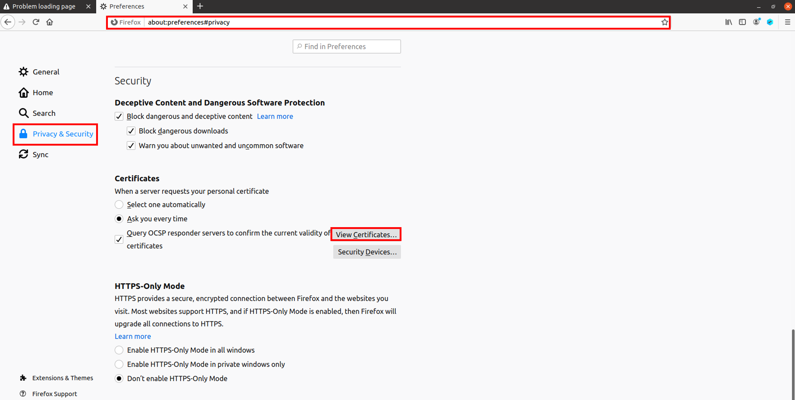
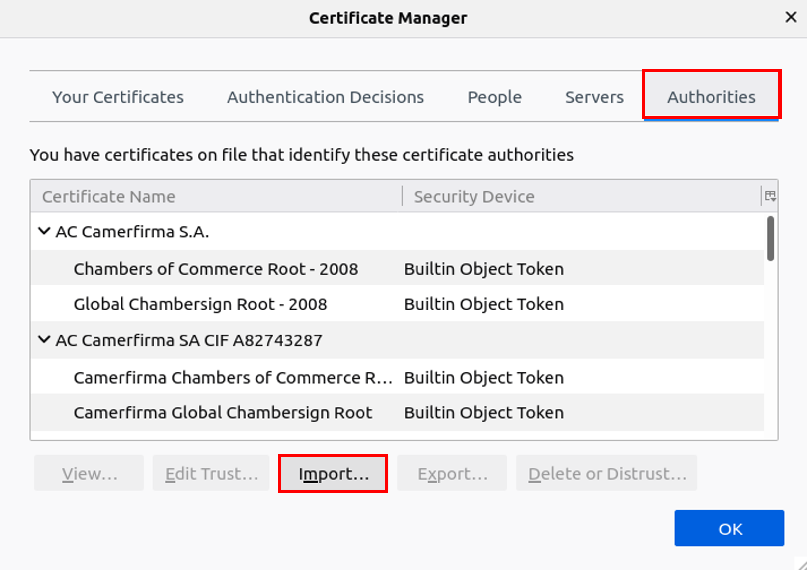
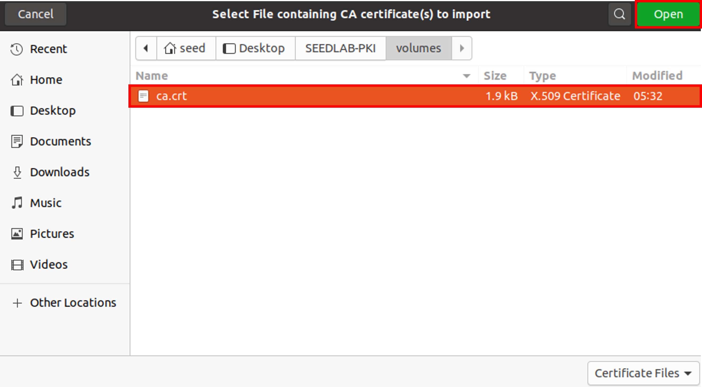
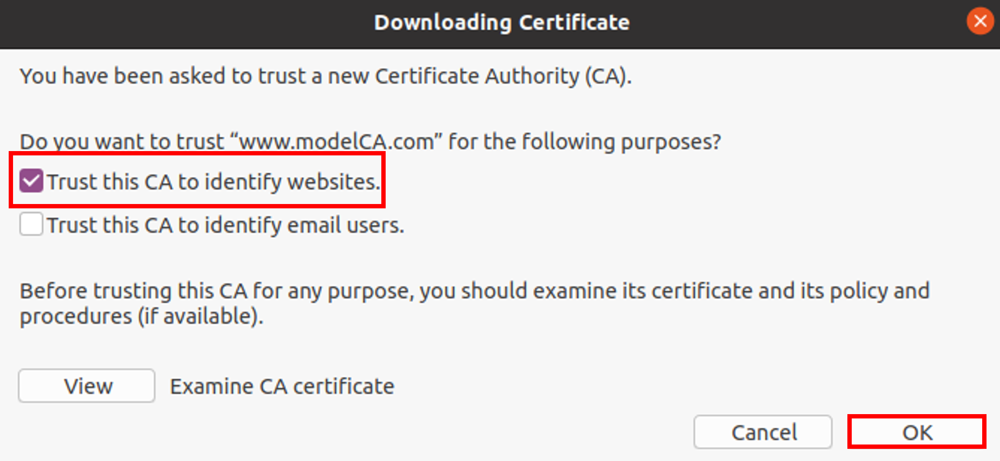
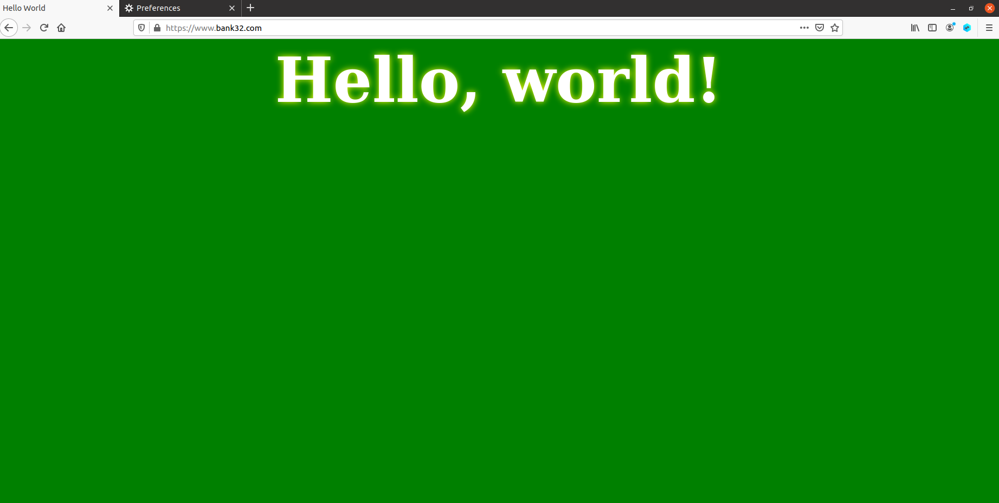
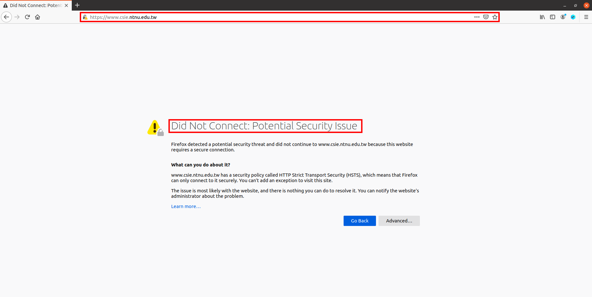
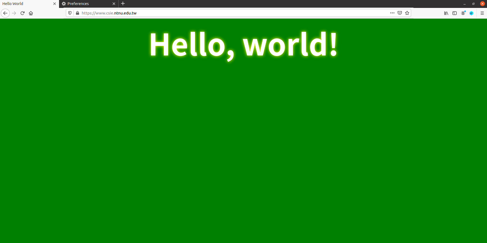

## Motivation

公開金鑰加密是當前通訊安全的基礎，但在雙方傳送公開金鑰時，也成為中間人攻擊的目標之一，其根本的問題在於 **驗證公開金鑰的擁有者** 不是件容易的事情，換句話說，**如何驗證送過來的公開金鑰就如它聲稱的是來自於該擁有者**，而 **公開金鑰基礎設施 (Public Key Infrastructure, PKI)** 就是此問題的有效解法

## Lab Environment

### Get Corresponding Files

至 [Seed Labs 2.0 > Crypto > PKI Lab](https://seedsecuritylabs.org/Labs_20.04/Crypto/Crypto_PKI/) 下載相關檔案，包含 [題目說明] (https://seedsecuritylabs.org/Labs_20.04/Files/Crypto_PKI/Crypto_PKI.pdf)與 [lab 環境](https://seedsecuritylabs.org/Labs_20.04/Files/Crypto_PKI/Labsetup.zip)

### DNS Set Up

在這個 lab 當中，會以 [www.bank32.com](https://www.bank32.com) 作為設定 HTTPS server 的範例，因此需特別針對 DNS 做設定

```bash=
# 打開 /etc/hosts，新增下面一行資訊
[02/13/25]seed@VM:~/.../SEEDLAB-PKI$ sudo vim /etc/hosts

10.9.0.80 www.bank32.com
```

## Lab Tasks
    
### Task 1: Becoming a Certificate Authority (CA)

:::success
憑證管理中心、憑證頒發機構 (Certificate Authority, CA) 是具公信力第三方，可對個人及機關團體提供認證及憑證簽發管理等服務，而數位憑證 (digital certificates) 可以用來證明一把公開金鑰的擁有性。有些商業類型的 CAs 被稱作根憑證頒發機構 (root CAs)，例如 [VeriSign](https://www.verisign.com/)，一般用戶可以透過 CA 獲取數位憑證，而 CA 的憑證可能是由另一間 CA 所頒發，不斷追溯源頭就會找到一間最大的 CA，即 root CA，而 root CA 的憑證是自行頒發的 (self-signed)，也理所當然的被相信，通常 root CA 憑證都是先裝在大多數的作業系統、網路瀏覽器或其他需要 PKI 的軟體

這個 task 的目標就是假扮 root CA 產生一張數位憑證，並在之後的 task 頒發憑證給其他 server
:::

要使用 OpenSSL 產生憑證會需要一份設定檔 (configuration file)，通常設定檔會以 `.cnf` 後綴結尾，供三個 OpenSSL 指令所使用： `ca`, `req` 以及 `x509`。預設上 OpenSSL 會使用 */usr/lib/ssl/openssl.cnf* 作為設定檔，但因為我會需要對它做一些修正，所以先將它複製到當前目錄，並告訴 OpenSSL 要使用這份新的配置檔。

在配置檔中的預設設定提到，所有東西會放在 *./demoCA* 底下，頒發的 certs 會放在 *$dir/certs*，頒發的 crl 會放在 *$dir/crl*，新憑證會放在 *$dir/newcerts*，index file 的資料庫為 *$dir/index.txt*，serial number 會放在 *$dir/derial* 中。因此先根據上述設定建立環境

```bash=
# 把預設的 conf 檔從 /usr/lib/ssl/openssl.cnf 複製過來，重新命名成 myCA_openssl.cnf
[02/13/25]seed@VM:~/.../SEEDLAB-PKI$ cp /usr/lib/ssl/openssl.cnf myCA_openssl.cnf

# 創建資料夾 demoCA
[02/13/25]seed@VM:~/.../SEEDLAB-PKI$ mkdir demoCA

# 進到 demoCA
[02/13/25]seed@VM:~/.../SEEDLAB-PKI$ cd demoCA/

# 再創建三個資料夾 certs, crl 和 newcerts
[02/13/25]seed@VM:~/.../demoCA$ mkdir certs crl newcerts

# 創建兩個空白檔案 index.txt 和 serial
[02/13/25]seed@VM:~/.../demoCA$ touch index.txt serial

# serial 裡面要放 serial number，假設放 1000
[02/13/25]seed@VM:~/.../demoCA$ echo 1000 > serial
```

又因為這個 lab 可能會對同一個 subject 創建很多次憑證，所以需要特別把 `#unique_subject = no` 這行取消註解

```bash=
# 編輯 myCA_openssl.cnf，將 unique_subject = no 那行取消註解
[02/13/25]seed@VM:~/.../SEEDLAB-PKI$ vim myCA_openssl.cnf

# 節錄 myCA_openssl.cnf 內容
[ CA_default ]

dir		= ./demoCA		# Where everything is kept
certs		= $dir/certs		# Where the issued certs are kept
crl_dir		= $dir/crl		# Where the issued crl are kept
database	= $dir/index.txt	# database index file.
unique_subject	= no			# Set to 'no' to allow creation of
					# several certs with same subject.
new_certs_dir	= $dir/newcerts	# default place for new certs.

certificate	= $dir/cacert.pem 	# The CA certificate
serial		= $dir/serial 		# The current serial number
crlnumber	= $dir/crlnumber	# the current crl number
					# must be commented out to leave a V1 CRL
crl		= $dir/crl.pem 	# The current CRL
private_key	= $dir/private/cakey.pem# The private key

x509_extensions	= usr_cert	# The extensions to add to the cert
```

完成設定檔後，即可透過 `openssl` 指令產生憑證，又因為這個 lab 是假設為 root CA，因此簽出來的憑證會是自簽憑證，指令如下

```bash=
# 使用以下指令產生憑證
[02/13/25]seed@VM:~/.../SEEDLAB-PKI$ openssl req -x509 -newkey rsa:4096 -sha256 -days 3650 -keyout ca.key -out ca.crt -subj "/CN=www.modelCA.com/O=Model CA LTD./C=US" -passout pass:dees
Generating a RSA private key
....................................................................................................................................................................................................................++++
.......................................++++
writing new private key to 'ca.key'
-----
```

| 指令、參數 | 說明 |
| :-- | :-- |
| `openssl req` | 向 root CA 發送憑證簽署要求或自前憑證 |
| `-x509` | 告訴 OpenSSL 這是自簽憑證，而不是簽給別人 |
| `-newkey rsa:4096` | 產生一組大小為 4096 bits 用來簽署憑證的 RSA key-pair |
| `-sha256` | 指定要用 sha256 簽署該憑證 |
| `-days 3650` | 設定有效日期為 3650 天 |
| `-keyout ca.key` | CA private key 儲存於 `ca.key` 中 |
| `-out ca.crt` | 公鑰憑證 (public key certificate) 存放於 `ca.crt` 中 |
| `-subj "/CN=www.modelCA.com/O=Model CA LTD./C=US"` | subject information<br/>`/CN`: Common Name<br/>`/O`: Organization<br/>`/C`: Country |
| `-passout pass:dees` | 密碼，每次使用此 CA 為他人簽憑證時都需輸入一次 |

可以透過以下指令查看憑證

```bash=
[02/13/25]seed@VM:~/.../SEEDLAB-PKI$ openssl x509 -in ca.crt -text -noout
Certificate:
    Data:
        Version: 3 (0x2)
        Serial Number:
            74:cd:b2:fb:e0:15:b2:1f:12:e1:4a:41:39:8d:7b:31:26:9f:b8:44
        Signature Algorithm: sha256WithRSAEncryption
        Issuer: CN = www.modelCA.com, O = Model CA LTD., C = US
        Validity
            Not Before: Feb 13 07:38:24 2025 GMT
            Not After : Feb 11 07:38:24 2035 GMT
        Subject: CN = www.modelCA.com, O = Model CA LTD., C = US
        Subject Public Key Info:
            Public Key Algorithm: rsaEncryption
                RSA Public-Key: (4096 bit)
                Modulus:
                    00:e4:6f:76:32:94:48:4d:c4:e1:18:23:d9:c7:cb:...
                Exponent: 65537 (0x10001)
        X509v3 extensions:
            X509v3 Subject Key Identifier: 
                A5:E9:74:99:52:6F:A3:D7:0E:8A:A6:C1:F6:E6:24:5B:BE:C6:A4:03
            X509v3 Authority Key Identifier: 
                keyid:A5:E9:74:99:52:6F:A3:D7:0E:8A:A6:C1:F6:E6:24:5B:BE:C6:A4:03

            X509v3 Basic Constraints: critical
                CA:TRUE
    Signature Algorithm: sha256WithRSAEncryption
         03:e3:a7:4f:b2:e2:6b:df:66:f0:bc:32:1d:3d:c1:25:fb:e3:...
```

| 指令、參數 | 說明 |
| :-- | :-- |
| `openssl x509` | 告訴 OpenSSL 要解讀 X509 憑證 |
| `-in ca.crt` | 指定 input file |
| `-text` | 以人類讀得懂的方式顯示該憑證的完整資訊<br/>包含擁有者 (Subject) 資訊、發佈人資訊、驗證期限、公鑰資訊、簽章所用演算法等等 |
| `-noout` | 不要顯示 base64 編碼版本<br/>如果沒加這行則會同時印出編碼版與文字版 |

另外，可以透過以下指令查看私鑰

```bash=
[02/13/25]seed@VM:~/.../SEEDLAB-PKI$ openssl rsa -in ca.key -text -noout
Enter pass phrase for ca.key:
RSA Private-Key: (4096 bit, 2 primes)
modulus:
    00:e4:6f:76:32:94:48:4d:c4:e1:18:23:d9:c7:cb:...
publicExponent: 65537 (0x10001)
privateExponent:
    00:84:df:d4:e7:fc:da:c5:e9:d4:68:ff:49:89:6e:...
prime1:
    00:f4:53:7e:98:01:5e:0d:f3:86:90:c1:4c:bd:5f:...
prime2:
    00:ef:59:98:f5:44:32:bf:8f:ad:43:8d:21:8a:e4:...
exponent1:
    0d:71:82:a7:ae:7b:94:5c:ef:ec:8b:16:43:dd:38:...
exponent2:
    00:80:cb:d3:f5:57:67:7f:91:8f:08:e4:af:02:10:...
coefficient:
    00:8f:2f:26:4b:4e:27:5f:bf:17:39:fe:e4:3f:1f:...
```

| 指令、參數 | 說明 |
| :-- | :-- |
| `openssl rsa` | 告訴 OpenSSL 要做與 RSA 私鑰相關的事情 |
| `-in ca.key` | 指定 input file |
| `-text` | 以人類讀得懂的方式顯示該憑證的完整資訊<br/>包含私鑰組成以及公鑰推導等等 |
| `-noout` | 不要顯示 base64 編碼版本<br/>如果沒加這行則會同時印出編碼版與文字版 |

1. What part of the certificate indicates this is a CA’s certificate?
    > CA:TRUE
2. What part of the certificate indicates this is a self-signed certificate?
    > Issuer 與 Subject 皆相同
3. In the RSA algorithm, we have a public exponent e, a private exponent d, a modulus n, and two secret numbers p and q, such that n = pq. Please identify the values for these elements in your certificate and key files.
    | 參數 | 值 | 
    | :-- | :-- |
    | e | *ca.crt* 中的 `Exponent`<br/>*ca.key* 中的 `publicExponent` |
    | d | *ca.key* 中的 `privateExponent` |
    | n | *ca.crt* 中的 `Modulus`<br/>ca.key 中的 `Modulus` |
    | p | *ca.key* 中的 `prime1` |
    | q | *ca.key* 中的 `prime2` |

### Task 2: Generating a Certificate Request for Your Web Server

接下來要幫一間叫做 bank32.com 的公司簽憑證，流程是 bank32.com 發送一個憑證簽署請求 (Certificate Signing Request, CSR)，CSR 會被送到 CA 那邊，再由 CA 驗證提交的身分資訊是否正確，最後產生憑證。在 Task 2 中，會模擬 bank32.com 發送 CSR 至 CA 端

與 Task 1 十分類似，只是這次不需要加上 `-x509`，因為這次不是自簽憑證

```bash=
[02/13/25]seed@VM:~/.../SEEDLAB-PKI$ openssl req -newkey rsa:2048 -sha256 -keyout server.key -out server.csr -subj "/CN=www.bank32.com/O=Bank32 Inc./C=US" -passout pass:dees
Generating a RSA private key
.....................................................................+++++
......................+++++
writing new private key to 'server.key'
-----
```

查看一下 CSR

```bash=
[02/13/25]seed@VM:~/.../SEEDLAB-PKI$ openssl req -in server.csr -text -noout
Certificate Request:
    Data:
        Version: 1 (0x0)
        Subject: CN = www.bank32.com, O = Bank32 Inc., C = US
        Subject Public Key Info:
            Public Key Algorithm: rsaEncryption
                RSA Public-Key: (2048 bit)
                Modulus:
                    00:c9:fc:7a:a2:0e:c3:f8:a1:4c:b6:ee:1c:c9:07:...
                Exponent: 65537 (0x10001)
        Attributes:
            a0:00
    Signature Algorithm: sha256WithRSAEncryption
         28:78:1e:30:e9:ff:21:48:6a:cb:26:4c:d0:98:ca:48:9a:38:...
```

不過現今很多網站會有不同的 URL，但都可以連到同一個伺服器，這是因為瀏覽器的 hostname matching policy，可以透過 X509 的延伸套件 (extension) **Subject Alternative Name (SAN)** 幫主機指定不同 URL 別名，如此提交的 CSR 就會告訴 CA 這些別名都可以使用

這邊要透過指令 `-addext "subjectAltName = DNS:<URL>"` 做到，不過需要注意 `subjectAltName` 中還是必須包含 common name (CN)，否則 CN 會變成 invalid name

```bash=
[02/13/25]seed@VM:~/.../SEEDLAB-PKI$ openssl req -newkey rsa:2048 -sha256 -keyout server.key -out server.csr -subj "/CN=www.bank32.com/O=Bank32 Inc./C=US" -passout pass:dees -addext "subjectAltName = DNS:www.bank32.com, DNS:www.bank32A.com, DNS:www.bank32B.com"
Generating a RSA private key
.................+++++
....+++++
writing new private key to 'server.key'
-----
```

查看一下更新後的 CSR，就看到有多一段 `Requested Extension` 指出 URL alias

```bash=
[02/13/25]seed@VM:~/.../SEEDLAB-PKI$ openssl req -in server.csr -text -noout
Certificate Request:
    Data:
        Version: 1 (0x0)
        Subject: CN = www.bank32.com, O = Bank32 Inc., C = US
        Subject Public Key Info:
            Public Key Algorithm: rsaEncryption
                RSA Public-Key: (2048 bit)
                Modulus:
                    00:ec:2a:5a:ac:70:e0:f6:99:20:e0:22:17:cd:f7:...
                Exponent: 65537 (0x10001)
        Attributes:
        Requested Extensions:
            X509v3 Subject Alternative Name: 
                DNS:www.bank32.com, DNS:www.bank32A.com, DNS:www.bank32B.com
    Signature Algorithm: sha256WithRSAEncryption
         20:ae:80:70:aa:ad:e5:b7:23:62:2f:c8:c5:04:60:34:37:44:...
```

### Task 3: Generating a Certificate for your server

延續 Task 2，在 Task 3 中，要扮演回 CA 的角色，拿著 CSR 幫助 bank32.com 產生憑證。

要注意的是，因為安全性的考量，OpenSSL 預設不讓 `openssl ca` 從 request 中複製 extension field 至最終的憑證，但這次先把這個預設打開，從 *myCA_openssl.cnf* 中取消註解 `# copy_extensions = copy`

```bash=
# 編輯 myCA_openssl.cnf，將 copy_extensions = copy 那行取消註解
[02/13/25]seed@VM:~/.../SEEDLAB-PKI$ vim myCA_openssl.cnf

# 節錄 myCA_openssl.cnf 內容
[ CA_default ]

dir		= ./demoCA		# Where everything is kept
certs		= $dir/certs		# Where the issued certs are kept
crl_dir		= $dir/crl		# Where the issued crl are kept
database	= $dir/index.txt	# database index file.
unique_subject	= no			# Set to 'no' to allow creation of
					# several certs with same subject.
new_certs_dir	= $dir/newcerts		# default place for new certs.

certificate	= $dir/cacert.pem 	# The CA certificate
serial		= $dir/serial 		# The current serial number
crlnumber	= $dir/crlnumber	# the current crl number
					# must be commented out to leave a V1 CRL
crl		= $dir/crl.pem 		# The current CRL
private_key	= $dir/private/cakey.pem# The private key

x509_extensions	= usr_cert		# The extensions to add to the cert

# Comment out the following two lines for the "traditional"
# (and highly broken) format.
name_opt 	= ca_default		# Subject Name options
cert_opt 	= ca_default		# Certificate field options

# Extension copying option: use with caution.
copy_extensions = copy
```

接著透過下面的指令產生憑證

```bash=
[02/13/25]seed@VM:~/.../SEEDLAB-PKI$ openssl ca -config myCA_openssl.cnf -policy policy_anything -md sha256 -days 3650 -in server.csr -out server.crt -batch -cert ca.crt -keyfile ca.key
Using configuration from myCA_openssl.cnf
Enter pass phrase for ca.key:
Check that the request matches the signature
Signature ok
Certificate Details:
        Serial Number: 4096 (0x1000)
        Validity
            Not Before: Feb 13 09:25:04 2025 GMT
            Not After : Feb 11 09:25:04 2035 GMT
        Subject:
            countryName               = US
            organizationName          = Bank32 Inc.
            commonName                = www.bank32.com
        X509v3 extensions:
            X509v3 Basic Constraints: 
                CA:FALSE
            Netscape Comment: 
                OpenSSL Generated Certificate
            X509v3 Subject Key Identifier: 
                A7:DB:BB:3C:41:57:FD:0F:32:07:B5:25:71:5C:C1:C4:C6:CE:CF:D5
            X509v3 Authority Key Identifier: 
                keyid:A5:E9:74:99:52:6F:A3:D7:0E:8A:A6:C1:F6:E6:24:5B:BE:C6:A4:03

            X509v3 Subject Alternative Name: 
                DNS:www.bank32.com, DNS:www.bank32A.com, DNS:www.bank32B.com
Certificate is to be certified until Feb 11 09:25:04 2035 GMT (3650 days)

Write out database with 1 new entries
Data Base Updated
```

| 指令、參數 | 說明 |
| :-- | :-- |
| `openssl ca` | 告訴 OpenSSL 現在要簽核一張 CSR |
| `-config myCA_openssl.cnf` | 告訴 OpenSSL 使用 *myCA_openssl.cnf* 這個設定檔 |
| `-policy policy_anything` | 指定憑證使用的政策<br/>`policy_anything` 在 *myCA_openssl.cnf* 中有提及 |
| `-md sha256` | 使用 sha256 簽署憑證 |
| `-days 3650` | 設定有效日期為 3650 天 |
| `-in server.csr` | 指定 input CSR 為 *server.csr*  |
| `-out server.crt` | 指定產出的憑證名為 *server.crt* |
| `-batch` | 執行 batch mode，這樣就不會中途停下來要求手動許可簽屬程序 |
| `-cert ca.crt` | 指定使用 CA 的憑證 *ca.crt* 簽署 CSR |
| `-keyfile ca.key` | 使用 *ca.key* 作為 CA 的私鑰簽署 CSR |

確認簽署的憑證，應該包含 CSR 中指定的 DNS alias

```bash=
[02/13/25]seed@VM:~/.../SEEDLAB-PKI$ openssl x509 -in server.crt -text -noout
Certificate:
    Data:
        Version: 3 (0x2)
        Serial Number: 4096 (0x1000)
        Signature Algorithm: sha256WithRSAEncryption
        Issuer: CN = www.modelCA.com, O = Model CA LTD., C = US
        Validity
            Not Before: Feb 13 09:25:04 2025 GMT
            Not After : Feb 11 09:25:04 2035 GMT
        Subject: C = US, O = Bank32 Inc., CN = www.bank32.com
        Subject Public Key Info:
            Public Key Algorithm: rsaEncryption
                RSA Public-Key: (2048 bit)
                Modulus:
                    00:ec:2a:5a:ac:70:e0:f6:99:20:e0:22:17:cd:f7:...
                Exponent: 65537 (0x10001)
        X509v3 extensions:
            X509v3 Basic Constraints: 
                CA:FALSE
            Netscape Comment: 
                OpenSSL Generated Certificate
            X509v3 Subject Key Identifier: 
                A7:DB:BB:3C:41:57:FD:0F:32:07:B5:25:71:5C:C1:C4:C6:CE:CF:D5
            X509v3 Authority Key Identifier: 
                keyid:A5:E9:74:99:52:6F:A3:D7:0E:8A:A6:C1:F6:E6:24:5B:BE:C6:A4:03

            X509v3 Subject Alternative Name: 
                DNS:www.bank32.com, DNS:www.bank32A.com, DNS:www.bank32B.com
    Signature Algorithm: sha256WithRSAEncryption
         df:0b:02:78:52:d2:b8:9e:d7:23:56:1e:b5:11:81:ac:40:a6:...
```

### Task 4: Deploying Certificate in an Apache-Based HTTPS Website

Task 4 要實際將產生的憑證放入瀏覽器中，使其能夠辨識並使用 HTTPS 安全瀏覽信任的網頁。概念上來說，對於 CA 而言，需要將先前產生的憑證 *ca.crt* 提交給瀏覽器，跟瀏覽器說我相信這個 CA 簽出來的憑證；對 bank32 這間公司而言，瀏覽器會跟它要屬於它的憑證，即 *server.crt*，又因為 *server.crt* 是 CA 簽出來的，所以瀏覽器會相信，並讓用戶成功瀏覽 [https://www.bank32.com](https://www.bank32.com) 網頁。

這個 task 會需要建置基於 HTTPS 的 apache server，Seed lab 已經將它安裝於 container，只需要根據先前 tasks 產生的內容作一些設定上的調整即可

第一個是要修改 apache server 的設定檔，位於 *image_www/bank32_apache_ssl.conf*，需要調整 bank32 的資訊，包含 SSLCertificateFile 會從 */certs/server.crt* 抓，相似地，SSLCertificateKeyFile 會從 */certs/server.key* 取得，結果如下：

```
<VirtualHost *:443> 
    DocumentRoot /var/www/bank32
    ServerName www.bank32.com
    ServerAlias www.bank32A.com
    ServerAlias www.bank32B.com
    ServerAlias www.bank32W.com
    DirectoryIndex index.html
    SSLEngine On 
    SSLCertificateFile /certs/server.crt
    SSLCertificateKeyFile /certs/server.key
</VirtualHost>

<VirtualHost *:80> 
    DocumentRoot /var/www/bank32
    ServerName www.bank32.com
    DirectoryIndex index_red.html
</VirtualHost>

# Set the following gloal entry to suppress an annoying warning message
ServerName localhost
```

接著是 *Dockerfile*，建置 container 時要把 *server.crt* 和 *server.key* 複製到 container 的 */certs/* 中

```
FROM handsonsecurity/seed-server:apache-php

ARG WWWDIR=/var/www/bank32

COPY ./index.html ./index_red.html $WWWDIR/
COPY ./bank32_apache_ssl.conf /etc/apache2/sites-available
COPY ./certs/server.crt ./certs/server.key  /certs/

RUN  chmod 400 /certs/server.key \
     && chmod 644 $WWWDIR/index.html \
     && chmod 644 $WWWDIR/index_red.html \
     && asenmod ssl \
     && a2ensite bank32_apache_ssl   

CMD  tail -f /dev/null
```

根據上面調整的內容，把 *server.crt* 以及 *server.key* 移到 *image_www/certs/* 中

使用 `dcbuild` 建置環境，並以 `dcup` 將 container 啟動

```bash=
[02/14/25]seed@VM:~/.../SEEDLAB-PKI$ dcbuild
Building web-server
Step 1/7 : FROM handsonsecurity/seed-server:apache-php
 ---> 2365d0ed3ad9
Step 2/7 : ARG WWWDIR=/var/www/bank32
 ---> Using cache
 ---> 16a0763ac43d
Step 3/7 : COPY ./index.html ./index_red.html $WWWDIR/
 ---> Using cache
 ---> 718a24968c38
Step 4/7 : COPY ./bank32_apache_ssl.conf /etc/apache2/sites-available
 ---> Using cache
 ---> 844a04cc06cf
Step 5/7 : COPY ./certs/server.crt ./certs/server.key  /certs/
 ---> d81c4562174e
Step 6/7 : RUN  chmod 400 /certs/server.key      && chmod 644 $WWWDIR/index.html      && chmod 644 $WWWDIR/index_red.html      && a2ensite bank32_apache_ssl
 ---> Running in 6e1c1867ea71
Enabling site bank32_apache_ssl.
To activate the new configuration, you need to run:
  service apache2 reload
Removing intermediate container 6e1c1867ea71
 ---> 7ed73be4cc19
Step 7/7 : CMD  tail -f /dev/null
 ---> Running in a8c9a1796b6f
Removing intermediate container a8c9a1796b6f
 ---> 362809e7726b

Successfully built 362809e7726b
Successfully tagged seed-image-www-pki:latest
[02/14/25]seed@VM:~/.../SEEDLAB-PKI$ dcup -d
Creating network "net-10.9.0.0" with the default driver
Creating www-10.9.0.80 ... done
```

透過 `dockps` 可查看 container ID，以 `docksh <id>` 連線進去

```bash=
[02/14/25]seed@VM:~/.../SEEDLAB-PKI$ dockps
0cc4d835efca  www-10.9.0.80
[02/14/25]seed@VM:~/.../SEEDLAB-PKI$ docksh 0c
root@0cc4d835efca:/#
```

進到 container 後，要開啟 apache service，使用指令 `service apache2 start`，它會要求輸入 *server.key* 的密碼，密碼為 `dees`

```bash=
root@0cc4d835efca:/# service apache2 start
 * Starting Apache httpd web server apache2                                 Enter passphrase for SSL/TLS keys for www.bank32.com:443 (RSA):
 * 
root@0cc4d835efca:/#
```

打開 firefox 瀏覽器，嘗試連線 [https://www.bank32.com](https://www.bank32.com)，會發現還是無法連線，這是因為我們還沒告知瀏覽器我們的 CA 是可以信任的


在網址列輸入 `about:preferences#private`，找到憑證的區域，點擊 View Certificate


在 Authorities 標籤內，點擊 Import


匯入 *ca.crt* 這張憑證


這邊要選擇 "Trust this CA to identify websites"，這樣瀏覽器就會信任這個 CA 所頒發的憑證的網站


重新瀏覽 [https://www.bank32.com](https://www.bank32.com)，看到綠色的 Hello World 代表成功連線


### Task 5: Launching a Man-In-The-Middle Attack

Task 5 會說明 PKI 可以阻擋中間人攻擊，先簡單說明這個 Task 的攻擊場景：接下來有三個人物：用戶 (Alice)、中間人 (MITM)、伺服器 (server)，Alice 打算使用 server 的服務，MITM 打算從中作梗，讓 Alice 存取的服務有問題，在這個 task 中，假設 server 是師大資工 [www.csie.ntnu.edu.tw](https://www.csie.ntnu.edu.tw)，Alice 想要瀏覽該網頁，而中間人（也就是自己）打算將該網站導到別的地方，如果成功導向其他地方，那代表 MITM 攻擊成功，否則表示 PKI 成功阻擋了 MITM 攻擊。

接著要思考如何進行攻擊，有兩個方法可以做到，一個是直接攻擊路由，另一個方法是攻擊 DNS，這個 task 中會以後者作為範例。假設中間人有方法修改 Alice 本機上的 */etc/hosts*（VM 上的 */etc/hosts/*），並新增 `10.9.0.80 www.csie.ntnu.edu.tw`，如此當 Alice 瀏覽 [https://www.csie.ntnu.edu.tw](https://www.csie.ntnu.edu.tw) 時，就會被導到 10.9.0.80，也就是 MITM 自架的服務

```bash=
[02/14/25]seed@VM:~/.../SEEDLAB-PKI$ sudo vim /etc/hosts

10.9.0.80 www.csie.ntnu.edu.tw
```

打開 firefox 瀏覽器，嘗試連線 [https://www.csie.ntnu.edu.tw](https://www.csie.ntnu.edu.tw)，會發現並沒有如 Task 4 一樣顯示綠色的 Hello World 頁面，表示 PKI 有成功擋下 MITM 攻擊


進到 Task 6 之前稍微說明一下原因：原因就是因為 [https://www.csie.ntnu.edu.tw](https://www.csie.ntnu.edu.tw) 並無法提交合格的憑證，所以 PKI 將它擋了下來

### Task 6: Launching a Man-In-The-Middle Attack with a Compromised CA

Task 6 就是要幫假服務偽造假憑證，使 MITM 攻擊成功，過程基本上就是仿造 Task 1-4

首先建立向 CA 發出憑證簽署要求的 CSR (*ntnu.csr*) 及私鑰 (*ntnu.key*)，再讓 CA 簽署該 CSR，產生憑證 *ntnu.crt*
```bash=
[02/14/25]seed@VM:~/.../SEEDLAB-PKI$ openssl req -newkey rsa:2048 -sha256 -keyout ntnu.key -out ntnu.csr -subj "/CN=www.csie.ntnu.edu.tw/O=NTNU CSIE/C=TW" -passout pass:dees
Generating a RSA private key
..........................................................................................+++++
.............................................................................................................................................................................+++++
writing new private key to 'ntnu.key'
-----
[02/14/25]seed@VM:~/.../SEEDLAB-PKI$ openssl ca -config myCA_openssl.cnf -policy policy_anything -md sha256 -days 3650 -in ntnu.csr -out ntnu.crt -batch -cert ca.crt -keyfile ca.key
Using configuration from myCA_openssl.cnf
Enter pass phrase for ca.key:
Check that the request matches the signature
Signature ok
Certificate Details:
        Serial Number: 4097 (0x1001)
        Validity
            Not Before: Feb 14 15:08:24 2025 GMT
            Not After : Feb 12 15:08:24 2035 GMT
        Subject:
            countryName               = TW
            organizationName          = NTNU CSIE
            commonName                = www.csie.ntnu.edu.tw
        X509v3 extensions:
            X509v3 Basic Constraints: 
                CA:FALSE
            Netscape Comment: 
                OpenSSL Generated Certificate
            X509v3 Subject Key Identifier: 
                53:48:8B:B3:ED:7F:8C:1E:19:7C:FA:84:F7:05:BC:59:69:6E:3F:51
            X509v3 Authority Key Identifier: 
                keyid:D6:9E:DC:28:B8:0B:6E:67:00:F1:F3:C2:83:AC:7C:66:89:AC:D4:FF

Certificate is to be certified until Feb 12 15:08:24 2035 GMT (3650 days)

Write out database with 1 new entries
Data Base Updated
```

接著修改 container 設定，Dockerfile 設定如下
```
FROM handsonsecurity/seed-server:apache-php

ARG WWWDIR=/var/www/bank32

COPY ./index.html ./index_red.html $WWWDIR/
COPY ./bank32_apache_ssl.conf /etc/apache2/sites-available
COPY ./ntnu_apache_ssl.conf /etc/apache2/sites-available
COPY ./certs/server.crt ./certs/server.key  /certs/
COPY ./certs/ntnu.crt ./certs/ntnu.key  /certs/

RUN  chmod 400 /certs/server.key \
     && chmod 400 /certs/ntnu.key \
     && chmod 644 $WWWDIR/index.html \
     && chmod 644 $WWWDIR/index_red.html \
     && a2enmod ssl \
     && a2ensite bank32_apache_ssl \
     && a2ensite ntnu_apache_ssl   

CMD  tail -f /dev/null
```

apache server 也要新增 [https://www.csie.ntnu.edu.tw](https://www.csie.ntnu.edu.tw)
```bash=
[02/14/25]seed@VM:~/.../image_www$ cp bank32_apache_ssl.conf ntnu_apache_ssl.conf
[02/14/25]seed@VM:~/.../image_www$ vim ntnu_apache_ssl.conf 
```

*ntnu_apache_ssl.conf* 設定如下
```
<VirtualHost *:443> 
    DocumentRoot /var/www/bank32
    ServerName www.csie.ntnu.edu.tw
    DirectoryIndex index.html
    SSLEngine On 
    SSLCertificateFile /certs/ntnu.crt
    SSLCertificateKeyFile /certs/ntnu.key
</VirtualHost>

<VirtualHost *:80> 
    DocumentRoot /var/www/bank32
    ServerName www.csie.ntnu.edu.tw
    DirectoryIndex index_red.html
</VirtualHost>

# Set the following gloal entry to suppress an annoying warning message
ServerName localhost
```

一樣根據 Dockerfile 的設定，將 *ntnu.crt*、*ntnu.key* 複製到 *image_www/certs* 中
```bash=
[02/14/25]seed@VM:~/.../SEEDLAB-PKI$ cp ntnu.crt ntnu.key ./image_www/certs/
```

最後 `dcbuild` 建置 container，`dcup` 啟動
```bash=
[02/14/25]seed@VM:~/.../SEEDLAB-PKI$ dcbuild
Building web-server
Step 1/9 : FROM handsonsecurity/seed-server:apache-php
 ---> 2365d0ed3ad9
Step 2/9 : ARG WWWDIR=/var/www/bank32
 ---> Using cache
 ---> 16a0763ac43d
Step 3/9 : COPY ./index.html ./index_red.html $WWWDIR/
 ---> Using cache
 ---> 718a24968c38
Step 4/9 : COPY ./bank32_apache_ssl.conf /etc/apache2/sites-available
 ---> Using cache
 ---> 844a04cc06cf
Step 5/9 : COPY ./ntnu_apache_ssl.conf /etc/apache2/sites-available
 ---> 4f12dd172ab3
Step 6/9 : COPY ./certs/server.crt ./certs/server.key  /certs/
 ---> 72f13efc4133
Step 7/9 : COPY ./certs/ntnu.crt ./certs/ntnu.key  /certs/
 ---> cff8cc3d7e59
Step 8/9 : RUN  chmod 400 /certs/server.key      && chmod 400 /certs/ntnu.key      && chmod 644 $WWWDIR/index.html      && chmod 644 $WWWDIR/index_red.html      && a2ensite bank32_apache_ssl      && a2ensite ntnu_apache_ssl
 ---> Running in baafc9959d27
Enabling site bank32_apache_ssl.
To activate the new configuration, you need to run:
  service apache2 reload
Enabling site ntnu_apache_ssl.
To activate the new configuration, you need to run:
  service apache2 reload
Removing intermediate container baafc9959d27
 ---> b781c9decb84
Step 9/9 : CMD  tail -f /dev/null
 ---> Running in afe500be0d41
Removing intermediate container afe500be0d41
 ---> a79c3a37a3b6

Successfully built a79c3a37a3b6
Successfully tagged seed-image-www-pki:latest
[02/14/25]seed@VM:~/.../SEEDLAB-PKI$ dcup -d
Creating network "net-10.9.0.0" with the default driver
Creating www-10.9.0.80 ... done
```

`docksh <id>` 連進 container 後，使用指令 `service apache2 start` 啟用 apache 服務
```bash=
[02/14/25]seed@VM:~/.../SEEDLAB-PKI$ dockps
5b31c4d5ea6f  www-10.9.0.80
[02/14/25]seed@VM:~/.../SEEDLAB-PKI$ docksh 5b
root@5b31c4d5ea6f:/# service apache2 start
 * Starting Apache httpd web server apache2                                                                                                                                                                Enter passphrase for SSL/TLS keys for www.csie.ntnu.edu.tw:443 (RSA):
 * 
root@5b31c4d5ea6f:/#
```

重新瀏覽 [https://www.csie.ntnu.edu.tw](https://www.csie.ntnu.edu.tw)，發現成功顯示 Hello World 頁面，表示 MITM 攻擊成功
