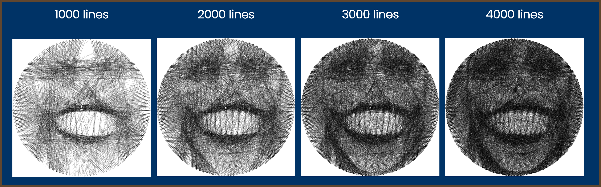
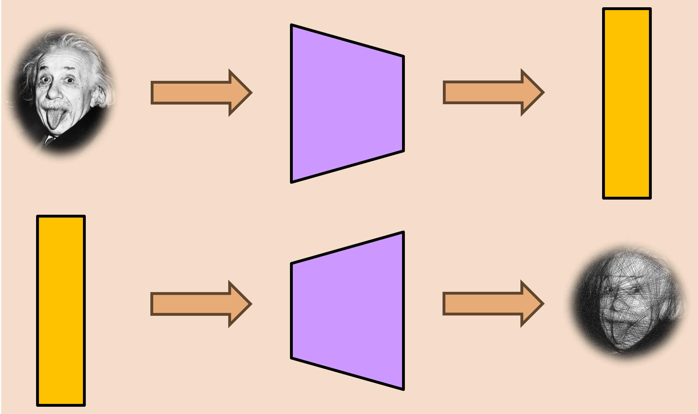
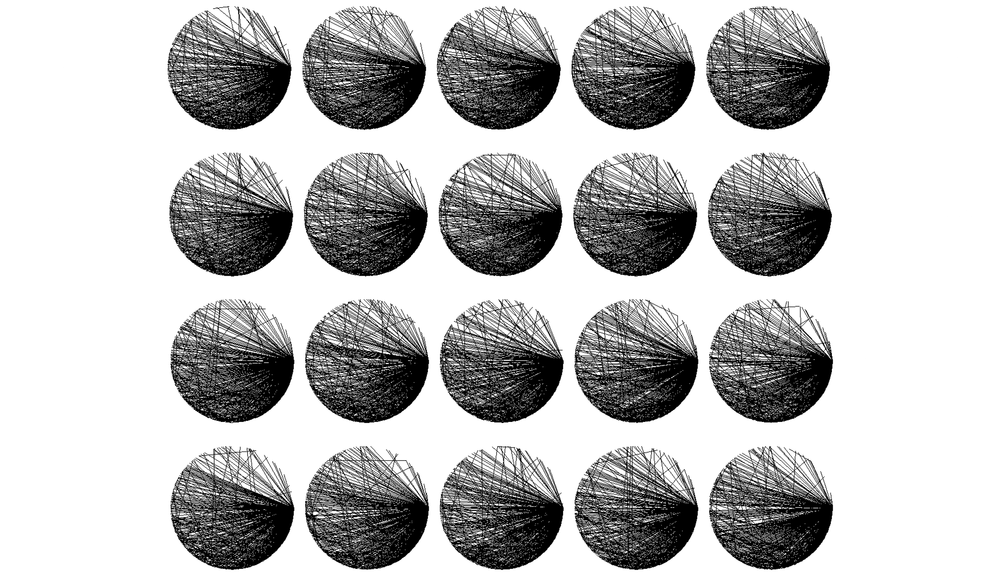

## 弦藝術 String Art Image

弦藝術又被稱作 string art 或 thread art，是透過一條一條的線段組成的一幅畫，首先會有一個圓盤 (canva)，接著在圓盤周圍可以釘上幾個 pins，在 pin 和 pin 之間拉線 (pin-pair connections)，就會形成一幅肉眼可辨識的畫

我從《我獨自升級》這部動漫中找了最經典的石像臉作為範例，並透過[這個網站](https://halfmonty.github.io/StringArtGenerator/)畫出 string art image，string art image 在開始製作前會有預處理的步驟，也就是將圖片轉成灰階，並設定成特定尺寸。接著會開始在 pin 和 pin 之間拉線，如下圖，在經過 1000 條線之後，產生的 string art image 基本上可以粗略看到輪廓，但說要辨識出更詳細的資訊還有點困難，因此我再畫上 1000 條線，2000 條線的結果可以明確知道眼睛、鼻子和嘴巴，甚至牙齒的位置，臉型也有一點出來，到了 3000 條線，其實已經滿完美的了，很明確可以知道這就是 solo leveling 石像的臉，最後到了 4000 條線，可以更清楚的看見原本石像的紋路，雖然 4000 條線下顏色有點深，但更具立體感，這就是 string art image。

根據實驗，這是在 canva 設為 1024 * 1024，圓周放上 288 個 pins的結果，可以猜測出來 string art image 在 canva 尺寸、pins 數量、線條數量改變的時候會有不同的效果，甚至可以調整線條粗細和顏色達到彩色的 string art image。

所以 string art image 的問題其實就是給予一張原始圖片，要透過某個神奇的方法產生一張 string art image，當然有人針對這個問題進行研究過，第一個方法肯定是 brute force，但可以猜測到這非常沒有效率，所以後續有人針對數學性質、貪婪演算法或其他啟發式演算法，如基因演算法為主進行研究，嘗試有效率的產生 string art image。

而這個問題其實也可以看成我要尋找一個函數，這個函數 input 一張原始圖片，我要 output 出 string art image，或簡單一點，我要找出 pin-pair connections 就好，那找函數正是 machine learning  在做的，但目前確實沒什麼人透過 machine learning 進行這方面的研究，因此我趁這次專題透過 autoencoder 尋找 string art image 這個問題需要的函數。

## 實驗設計

Autoencoder 的 model 會對 encoder 餵入訓練資料，產生一段 latent code，latent code 經過 decoder 會盡可能的產出類似原訓練資料的結果，這個流程其實很像 string art image 的產生過程：給予一張原始圖片，經過 encoder 產生一段 pin pairs connection，pin pairs connection 經過 decoder 要產生 string art image，且越接近原圖片越好。

接著來細看我的實驗設計，input image 原本想要人臉，但因為人臉解析度比較高，訓練資料太大，所以換成 kaggle 上的 [anime face dataset](https://www.kaggle.com/datasets/soumikrakshit/anime-faces)，這個 dataset 有將近 21000 筆資料，每張 anime face 都被 resize 成 64 * 64；encoder 是一個 3 層的 CNN model，最後會產生一個 1 * 2000 的 latent code，這個 code 表示 string art image 上 1000 條線的連接關係，每兩個數值表示 canva 上的兩個 pin，彼此之間會拉起一條線。

接著我會拿 latent code 丟到 decoder 裡面，decoder 是一個和 encoder 對稱的 3 層 CNN 模型，最後產生的結果並不會是 string art image，而是一張接近但不相同的圖片，就像一般 autoencoder 在做訓練時產生的東西一樣。所以我會同時拿 latent code 丟到一個既有的演算法中，這個演算法做的事情就是拿這些 pin pair connection 產出一張 string art image。

接著是最核心的地方，我要怎麼衡量模型的好壞？當然和一般 autoencoder model 一樣拿 decoder output 和原圖做比較，我透過 MSE loss 去進行衡量，起初按照這樣的結果會發現 loss 從一開始就維持差不多 0.47，沒有特別上升或下降的幅度，就好像完全沒在訓練一樣，但仔細觀察這一步其實很奇怪，因為我根本不在意 decoder 的 output 長什麼樣子，反而是在乎 latent code 產生的 string art image，所以第二次實驗我同時考慮了 string art image，並透過 L1 loss 進行衡量，因為要求 string art image 和原圖長一樣是很過分的，比起每個 pixel 的衡量，應該更著重 圖片 structure 的相似度，衡量方法就是很簡單地把兩個 loss 加起來。

## 實驗結果

圖顯示 epoch = 10, 20, 30 以及 40 的情況，loss 標註在旁邊，可以很清楚的看到根本分辨不出來這是什麼，但在前 40 個 epochs 的 loss 變化雖然一直往下，但幅度非常的小，整體來說結果並不是很好

我簡單分析了幾個可能的原因
1. 可能和 input dataset 有關，畢竟原圖只有 64 * 64 的解析度，在產生 string art image 的時候，因為更難解析原圖的結構，所以不容易產生好的 pin pairs connection，但這是訓練過程應該學到的事情，應該不是主要問題
2. output string art image 的尺寸也是一個原因，為了讓模型能持續跑在 google colab 上，我將 size 設為 512 * 512，pins 數設為 288，線條粗細調整到最細，但在這張 canva 上畫了 1000 條線很有可能讓整張圖片都變成全黑的，那在判斷 loss 的時候，確實就沒什麼好判斷的，就像全黑的圖和原圖做比較，每次比出來的結果都是一樣的，至於為什麼我不增加 output string art image size，因為如果增加這個模型跑到一半就會噴 running out of RAM 並停止，算是硬體設備上的不足
3. 僅使用 1000 條線在最前面介紹 string art image 的時候有提到並無法好好呈現原圖的長相，也有可能是因為這個緣故，讓衡量圖片好壞時效果不彰。
4. 最後當然就是訓練期間太短，前一頁顯示的結果到 40 個 epochs，這個訓練期間差不多需要 8 個小時，但因為 loss 下降幅度並不高，當時就停止了，如果訓練期間在拉長應該也能看到稍微好一些的結果，但我不認為這是主要原因

總而言之，會造成實驗失敗的主因應該會是第二項與第三項

## 結論

這份專題的貢獻當然是前衛的提出透過機器學習的角度解決 string art image，但不幸失敗收場。或許這也可以反思為什麼沒人要透過機器學習解決這類問題，如果數論或其他貪婪演算法就能有效的解決，且維持不錯的品質，那訓練一個模型，可能因為圖片不再是人臉，換成風景圖，或其他因素導致使用模型的 target 不適合，產出結果不會像現存的解決方案這麼好，可能不是這麼划算的解決方案。

未來研究方向的部分，一個當然是提升硬體設備，在足夠的算力與時間成本下，進行完整的訓練，並將 input 與 output image 的解析度調高，讓 loss evaluation 可以正確比較，第二個就是嘗試不同模型，這次雖然使用 autoencoder，但可以從整體架構，或是撤換 encoder 或 decoder 的模型、調整參數來實驗，最後就是 loss function 的使用，不僅僅是替換 MSE 和 L1 loss，也可以調整兩者之間的比例，例如將 string art 的 loss 給予 7 成的權重，而 decoder output 給予 3 成，來更著重 string art image 的成果